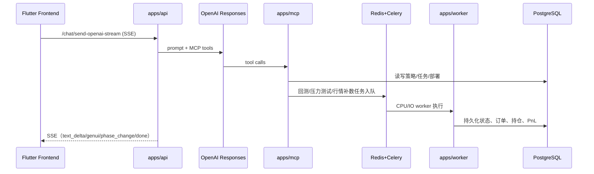

# Minsy MVP Remastered Backend（v0.1.0）

## 1. 项目目标（Higher Level）

Minsy 是一个 AI 驱动的量化策略平台后端。目标是把用户从自然语言对话一路带到可运行部署：

- KYC 画像
- 策略生成与确认
- 回测与压力测试
- 模拟部署与运行监控

对应后端能力：

- FastAPI 对外 API + SSE
- MCP 工具服务（策略/回测/行情/压力测试/交易）
- Celery 异步执行（CPU/IO 分工）
- PostgreSQL + Redis 作为状态与任务基础设施

---

## 2. 系统总览（按分层）

### 2.1 应用入口层（`apps/`）

- `apps/api`：HTTP API、鉴权、编排、SSE 输出
- `apps/mcp`：5 个 MCP domain 工具服务
- `apps/worker`：异步任务执行（CPU/IO）
- `apps/beat`：定时任务调度

### 2.2 复用能力层（`packages/`）

- `packages/domain`：纯业务逻辑（策略 DSL、回测引擎、交易运行时、压力测试等）
- `packages/infra`：DB/Redis/Queue/Provider/Observability 适配
- `packages/core`：跨模块事件与契约
- `packages/shared_settings`：统一配置加载

### 2.3 架构约束

使用 `scripts/check_import_boundaries.py` 强制边界：

- `packages/` 不允许 import `apps.*`
- `apps/`/`packages/` 不允许 import `src.*`
- app 间跨 import 默认禁止（仅 allowlist 放行）

---

## 3. 关键业务主链（端到端）



核心数据链：

`User -> Session -> Strategy(含 revision) -> Deployment -> Order/Fill/Signal/Position/PnlSnapshot`

---

## 4. 运行前准备

## 4.1 依赖

- Python 3.12+
- `uv`
- Docker（本地快速起 PostgreSQL/Redis）
- 可选：`7z`（首次市场数据冷启动会用到）
- 可选：`pg_dump`（维护备份任务）

## 4.2 安装依赖

```bash
cd backend
uv sync --frozen
```

## 4.3 环境变量分层

默认加载顺序（后者覆盖前者）：

1. `env/.env.secrets`
2. `env/.env.common`
3. `env/.env.{profile}`
4. `env/.env.{profile}.{service}`

其中：

- `profile` 由 `MINSY_ENV_PROFILE` 或 `APP_ENV` 决定，仅允许 `dev` / `prod`（默认 `dev`）
- `service` 由 `MINSY_SERVICE` 决定（如 `api/mcp/worker_cpu/worker_io/beat`）
- `env/.env.dev` 与 `env/.env.prod` 是必须存在的基线文件

---

## 5. 本地启动（以 `compose.dev.yml` 为准）

## 5.1 compose 会启动哪些服务

`backend/compose.dev.yml` 不是“仅基础设施”文件，而是完整后端编排，会启动 7 个服务：

- 基础设施：`postgres`（5432->5432）、`redis`（6379->6379）
- MCP：`mcp`（单容器，内部 5 个 domain + 路由器，对外端口 8110）
- API：`api`（8000）
- 异步执行：`worker-cpu`、`worker-io`
- 调度器：`beat`

依赖顺序由 compose 控制：

- `postgres/redis` healthy 后，`mcp` 才会启动
- `mcp` healthy 后，`api` 才会启动
- `api` healthy 后，`worker-cpu` / `worker-io` / `beat` 才会启动

## 5.2 一键启动（推荐）

```bash
cd backend
docker compose -f compose.dev.yml up -d --build
```

说明：

- `--build` 推荐保留。`mcp/api/worker/beat` 共用镜像 `minsy-backend:dev`，首次启动或代码变更后都需要重建镜像。
- API 容器启动时会执行市场数据冷启动检查（`ensure_market_data`），首次可能比平时慢。

## 5.3 启动后检查

```bash
docker compose -f compose.dev.yml ps
docker compose -f compose.dev.yml logs -f api
```

常用按服务看日志：

```bash
docker compose -f compose.dev.yml logs -f mcp
docker compose -f compose.dev.yml logs -f worker-cpu
docker compose -f compose.dev.yml logs -f worker-io
docker compose -f compose.dev.yml logs -f beat
```

## 5.4 常见本地调试操作

仅起基础设施（例如你要本机跑 Python 进程）：

```bash
docker compose -f compose.dev.yml up -d postgres redis
```

只重建并重启某个服务：

```bash
docker compose -f compose.dev.yml up -d --build api
docker compose -f compose.dev.yml up -d --build worker-cpu worker-io beat
```

修改端口映射（临时）：

```bash
POSTGRES_HOST_PORT=5433 REDIS_HOST_PORT=6380 docker compose -f compose.dev.yml up -d --build
```

## 5.5 端口清单（宿主机）

- API：`http://127.0.0.1:8000`
- MCP：`http://127.0.0.1:8110`（按路径区分 domain）
- PostgreSQL：`127.0.0.1:5432`
- Redis：`127.0.0.1:6379`

## 5.6 从旧独立容器迁移数据到 compose（PostgreSQL + Redis）

适用场景：你之前有独立容器 `postgres(5432)`、`redis(6379)`，现在迁入 compose 里的 `minsy-postgres-dev`、`minsy-redis-dev`。

迁移策略是 **复制（copy）**，不是剪切（cut）：

- 迁移阶段不会删除源数据；
- 验收通过后，才允许执行“清理旧库”；
- 清理动作必须显式传入确认口令，避免误删。

先停止会写入新库的服务（保留新 `postgres/redis` 运行）：

```bash
cd backend
docker compose -f compose.dev.yml stop api worker-cpu worker-io beat mcp
```

若旧独立容器仍占用 `5432/6379`，先临时把 compose 基础设施映射到 `5433/6380`（仅迁移窗口使用）：

```bash
POSTGRES_HOST_PORT=5433 REDIS_HOST_PORT=6380 docker compose -f compose.dev.yml up -d postgres redis
```

执行迁移脚本（默认已按上述容器名与端口配置；默认会自动做迁移后验收）：

```bash
uv run python scripts/migrate_legacy_docker_data.py --yes
```

默认仅迁移 Redis `db0`（用户态数据）。如需连 Celery 队列与结果库一起迁移：

```bash
uv run python scripts/migrate_legacy_docker_data.py --yes --redis-dbs 0,1,2
```

常见参数覆盖（容器名/端口变化时）：

```bash
uv run python scripts/migrate_legacy_docker_data.py --yes \
  --src-pg-container postgres \
  --dst-pg-container minsy-postgres-dev \
  --src-pg-db minsy_pgsql \
  --dst-pg-db minsy_pgsql \
  --src-redis-port 6379 \
  --dst-redis-port 6380
```

### 5.6.1 迁移验收项目（前后）

- 迁移前：
  - 已停止 `api/mcp/worker/beat` 写入进程；
  - 源/目标 PostgreSQL、Redis 容器都可连接。
- 迁移后（脚本自动验收）：
  - PostgreSQL：逐表行数对比一致（source vs destination）；
  - Redis：源 key 在目标中必须都存在，且序列化值一致（`missing=0`、`value_mismatch=0`）；
  - 若加 `--fail-on-extra-redis-keys`，目标 Redis 不能多出额外 key。
- 迁移后（人工补充核验）：
  - API 健康：`/api/v1/health` 正常；
  - 抽样关键业务表行数、关键 Redis key（如会话、鉴权、任务）检查。

快速人工校验命令：

```bash
docker exec -it postgres psql -U postgres -d minsy_pgsql -c "\dt"
docker exec -it minsy-postgres-dev psql -U postgres -d minsy_pgsql -c "\dt"

redis-cli -p 6379 -n 0 DBSIZE
redis-cli -p 6380 -n 0 DBSIZE
```

### 5.6.2 验收通过后再清理旧库（可选）

下面命令会先做“只验收”（`--verify-only`），通过后才执行源库删除：

```bash
uv run python scripts/migrate_legacy_docker_data.py --yes \
  --verify-only \
  --cleanup-source-after-verify \
  --confirm-source-cleanup DELETE_SOURCE \
  --redis-dbs 0,1,2 \
  --dst-redis-port 6380
```

说明：

- 不建议跳过验收（`--skip-verify`）；
- 不要在首次迁移时直接清理源库；
- 至少保留一段观察期再执行清理，降低误删风险。

### 5.6.3 更新完成后的收尾步骤（清理旧数据库/镜像 + 恢复默认端口）

1. 清理旧独立数据库（仅在验收通过后执行）：

```bash
uv run python scripts/migrate_legacy_docker_data.py --yes \
  --verify-only \
  --cleanup-source-after-verify \
  --confirm-source-cleanup DELETE_SOURCE \
  --redis-dbs 0,1,2 \
  --dst-redis-port 6380
```

2. 删除旧独立容器与旧镜像（示例为你当前的 `postgres:16` / `redis:8`）：

```bash
docker stop postgres redis || true
docker rm postgres redis || true
docker image rm postgres:16 redis:8 || true
```

3. compose 端口改回默认值并重启（本仓库已回到默认：PostgreSQL `5432`，Redis `6379`）：

```bash
docker compose -f compose.dev.yml up -d --build
docker compose -f compose.dev.yml ps
```

### 5.6.4 FastAPI / Worker 连接端口设置（重要）

当前只保留两套 profile：`dev` / `prod`，不再使用 `*.local` 或 `dev_docker`。

- 本地 compose 统一使用 `env/.env.dev`（容器内应配置为 `POSTGRES_HOST=postgres`、`REDIS_HOST=redis`）。
- 生产环境使用 `env/.env.prod`。
- 若临时迁移窗口需要端口改动，直接修改 `env/.env.dev`，迁移结束后改回默认值。

---

## 6. 健康检查与验证

- API 基础健康：`GET /api/v1/health`
- 运行状态聚合：`GET /api/v1/status`
- MCP 可用性：`http://127.0.0.1:8110/{domain}/mcp`（domain: strategy/backtest/market/stress/trading）

快速验证命令：

```bash
curl -fsS http://127.0.0.1:8000/api/v1/health
curl -fsS http://127.0.0.1:8000/api/v1/status
for d in strategy backtest market stress trading; do curl -sS -o /dev/null -w "mcp:$d -> %{http_code}\n" http://127.0.0.1:8110/$d/mcp; done

uv run pytest -q
uv run python scripts/check_import_boundaries.py
```

---

## 7. 停止方式

- 停止但保留容器：

```bash
docker compose -f compose.dev.yml stop
```

- 停止并移除容器/网络（保留数据库与 redis 数据卷）：

```bash
docker compose -f compose.dev.yml down
```

- 停止并删除数据卷（彻底重置本地状态）：

```bash
docker compose -f compose.dev.yml down -v
```

---

## 8. Dockerfile 说明

文件：`backend/Dockerfile`

构建逻辑：

1. 基础镜像 `python:3.12-slim`
2. 安装 TA-Lib C 库（按架构下载 `.deb`）
3. 从 `ghcr.io/astral-sh/uv` 复制 `uv`
4. 先复制 `pyproject.toml + uv.lock`，`uv sync --frozen --no-dev --no-install-project`
5. 再复制 `apps/ packages/ env/ data/`
6. 默认启动命令：
   - `uv run uvicorn apps.api.main:app --host 0.0.0.0 --port 8000`

注意：该 Dockerfile 默认只起 **API 进程**，不包含 MCP/worker/beat 多进程编排。

示例：

```bash
docker build -t minsy-backend:dev .
docker run --rm -p 8000:8000 \
  --env-file env/.env.secrets \
  --env-file env/.env.common \
  --env-file env/.env.dev \
  --env-file env/.env.dev.api \
  minsy-backend:dev
```

---

## 9. 反向代理与端口

`Caddyfile` 里默认映射：

- `api.minsyai.com` -> `127.0.0.1:8000`
- `mcp.minsyai.com/{strategy|backtest|market|stress|trading}` -> `127.0.0.1:8110`（由 MCP 路由器二次分发）
- `flower.minsyai.com` -> `127.0.0.1:5555`

---

## 10. Dev MCP 域名（Cloudflare Tunnel）

为了让 OpenAI 直接调用开发环境 MCP，`MCP_SERVER_URL_*_DEV` 应指向：

- `https://dev.minsyai.com/strategy/mcp`
- `https://dev.minsyai.com/backtest/mcp`
- `https://dev.minsyai.com/market/mcp`
- `https://dev.minsyai.com/stress/mcp`
- `https://dev.minsyai.com/trading/mcp`

本机 tunnel 使用命名 tunnel（非 quick tunnel）：

```bash
cloudflared tunnel run dev-tunnel
```

注意：

- 不要在该场景下使用 `cloudflared tunnel --url ...` quick tunnel（会绕过你在 `~/.cloudflared/config.yml` 里的 `dev.minsyai.com` ingress）。
- `~/.cloudflared/config.yml` 里应保持：
  - `hostname: dev.minsyai.com`
  - `service: http://127.0.0.1:8110`

---
## 11. 当前阶段说明

当前为 Early MVP（v0.1.0）：

- 对话编排、策略管理、回测、部署监控主链路已打通。
- `stress_test` phase 仍保留 legacy 兼容路径，产品主路径以 `strategy` 内迭代为主。
- 前端 `Community Strategies` 区块目前仍是 mock（不由 backend 动态供数）。
