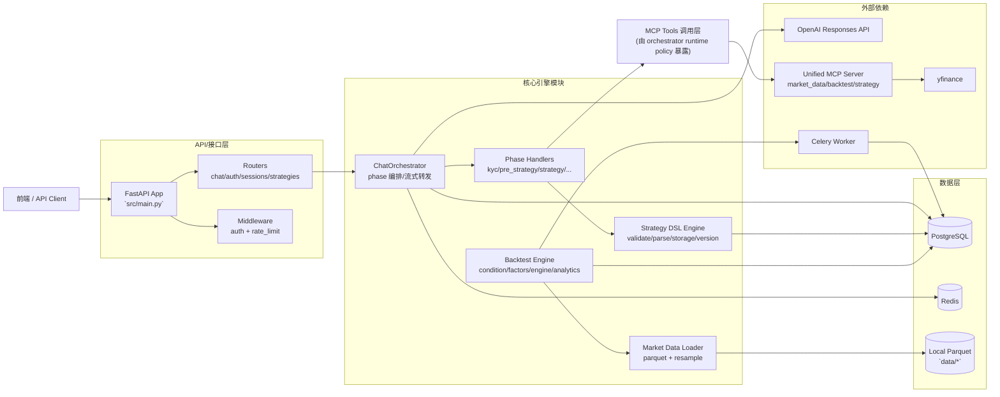

# Minsy Backend README（架构审计版）

> 本文档基于对 `backend/` 代码仓库的递归阅读生成；`tests/` 与 `src/scripts/` 已阅读用于理解系统，但按要求不做逐文件索引展开。

## A. 项目概览 + 快速开始 + 系统架构

### A.1 项目概览

#### 项目目标与核心能力
本项目是一个面向量化策略共创的后端 MVP：通过 FastAPI + OpenAI Responses + MCP 工具链，把用户从 KYC、策略范围确定、策略 DSL 设计、回测执行到结果迭代串成可流式交互的会话流程。

当前核心能力（基于代码现状）：
- 会话编排与阶段化 Agent：`kyc -> pre_strategy -> strategy` 为主流程，`stress_test`/`deployment` 目前保留兼容位。
- 策略 DSL 全链路：JSON Schema 校验 + 语义校验 + 解析 + 持久化 + 版本化（patch/diff/rollback）。
- 回测执行与结果分析：事件驱动回测引擎 + Celery 队列执行 + 结果分析工具（热力图、滚动指标、回撤曲线等）。
- MCP 工具统一暴露：market data / strategy / backtest 三类工具由统一 MCP server 提供。

#### 主要使用场景
- 场景 1：用户通过聊天逐步完成 KYC 与策略范围确认，进入策略 DSL 生成与修订。
- 场景 2：前端确认 DSL 后持久化为 `strategy_id`，随后在同一 strategy phase 发起回测并迭代参数。
- 场景 3：通过 MCP 对策略版本进行差异比较、回滚与可调参数探索。

#### 当前 MVP 范围（按代码真实边界）
- 已完成：KYC、pre-strategy、strategy 主流程；strategy 内回测迭代；版本化策略存储；MCP 工具化。
- 受限：`advance_to_stress_test` 在 API 层被显式忽略（仅记录 metadata）；stop criteria 仍是占位逻辑。
- 受限：回测服务当前只取 `universe.tickers` 的第一个标的执行（未做组合级回测）。

### A.2 系统架构图（当前实现）



#### 核心模块职责说明
- `ChatOrchestrator`（`src/agents/orchestrator.py`）：统一处理会话生命周期、OpenAI 流式事件转发、GenUI/状态补丁解析、phase 迁移与消息持久化。
- `Phase Handlers`（`src/agents/handlers/*.py`）：按 phase 负责提示词拼装、字段校验、artifact 更新与必要副作用（如 KYC 写入 `UserProfile`）。
- `Strategy DSL Engine`（`src/engine/strategy/*`）：完成 DSL 的 schema+语义校验、解析、存储、版本管理（patch/diff/rollback）和草稿缓存。
- `Backtest Engine`（`src/engine/backtest/*`）：执行事件驱动回测，输出交易、权益曲线、统计指标，并由 service 层封装为异步 job。
- `MCP Server & Tools`（`src/mcp/*`）：把 strategy/backtest/market_data 能力暴露为标准工具接口供 Agent 调用。
- `DataLoader`（`src/engine/data/data_loader.py`）：从本地 parquet 加载行情并支持 timeframe 归一化与重采样。

### A.3 技术栈与依赖

#### 语言与框架
- Python 3.12+（`pyproject.toml` 指定 `requires-python = ">=3.12"`）
- FastAPI + Uvicorn：HTTP API 与 SSE 流式响应
- SQLAlchemy (async) + asyncpg：PostgreSQL 数据访问
- Redis（`redis.asyncio`）：缓存与限流
- Celery：回测异步任务执行

#### 关键库与作用
- `openai`：Responses API 流式事件
- `mcp[cli]`：MCP server/tool 实现
- `pandas`/`numpy`/`pyarrow`：行情加载、因子与回测计算
- `ta-lib` / `pandas-ta`：技术指标计算后端
- `quantstats`：绩效指标封装
- `yfinance`：行情与元数据补充
- `bcrypt` + `pyjwt`：鉴权与令牌签发

### A.4 安装与启动

#### 环境要求
- Python: `>=3.12`
- PostgreSQL: 建议 `14+`
- Redis: 建议 `6+`
- 系统工具：`7z`（首次启动解压市场数据）、TA-Lib C 库（技术指标）
- 包管理：`uv`

#### 安装步骤
```bash
cd /Users/yifanwang/minsy_mvp_remastered/backend
uv sync
```

如本机缺少 TA-Lib/7z，请先安装系统依赖（示例）：
```bash
# macOS (Homebrew)
brew install ta-lib p7zip
```

#### 配置方式（`.env` 示例）
```env
APP_NAME=Minsy
APP_ENV=development
DEBUG=true
API_V1_PREFIX=/api/v1

OPENAI_API_KEY=<your_openai_api_key>
OPENAI_RESPONSE_MODEL=gpt-5
MCP_ENV=dev
MCP_SERVER_URL_DEV=http://127.0.0.1:8111/mcp
MCP_SERVER_URL_PROD=https://mcp.minsyai.com/mcp

POSTGRES_HOST=127.0.0.1
POSTGRES_PORT=5432
POSTGRES_USER=postgres
POSTGRES_PASSWORD=<password>
POSTGRES_DB=minsy_pgsql

REDIS_HOST=127.0.0.1
REDIS_PORT=6379
REDIS_DB=0

SECRET_KEY=<jwt_secret>
JWT_ALGORITHM=HS256
ACCESS_TOKEN_EXPIRE_MINUTES=1440
REFRESH_TOKEN_EXPIRE_DAYS=7
```

#### 启动命令
```bash
# 1) API
uv run uvicorn src.main:app --host 0.0.0.0 --port 8000 --reload

# 2) MCP server（另一个终端）
uv run python -m src.mcp.server --transport streamable-http --host 127.0.0.1 --port 8111

# 3) Celery worker（另一个终端）
uv run celery -A src.workers.celery_app.celery_app worker -l info -Q backtest
```

#### 验证方式
```bash
# 健康检查
curl -i http://127.0.0.1:8000/health

# 预期：200 + {"status":"ok",...}；若依赖异常可能返回 503 degraded
```

#### 常见排错
1. `RuntimeError: 7z extraction failed`：本机未安装 `7z`，安装 `p7zip` 后重试（`src/util/data_setup.py`）。
2. `Parquet support is unavailable`：缺少 `pyarrow`/`fastparquet`，执行 `uv sync` 重新安装依赖（`src/engine/data/data_loader.py`）。
3. `Redis client not initialized`：API 启动流程未完成或 Redis 未连通，先确认 `/health` 中 `redis=true`（`src/models/redis.py`）。
4. 指标报 `NotImplementedError`：当前环境缺少 TA-Lib/pandas-ta 部分能力（`src/engine/feature/indicators/categories/*.py`）。
5. Docker 容器启动失败（`api.main:app`）：当前 `Dockerfile` CMD 与代码入口不一致，需改为 `src.main:app`。

## B. 超详细文件索引（重点）

### B.1 目录树（排除 `tests/` 与 `src/scripts/` 目录内容）
```text
backend/
├── .github
│   └── workflows
│       └── deploy.yml
├── data
│   └── (本地 parquet 数据集，文件量大且为数据资产，索引仅聚焦代码/配置文本)
├── docs
│   └── RECENT_DOC_BUGFIX_FEATURES.md
├── logs
│   ├── code_audit_summary.json
│   ├── readme_inventory.json
│   └── strategy_backtest_coverage_guardrail_report.json
├── src
│   ├── agents
│   │   ├── handlers
│   │   │   ├── __init__.py
│   │   │   ├── deployment_handler.py
│   │   │   ├── kyc_handler.py
│   │   │   ├── pre_strategy_handler.py
│   │   │   ├── strategy_handler.py
│   │   │   ├── stress_test_handler.py
│   │   │   └── stub_handler.py
│   │   ├── skills
│   │   │   ├── deployment
│   │   │   │   └── skills.md
│   │   │   ├── kyc
│   │   │   │   └── skills.md
│   │   │   ├── pre_strategy
│   │   │   │   └── skills.md
│   │   │   ├── strategy
│   │   │   │   ├── stages
│   │   │   │   │   ├── artifact_ops.md
│   │   │   │   │   └── schema_only.md
│   │   │   │   └── skills.md
│   │   │   ├── strategy_patch
│   │   │   │   └── skills.md
│   │   │   ├── stress_test
│   │   │   │   ├── stages
│   │   │   │   │   ├── bootstrap.md
│   │   │   │   │   └── feedback.md
│   │   │   │   └── skills.md
│   │   │   ├── utils
│   │   │   │   ├── skills.md
│   │   │   │   └── tradingview.md
│   │   │   ├── deployment_skills.py
│   │   │   ├── kyc_skills.py
│   │   │   ├── pre_strategy_skills.py
│   │   │   ├── strategy_skills.py
│   │   │   └── stress_test_skills.py
│   │   ├── genui_registry.py
│   │   ├── handler_protocol.py
│   │   ├── handler_registry.py
│   │   ├── orchestrator.py
│   │   └── phases.py
│   ├── api
│   │   ├── middleware
│   │   │   ├── __init__.py
│   │   │   ├── auth.py
│   │   │   └── rate_limit.py
│   │   ├── routers
│   │   │   ├── __init__.py
│   │   │   ├── auth.py
│   │   │   ├── backtests.py
│   │   │   ├── chat.py
│   │   │   ├── health.py
│   │   │   ├── sessions.py
│   │   │   └── strategies.py
│   │   ├── schemas
│   │   │   ├── auth_schemas.py
│   │   │   ├── events.py
│   │   │   └── requests.py
│   │   ├── __init__.py
│   │   └── router.py
│   ├── engine
│   │   ├── backtest
│   │   │   ├── __init__.py
│   │   │   ├── analytics.py
│   │   │   ├── condition.py
│   │   │   ├── engine.py
│   │   │   ├── factors.py
│   │   │   ├── service.py
│   │   │   └── types.py
│   │   ├── data
│   │   │   ├── __init__.py
│   │   │   └── data_loader.py
│   │   ├── feature
│   │   │   ├── indicators
│   │   │   │   ├── categories
│   │   │   │   │   ├── __init__.py
│   │   │   │   │   ├── candle.py
│   │   │   │   │   ├── momentum.py
│   │   │   │   │   ├── overlap.py
│   │   │   │   │   ├── utils.py
│   │   │   │   │   ├── volatility.py
│   │   │   │   │   └── volume.py
│   │   │   │   ├── __init__.py
│   │   │   │   ├── base.py
│   │   │   │   ├── registry.py
│   │   │   │   └── wrapper.py
│   │   │   ├── __init__.py
│   │   │   ├── registry.py
│   │   │   └── specs.py
│   │   ├── performance
│   │   │   ├── __init__.py
│   │   │   └── quantstats_wrapper.py
│   │   ├── strategy
│   │   │   ├── assets
│   │   │   │   ├── DSL_SPEC.md
│   │   │   │   ├── SKILL.md
│   │   │   │   ├── example_strategy.json
│   │   │   │   └── strategy_dsl_schema.json
│   │   │   ├── __init__.py
│   │   │   ├── draft_store.py
│   │   │   ├── errors.py
│   │   │   ├── models.py
│   │   │   ├── parser.py
│   │   │   ├── pipeline.py
│   │   │   ├── schema.py
│   │   │   ├── semantic.py
│   │   │   └── storage.py
│   │   └── __init__.py
│   ├── mcp
│   │   ├── backtest
│   │   │   ├── __init__.py
│   │   │   └── tools.py
│   │   ├── market_data
│   │   │   ├── __init__.py
│   │   │   └── tools.py
│   │   ├── strategy
│   │   │   ├── skills
│   │   │   │   └── indicators
│   │   │   │       ├── atr.md
│   │   │   │       ├── bbands.md
│   │   │   │       ├── ema.md
│   │   │   │       ├── macd.md
│   │   │   │       ├── rsi.md
│   │   │   │       └── stoch.md
│   │   │   ├── __init__.py
│   │   │   └── tools.py
│   │   ├── __init__.py
│   │   ├── _utils.py
│   │   └── server.py
│   ├── models
│   │   ├── __init__.py
│   │   ├── backtest.py
│   │   ├── base.py
│   │   ├── database.py
│   │   ├── deployment.py
│   │   ├── phase_transition.py
│   │   ├── redis.py
│   │   ├── session.py
│   │   ├── strategy.py
│   │   ├── strategy_revision.py
│   │   └── user.py
│   ├── scripts
│   │   └── (目录内容按要求不展开；已阅读用于理解系统)
│   ├── services
│   │   ├── auth_service.py
│   │   └── openai_stream_service.py
│   ├── util
│   │   ├── __init__.py
│   │   ├── data_setup.py
│   │   └── logger.py
│   ├── workers
│   │   ├── __init__.py
│   │   ├── backtest_tasks.py
│   │   └── celery_app.py
│   ├── __init__.py
│   ├── config.py
│   ├── dependencies.py
│   └── main.py
├── tests
│   └── (目录内容按要求不展开；已阅读用于理解系统)
├── .env
├── .gitignore
├── Caddyfile
├── DSL_BACKTEST_MCP_REPORT.md
├── Dockerfile
├── README.md
└── pyproject.toml
```

### B.2 文件级索引（逐文件）

#### `.env`
- 文件作用：运行时环境变量（OpenAI、MCP、PostgreSQL、Redis、JWT、CORS、Celery 等）。

#### `.github/workflows/deploy.yml`
- 文件作用：主分支推送后通过 SSH 部署到 GCP VM，包含依赖同步、Caddy 更新与服务重启。

#### `.gitignore`
- 文件作用：Git 忽略规则，避免提交缓存、虚拟环境与日志等产物。

#### `Caddyfile`
- 文件作用：生产反向代理配置，分别暴露 FastAPI 与 MCP 服务，并为 SSE 关闭缓冲。

#### `DSL_BACKTEST_MCP_REPORT.md`
- 文件作用：现有 DSL/回测/MCP 代码结构梳理报告。

#### `Dockerfile`
- 文件作用：容器化构建脚本（Python 3.12 + TA-Lib + uv），用于后端镜像打包与运行。

#### `README.md`
- 文件作用：项目说明文档（本次重写）。

#### `docs/RECENT_DOC_BUGFIX_FEATURES.md`
- 文件作用：近期文档记录的缺陷修复与新增能力摘要。

#### `logs/code_audit_summary.json`
- 文件作用：Python AST 审计结果（公开符号、文档字符串、导入关系）。

#### `logs/readme_inventory.json`
- 文件作用：README 生成过程的索引中间产物，记录文本文件清单与公开符号抽取结果。

#### `logs/strategy_backtest_coverage_guardrail_report.json`
- 文件作用：策略回测 guardrail 真机探针报告样例。

#### `pyproject.toml`
- 文件作用：项目依赖、Python 版本、Ruff 与 Pytest 配置入口。

#### `src/__init__.py`
- 文件作用：该模块为系统运行提供通用实现。
- 模块级调用方（静态导入）：`tests/test_agents/test_orchestrator_runtime_policy.py`, `tests/test_agents/test_pre_strategy_dynamic_rules.py`
- 主要副作用：主要为纯计算/数据转换，无显式外部副作用。
- 对外暴露符号：无（仅常量、导入或私有实现）。

#### `src/agents/genui_registry.py`
- 文件作用：该模块主要实现：GenUI payload normalizer registry.
- 模块级调用方（静态导入）：`src/agents/orchestrator.py`, `tests/test_agents/test_genui_registry.py`
- 主要副作用：主要为纯计算/数据转换，无显式外部副作用。

| 对外符号 (`name(signature)`) | 功能说明 | 输入/输出 | 副作用 | 被哪些模块调用（静态） |
|---|---|---|---|---|
| `register_genui_normalizer(payload_type: str, normalizer: GenUiNormalizer)` | 功能：`register_genui_normalizer` 为该模块公开调用入口之一。 | 输入参数：payload_type: str, normalizer: GenUiNormalizer；输出：None。 | 主要为纯计算/数据转换，无显式外部副作用。 | `src/agents/orchestrator.py`, `tests/test_agents/test_genui_registry.py` |
| `get_genui_normalizer(payload_type: str)` | 功能：`get_genui_normalizer` 为该模块公开调用入口之一。 | 输入参数：payload_type: str；输出：GenUiNormalizer \| None。 | 主要为纯计算/数据转换，无显式外部副作用。 | `src/agents/orchestrator.py`, `tests/test_agents/test_genui_registry.py` |
| `normalize_genui_payloads(payloads: list[dict[str, Any]], *, allow_passthrough_unregistered: bool=True)` | 功能：`normalize_genui_payloads` 为该模块公开调用入口之一。 | 输入参数：payloads: list[dict[str, Any]], *, allow_passthrough_unregistered: bool=True；输出：list[dict[str, Any]]。 | 主要为纯计算/数据转换，无显式外部副作用。 | `src/agents/orchestrator.py`, `tests/test_agents/test_genui_registry.py` |

#### `src/agents/handler_protocol.py`
- 文件作用：该模块主要实现：PhaseHandler protocol – the contract every phase agent must satisfy.
- 模块级调用方（静态导入）：`src/agents/handler_registry.py`, `src/agents/handlers/deployment_handler.py`, `src/agents/handlers/kyc_handler.py`, `src/agents/handlers/pre_strategy_handler.py`, `src/agents/handlers/strategy_handler.py`, `src/agents/handlers/stress_test_handler.py` 等 10 个模块
- 主要副作用：PostgreSQL/ORM 读写

| 对外符号 (`name(signature)`) | 功能说明 | 输入/输出 | 副作用 | 被哪些模块调用（静态） |
|---|---|---|---|---|
| `RuntimePolicy()` | 功能：Per-turn runtime controls for prompt/tool exposure. | 构造参数请见实现与类型标注。 | PostgreSQL/ORM 读写 | `src/agents/handler_registry.py`, `src/agents/handlers/deployment_handler.py`, `src/agents/handlers/kyc_handler.py`, `src/agents/handlers/pre_strategy_handler.py`, `src/agents/handlers/strategy_handler.py`, `src/agents/handlers/stress_test_handler.py` 等 10 个模块 |
| `PhaseContext()` | 功能：Read-only snapshot of data a handler needs to do its work. | 构造参数请见实现与类型标注。 | PostgreSQL/ORM 读写 | `src/agents/handler_registry.py`, `src/agents/handlers/deployment_handler.py`, `src/agents/handlers/kyc_handler.py`, `src/agents/handlers/pre_strategy_handler.py`, `src/agents/handlers/strategy_handler.py`, `src/agents/handlers/stress_test_handler.py` 等 10 个模块 |
| `PromptPieces()` | 功能：What the handler returns for the AI call. | 构造参数请见实现与类型标注。 | PostgreSQL/ORM 读写 | `src/agents/handler_registry.py`, `src/agents/handlers/deployment_handler.py`, `src/agents/handlers/kyc_handler.py`, `src/agents/handlers/pre_strategy_handler.py`, `src/agents/handlers/strategy_handler.py`, `src/agents/handlers/stress_test_handler.py` 等 10 个模块 |
| `PostProcessResult()` | 功能：What the handler returns after processing the AI's output. | 构造参数请见实现与类型标注。 | PostgreSQL/ORM 读写 | `src/agents/handler_registry.py`, `src/agents/handlers/deployment_handler.py`, `src/agents/handlers/kyc_handler.py`, `src/agents/handlers/pre_strategy_handler.py`, `src/agents/handlers/strategy_handler.py`, `src/agents/handlers/stress_test_handler.py` 等 10 个模块 |
| `PhaseHandler()` | 功能：Contract that each phase handler must implement. | 构造参数请见实现与类型标注。 | PostgreSQL/ORM 读写 | `src/agents/handler_registry.py`, `src/agents/handlers/deployment_handler.py`, `src/agents/handlers/kyc_handler.py`, `src/agents/handlers/pre_strategy_handler.py`, `src/agents/handlers/strategy_handler.py`, `src/agents/handlers/stress_test_handler.py` 等 10 个模块 |
| `PhaseHandler.phase_name(self)` | 功能：The Phase enum value this handler is responsible for. | 输入参数：self；输出：str。 | PostgreSQL/ORM 读写 | `src/agents/handler_registry.py`, `src/agents/handlers/deployment_handler.py`, `src/agents/handlers/kyc_handler.py`, `src/agents/handlers/pre_strategy_handler.py`, `src/agents/handlers/strategy_handler.py`, `src/agents/handlers/stress_test_handler.py` 等 10 个模块 |
| `PhaseHandler.required_fields(self)` | 功能：Canonical ordered list of fields this phase collects. | 输入参数：self；输出：list[str]。 | PostgreSQL/ORM 读写 | `src/agents/handler_registry.py`, `src/agents/handlers/deployment_handler.py`, `src/agents/handlers/kyc_handler.py`, `src/agents/handlers/pre_strategy_handler.py`, `src/agents/handlers/strategy_handler.py`, `src/agents/handlers/stress_test_handler.py` 等 10 个模块 |
| `PhaseHandler.valid_values(self)` | 功能：Allowed enum values for each field. | 输入参数：self；输出：dict[str, set[str]]。 | PostgreSQL/ORM 读写 | `src/agents/handler_registry.py`, `src/agents/handlers/deployment_handler.py`, `src/agents/handlers/kyc_handler.py`, `src/agents/handlers/pre_strategy_handler.py`, `src/agents/handlers/strategy_handler.py`, `src/agents/handlers/stress_test_handler.py` 等 10 个模块 |
| `PhaseHandler.build_prompt(self, ctx: PhaseContext, user_message: str)` | 功能：Build static instructions + enriched input for the AI call. | 输入参数：self, ctx: PhaseContext, user_message: str；输出：PromptPieces。 | PostgreSQL/ORM 读写 | `src/agents/handler_registry.py`, `src/agents/handlers/deployment_handler.py`, `src/agents/handlers/kyc_handler.py`, `src/agents/handlers/pre_strategy_handler.py`, `src/agents/handlers/strategy_handler.py`, `src/agents/handlers/stress_test_handler.py` 等 10 个模块 |
| `PhaseHandler.post_process(self, ctx: PhaseContext, raw_patches: list[dict[str, Any]], db: AsyncSession)` | 功能：Validate patches, mutate artifacts, persist side-effects. | 输入参数：self, ctx: PhaseContext, raw_patches: list[dict[str, Any]], db: AsyncSession；输出：PostProcessResult。 | PostgreSQL/ORM 读写 | `src/agents/handler_registry.py`, `src/agents/handlers/deployment_handler.py`, `src/agents/handlers/kyc_handler.py`, `src/agents/handlers/pre_strategy_handler.py`, `src/agents/handlers/strategy_handler.py`, `src/agents/handlers/stress_test_handler.py` 等 10 个模块 |
| `PhaseHandler.filter_genui(self, payload: dict[str, Any], ctx: PhaseContext)` | 功能：可选过滤 GenUI payload（例如在不同 phase 隐藏内部字段）。 | 输入参数：self, payload: dict[str, Any], ctx: PhaseContext；输出：dict[str, Any] \| None。 | PostgreSQL/ORM 读写 | `src/agents/handler_registry.py`, `src/agents/handlers/deployment_handler.py`, `src/agents/handlers/kyc_handler.py`, `src/agents/handlers/pre_strategy_handler.py`, `src/agents/handlers/strategy_handler.py`, `src/agents/handlers/stress_test_handler.py` 等 10 个模块 |
| `PhaseHandler.init_artifacts(self)` | 功能：Return the initial artifacts block for this phase. | 输入参数：self；输出：dict[str, Any]。 | PostgreSQL/ORM 读写 | `src/agents/handler_registry.py`, `src/agents/handlers/deployment_handler.py`, `src/agents/handlers/kyc_handler.py`, `src/agents/handlers/pre_strategy_handler.py`, `src/agents/handlers/strategy_handler.py`, `src/agents/handlers/stress_test_handler.py` 等 10 个模块 |
| `PhaseHandler.build_phase_entry_guidance(self, ctx: PhaseContext)` | 功能：Return a short user-facing handoff sentence when entering this phase. | 输入参数：self, ctx: PhaseContext；输出：str \| None。 | PostgreSQL/ORM 读写 | `src/agents/handler_registry.py`, `src/agents/handlers/deployment_handler.py`, `src/agents/handlers/kyc_handler.py`, `src/agents/handlers/pre_strategy_handler.py`, `src/agents/handlers/strategy_handler.py`, `src/agents/handlers/stress_test_handler.py` 等 10 个模块 |

#### `src/agents/handler_registry.py`
- 文件作用：该模块主要实现：Phase handler registry – central mapping from Phase -> PhaseHandler.
- 模块级调用方（静态导入）：`src/agents/orchestrator.py`, `tests/test_agents/test_orchestrator_runtime_policy.py`, `tests/test_agents/test_phase_handlers.py`
- 主要副作用：主要为纯计算/数据转换，无显式外部副作用。

| 对外符号 (`name(signature)`) | 功能说明 | 输入/输出 | 副作用 | 被哪些模块调用（静态） |
|---|---|---|---|---|
| `get_handler(phase: str)` | 功能：Look up the handler for *phase*, or ``None`` if not registered. | 输入参数：phase: str；输出：PhaseHandler \| None。 | 主要为纯计算/数据转换，无显式外部副作用。 | `src/agents/orchestrator.py`, `tests/test_agents/test_orchestrator_runtime_policy.py`, `tests/test_agents/test_phase_handlers.py` |
| `init_all_artifacts()` | 功能：Build a fresh artifacts dict with every phase's initial block. | 输入参数：无；输出：dict[str, Any]。 | 主要为纯计算/数据转换，无显式外部副作用。 | `src/agents/orchestrator.py`, `tests/test_agents/test_orchestrator_runtime_policy.py`, `tests/test_agents/test_phase_handlers.py` |

#### `src/agents/handlers/__init__.py`
- 文件作用：该模块主要实现：Phase handler implementations.
- 模块级调用方（静态导入）：`tests/test_agents/test_pre_strategy_dynamic_rules.py`
- 主要副作用：主要为纯计算/数据转换，无显式外部副作用。
- 对外暴露符号：无（仅常量、导入或私有实现）。

#### `src/agents/handlers/deployment_handler.py`
- 文件作用：该模块主要实现：Deployment phase handler.
- 模块级调用方（静态导入）：`src/agents/handler_registry.py`, `src/agents/handlers/__init__.py`, `tests/test_agents/test_phase_handlers.py`
- 主要副作用：PostgreSQL/ORM 读写；外部网络请求

| 对外符号 (`name(signature)`) | 功能说明 | 输入/输出 | 副作用 | 被哪些模块调用（静态） |
|---|---|---|---|---|
| `DeploymentHandler()` | 功能：Implements deployment readiness/confirmation phase. | 构造参数请见实现与类型标注。 | PostgreSQL/ORM 读写；外部网络请求 | `src/agents/handler_registry.py`, `src/agents/handlers/__init__.py`, `tests/test_agents/test_phase_handlers.py` |
| `DeploymentHandler.phase_name(self)` | 功能：`phase_name` 为该模块公开调用入口之一。 | 输入参数：self；输出：str。 | PostgreSQL/ORM 读写；外部网络请求 | `src/agents/handler_registry.py`, `src/agents/handlers/__init__.py`, `tests/test_agents/test_phase_handlers.py` |
| `DeploymentHandler.required_fields(self)` | 功能：`required_fields` 为该模块公开调用入口之一。 | 输入参数：self；输出：list[str]。 | PostgreSQL/ORM 读写；外部网络请求 | `src/agents/handler_registry.py`, `src/agents/handlers/__init__.py`, `tests/test_agents/test_phase_handlers.py` |
| `DeploymentHandler.valid_values(self)` | 功能：`valid_values` 为该模块公开调用入口之一。 | 输入参数：self；输出：dict[str, set[str]]。 | PostgreSQL/ORM 读写；外部网络请求 | `src/agents/handler_registry.py`, `src/agents/handlers/__init__.py`, `tests/test_agents/test_phase_handlers.py` |
| `DeploymentHandler.build_prompt(self, ctx: PhaseContext, user_message: str)` | 功能：`build_prompt` 为该模块公开调用入口之一。 | 输入参数：self, ctx: PhaseContext, user_message: str；输出：PromptPieces。 | PostgreSQL/ORM 读写；外部网络请求 | `src/agents/handler_registry.py`, `src/agents/handlers/__init__.py`, `tests/test_agents/test_phase_handlers.py` |
| `DeploymentHandler.post_process(self, ctx: PhaseContext, raw_patches: list[dict[str, Any]], db: AsyncSession)` | 功能：`post_process` 为该模块公开调用入口之一。 | 输入参数：self, ctx: PhaseContext, raw_patches: list[dict[str, Any]], db: AsyncSession；输出：PostProcessResult。 | PostgreSQL/ORM 读写；外部网络请求 | `src/agents/handler_registry.py`, `src/agents/handlers/__init__.py`, `tests/test_agents/test_phase_handlers.py` |
| `DeploymentHandler.filter_genui(self, payload: dict[str, Any], ctx: PhaseContext)` | 功能：`filter_genui` 为该模块公开调用入口之一。 | 输入参数：self, payload: dict[str, Any], ctx: PhaseContext；输出：dict[str, Any] \| None。 | PostgreSQL/ORM 读写；外部网络请求 | `src/agents/handler_registry.py`, `src/agents/handlers/__init__.py`, `tests/test_agents/test_phase_handlers.py` |
| `DeploymentHandler.init_artifacts(self)` | 功能：`init_artifacts` 为该模块公开调用入口之一。 | 输入参数：self；输出：dict[str, Any]。 | PostgreSQL/ORM 读写；外部网络请求 | `src/agents/handler_registry.py`, `src/agents/handlers/__init__.py`, `tests/test_agents/test_phase_handlers.py` |
| `DeploymentHandler.build_phase_entry_guidance(self, ctx: PhaseContext)` | 功能：`build_phase_entry_guidance` 为该模块公开调用入口之一。 | 输入参数：self, ctx: PhaseContext；输出：str \| None。 | PostgreSQL/ORM 读写；外部网络请求 | `src/agents/handler_registry.py`, `src/agents/handlers/__init__.py`, `tests/test_agents/test_phase_handlers.py` |

#### `src/agents/handlers/kyc_handler.py`
- 文件作用：该模块主要实现：KYC phase handler – collects 3 risk-profile fields.
- 模块级调用方（静态导入）：`src/agents/handler_registry.py`, `src/agents/handlers/__init__.py`, `src/agents/orchestrator.py`
- 主要副作用：PostgreSQL/ORM 读写；外部网络请求

| 对外符号 (`name(signature)`) | 功能说明 | 输入/输出 | 副作用 | 被哪些模块调用（静态） |
|---|---|---|---|---|
| `KYCHandler()` | 功能：Implements :class:`PhaseHandler` for the KYC phase. | 构造参数请见实现与类型标注。 | PostgreSQL/ORM 读写；外部网络请求 | `src/agents/handler_registry.py`, `src/agents/handlers/__init__.py`, `src/agents/orchestrator.py` |
| `KYCHandler.phase_name(self)` | 功能：`phase_name` 为该模块公开调用入口之一。 | 输入参数：self；输出：str。 | PostgreSQL/ORM 读写；外部网络请求 | `src/agents/handler_registry.py`, `src/agents/handlers/__init__.py`, `src/agents/orchestrator.py` |
| `KYCHandler.required_fields(self)` | 功能：`required_fields` 为该模块公开调用入口之一。 | 输入参数：self；输出：list[str]。 | PostgreSQL/ORM 读写；外部网络请求 | `src/agents/handler_registry.py`, `src/agents/handlers/__init__.py`, `src/agents/orchestrator.py` |
| `KYCHandler.valid_values(self)` | 功能：`valid_values` 为该模块公开调用入口之一。 | 输入参数：self；输出：dict[str, set[str]]。 | PostgreSQL/ORM 读写；外部网络请求 | `src/agents/handler_registry.py`, `src/agents/handlers/__init__.py`, `src/agents/orchestrator.py` |
| `KYCHandler.build_prompt(self, ctx: PhaseContext, user_message: str)` | 功能：`build_prompt` 为该模块公开调用入口之一。 | 输入参数：self, ctx: PhaseContext, user_message: str；输出：PromptPieces。 | PostgreSQL/ORM 读写；外部网络请求 | `src/agents/handler_registry.py`, `src/agents/handlers/__init__.py`, `src/agents/orchestrator.py` |
| `KYCHandler.post_process(self, ctx: PhaseContext, raw_patches: list[dict[str, Any]], db: AsyncSession)` | 功能：`post_process` 为该模块公开调用入口之一。 | 输入参数：self, ctx: PhaseContext, raw_patches: list[dict[str, Any]], db: AsyncSession；输出：PostProcessResult。 | PostgreSQL/ORM 读写；外部网络请求 | `src/agents/handler_registry.py`, `src/agents/handlers/__init__.py`, `src/agents/orchestrator.py` |
| `KYCHandler.filter_genui(self, payload: dict[str, Any], ctx: PhaseContext)` | 功能：`filter_genui` 为该模块公开调用入口之一。 | 输入参数：self, payload: dict[str, Any], ctx: PhaseContext；输出：dict[str, Any] \| None。 | PostgreSQL/ORM 读写；外部网络请求 | `src/agents/handler_registry.py`, `src/agents/handlers/__init__.py`, `src/agents/orchestrator.py` |
| `KYCHandler.init_artifacts(self)` | 功能：`init_artifacts` 为该模块公开调用入口之一。 | 输入参数：self；输出：dict[str, Any]。 | PostgreSQL/ORM 读写；外部网络请求 | `src/agents/handler_registry.py`, `src/agents/handlers/__init__.py`, `src/agents/orchestrator.py` |
| `KYCHandler.build_phase_entry_guidance(self, ctx: PhaseContext)` | 功能：`build_phase_entry_guidance` 为该模块公开调用入口之一。 | 输入参数：self, ctx: PhaseContext；输出：str \| None。 | PostgreSQL/ORM 读写；外部网络请求 | `src/agents/handler_registry.py`, `src/agents/handlers/__init__.py`, `src/agents/orchestrator.py` |
| `KYCHandler.build_profile_from_user_profile(self, user_profile: UserProfile \| None)` | 功能：Extract KYC fields from a persisted UserProfile. | 输入参数：self, user_profile: UserProfile \| None；输出：dict[str, str]。 | PostgreSQL/ORM 读写；外部网络请求 | `src/agents/handler_registry.py`, `src/agents/handlers/__init__.py`, `src/agents/orchestrator.py` |
| `KYCHandler.is_profile_complete(self, user_profile: UserProfile \| None)` | 功能：Return True if all KYC fields are present and valid. | 输入参数：self, user_profile: UserProfile \| None；输出：bool。 | PostgreSQL/ORM 读写；外部网络请求 | `src/agents/handler_registry.py`, `src/agents/handlers/__init__.py`, `src/agents/orchestrator.py` |

#### `src/agents/handlers/pre_strategy_handler.py`
- 文件作用：该模块主要实现：Pre-strategy phase handler – collects market/instrument/frequency/holding fields.
- 模块级调用方（静态导入）：`src/agents/handler_registry.py`, `src/agents/handlers/__init__.py`, `tests/test_agents/test_pre_strategy_dynamic_rules.py`
- 主要副作用：PostgreSQL/ORM 读写；外部网络请求

| 对外符号 (`name(signature)`) | 功能说明 | 输入/输出 | 副作用 | 被哪些模块调用（静态） |
|---|---|---|---|---|
| `PreStrategyHandler()` | 功能：Implements :class:`PhaseHandler` for the pre-strategy phase. | 构造参数请见实现与类型标注。 | PostgreSQL/ORM 读写；外部网络请求 | `src/agents/handler_registry.py`, `src/agents/handlers/__init__.py`, `tests/test_agents/test_pre_strategy_dynamic_rules.py` |
| `PreStrategyHandler.phase_name(self)` | 功能：`phase_name` 为该模块公开调用入口之一。 | 输入参数：self；输出：str。 | PostgreSQL/ORM 读写；外部网络请求 | `src/agents/handler_registry.py`, `src/agents/handlers/__init__.py`, `tests/test_agents/test_pre_strategy_dynamic_rules.py` |
| `PreStrategyHandler.required_fields(self)` | 功能：`required_fields` 为该模块公开调用入口之一。 | 输入参数：self；输出：list[str]。 | PostgreSQL/ORM 读写；外部网络请求 | `src/agents/handler_registry.py`, `src/agents/handlers/__init__.py`, `tests/test_agents/test_pre_strategy_dynamic_rules.py` |
| `PreStrategyHandler.valid_values(self)` | 功能：`valid_values` 为该模块公开调用入口之一。 | 输入参数：self；输出：dict[str, set[str]]。 | PostgreSQL/ORM 读写；外部网络请求 | `src/agents/handler_registry.py`, `src/agents/handlers/__init__.py`, `tests/test_agents/test_pre_strategy_dynamic_rules.py` |
| `PreStrategyHandler.build_prompt(self, ctx: PhaseContext, user_message: str)` | 功能：`build_prompt` 为该模块公开调用入口之一。 | 输入参数：self, ctx: PhaseContext, user_message: str；输出：PromptPieces。 | PostgreSQL/ORM 读写；外部网络请求 | `src/agents/handler_registry.py`, `src/agents/handlers/__init__.py`, `tests/test_agents/test_pre_strategy_dynamic_rules.py` |
| `PreStrategyHandler.post_process(self, ctx: PhaseContext, raw_patches: list[dict[str, Any]], db: AsyncSession)` | 功能：`post_process` 为该模块公开调用入口之一。 | 输入参数：self, ctx: PhaseContext, raw_patches: list[dict[str, Any]], db: AsyncSession；输出：PostProcessResult。 | PostgreSQL/ORM 读写；外部网络请求 | `src/agents/handler_registry.py`, `src/agents/handlers/__init__.py`, `tests/test_agents/test_pre_strategy_dynamic_rules.py` |
| `PreStrategyHandler.filter_genui(self, payload: dict[str, Any], ctx: PhaseContext)` | 功能：`filter_genui` 为该模块公开调用入口之一。 | 输入参数：self, payload: dict[str, Any], ctx: PhaseContext；输出：dict[str, Any] \| None。 | PostgreSQL/ORM 读写；外部网络请求 | `src/agents/handler_registry.py`, `src/agents/handlers/__init__.py`, `tests/test_agents/test_pre_strategy_dynamic_rules.py` |
| `PreStrategyHandler.init_artifacts(self)` | 功能：`init_artifacts` 为该模块公开调用入口之一。 | 输入参数：self；输出：dict[str, Any]。 | PostgreSQL/ORM 读写；外部网络请求 | `src/agents/handler_registry.py`, `src/agents/handlers/__init__.py`, `tests/test_agents/test_pre_strategy_dynamic_rules.py` |
| `PreStrategyHandler.build_phase_entry_guidance(self, ctx: PhaseContext)` | 功能：`build_phase_entry_guidance` 为该模块公开调用入口之一。 | 输入参数：self, ctx: PhaseContext；输出：str \| None。 | PostgreSQL/ORM 读写；外部网络请求 | `src/agents/handler_registry.py`, `src/agents/handlers/__init__.py`, `tests/test_agents/test_pre_strategy_dynamic_rules.py` |

#### `src/agents/handlers/strategy_handler.py`
- 文件作用：该模块主要实现：Strategy phase handler.
- 模块级调用方（静态导入）：`src/agents/handler_registry.py`, `src/agents/handlers/__init__.py`, `tests/test_agents/test_phase_handlers.py`
- 主要副作用：PostgreSQL/ORM 读写；外部网络请求

| 对外符号 (`name(signature)`) | 功能说明 | 输入/输出 | 副作用 | 被哪些模块调用（静态） |
|---|---|---|---|---|
| `StrategyHandler()` | 功能：Implements strategy design + DSL persistence phase. | 构造参数请见实现与类型标注。 | PostgreSQL/ORM 读写；外部网络请求 | `src/agents/handler_registry.py`, `src/agents/handlers/__init__.py`, `tests/test_agents/test_phase_handlers.py` |
| `StrategyHandler.phase_name(self)` | 功能：`phase_name` 为该模块公开调用入口之一。 | 输入参数：self；输出：str。 | PostgreSQL/ORM 读写；外部网络请求 | `src/agents/handler_registry.py`, `src/agents/handlers/__init__.py`, `tests/test_agents/test_phase_handlers.py` |
| `StrategyHandler.required_fields(self)` | 功能：`required_fields` 为该模块公开调用入口之一。 | 输入参数：self；输出：list[str]。 | PostgreSQL/ORM 读写；外部网络请求 | `src/agents/handler_registry.py`, `src/agents/handlers/__init__.py`, `tests/test_agents/test_phase_handlers.py` |
| `StrategyHandler.valid_values(self)` | 功能：`valid_values` 为该模块公开调用入口之一。 | 输入参数：self；输出：dict[str, set[str]]。 | PostgreSQL/ORM 读写；外部网络请求 | `src/agents/handler_registry.py`, `src/agents/handlers/__init__.py`, `tests/test_agents/test_phase_handlers.py` |
| `StrategyHandler.build_prompt(self, ctx: PhaseContext, user_message: str)` | 功能：`build_prompt` 为该模块公开调用入口之一。 | 输入参数：self, ctx: PhaseContext, user_message: str；输出：PromptPieces。 | PostgreSQL/ORM 读写；外部网络请求 | `src/agents/handler_registry.py`, `src/agents/handlers/__init__.py`, `tests/test_agents/test_phase_handlers.py` |
| `StrategyHandler.post_process(self, ctx: PhaseContext, raw_patches: list[dict[str, Any]], db: AsyncSession)` | 功能：`post_process` 为该模块公开调用入口之一。 | 输入参数：self, ctx: PhaseContext, raw_patches: list[dict[str, Any]], db: AsyncSession；输出：PostProcessResult。 | PostgreSQL/ORM 读写；外部网络请求 | `src/agents/handler_registry.py`, `src/agents/handlers/__init__.py`, `tests/test_agents/test_phase_handlers.py` |
| `StrategyHandler.filter_genui(self, payload: dict[str, Any], ctx: PhaseContext)` | 功能：`filter_genui` 为该模块公开调用入口之一。 | 输入参数：self, payload: dict[str, Any], ctx: PhaseContext；输出：dict[str, Any] \| None。 | PostgreSQL/ORM 读写；外部网络请求 | `src/agents/handler_registry.py`, `src/agents/handlers/__init__.py`, `tests/test_agents/test_phase_handlers.py` |
| `StrategyHandler.init_artifacts(self)` | 功能：`init_artifacts` 为该模块公开调用入口之一。 | 输入参数：self；输出：dict[str, Any]。 | PostgreSQL/ORM 读写；外部网络请求 | `src/agents/handler_registry.py`, `src/agents/handlers/__init__.py`, `tests/test_agents/test_phase_handlers.py` |
| `StrategyHandler.build_phase_entry_guidance(self, ctx: PhaseContext)` | 功能：`build_phase_entry_guidance` 为该模块公开调用入口之一。 | 输入参数：self, ctx: PhaseContext；输出：str \| None。 | PostgreSQL/ORM 读写；外部网络请求 | `src/agents/handler_registry.py`, `src/agents/handlers/__init__.py`, `tests/test_agents/test_phase_handlers.py` |

#### `src/agents/handlers/stress_test_handler.py`
- 文件作用：该模块主要实现：Stress-test phase handler.
- 模块级调用方（静态导入）：`src/agents/handler_registry.py`, `src/agents/handlers/__init__.py`, `tests/test_agents/test_phase_handlers.py`
- 主要副作用：PostgreSQL/ORM 读写；外部网络请求

| 对外符号 (`name(signature)`) | 功能说明 | 输入/输出 | 副作用 | 被哪些模块调用（静态） |
|---|---|---|---|---|
| `StressTestHandler()` | 功能：Legacy stress-test phase handler. | 构造参数请见实现与类型标注。 | PostgreSQL/ORM 读写；外部网络请求 | `src/agents/handler_registry.py`, `src/agents/handlers/__init__.py`, `tests/test_agents/test_phase_handlers.py` |
| `StressTestHandler.phase_name(self)` | 功能：`phase_name` 为该模块公开调用入口之一。 | 输入参数：self；输出：str。 | PostgreSQL/ORM 读写；外部网络请求 | `src/agents/handler_registry.py`, `src/agents/handlers/__init__.py`, `tests/test_agents/test_phase_handlers.py` |
| `StressTestHandler.required_fields(self)` | 功能：`required_fields` 为该模块公开调用入口之一。 | 输入参数：self；输出：list[str]。 | PostgreSQL/ORM 读写；外部网络请求 | `src/agents/handler_registry.py`, `src/agents/handlers/__init__.py`, `tests/test_agents/test_phase_handlers.py` |
| `StressTestHandler.valid_values(self)` | 功能：`valid_values` 为该模块公开调用入口之一。 | 输入参数：self；输出：dict[str, set[str]]。 | PostgreSQL/ORM 读写；外部网络请求 | `src/agents/handler_registry.py`, `src/agents/handlers/__init__.py`, `tests/test_agents/test_phase_handlers.py` |
| `StressTestHandler.build_prompt(self, ctx: PhaseContext, user_message: str)` | 功能：`build_prompt` 为该模块公开调用入口之一。 | 输入参数：self, ctx: PhaseContext, user_message: str；输出：PromptPieces。 | PostgreSQL/ORM 读写；外部网络请求 | `src/agents/handler_registry.py`, `src/agents/handlers/__init__.py`, `tests/test_agents/test_phase_handlers.py` |
| `StressTestHandler.post_process(self, ctx: PhaseContext, raw_patches: list[dict[str, Any]], db: AsyncSession)` | 功能：`post_process` 为该模块公开调用入口之一。 | 输入参数：self, ctx: PhaseContext, raw_patches: list[dict[str, Any]], db: AsyncSession；输出：PostProcessResult。 | PostgreSQL/ORM 读写；外部网络请求 | `src/agents/handler_registry.py`, `src/agents/handlers/__init__.py`, `tests/test_agents/test_phase_handlers.py` |
| `StressTestHandler.filter_genui(self, payload: dict[str, Any], ctx: PhaseContext)` | 功能：`filter_genui` 为该模块公开调用入口之一。 | 输入参数：self, payload: dict[str, Any], ctx: PhaseContext；输出：dict[str, Any] \| None。 | PostgreSQL/ORM 读写；外部网络请求 | `src/agents/handler_registry.py`, `src/agents/handlers/__init__.py`, `tests/test_agents/test_phase_handlers.py` |
| `StressTestHandler.init_artifacts(self)` | 功能：`init_artifacts` 为该模块公开调用入口之一。 | 输入参数：self；输出：dict[str, Any]。 | PostgreSQL/ORM 读写；外部网络请求 | `src/agents/handler_registry.py`, `src/agents/handlers/__init__.py`, `tests/test_agents/test_phase_handlers.py` |
| `StressTestHandler.build_phase_entry_guidance(self, ctx: PhaseContext)` | 功能：`build_phase_entry_guidance` 为该模块公开调用入口之一。 | 输入参数：self, ctx: PhaseContext；输出：str \| None。 | PostgreSQL/ORM 读写；外部网络请求 | `src/agents/handler_registry.py`, `src/agents/handlers/__init__.py`, `tests/test_agents/test_phase_handlers.py` |

#### `src/agents/handlers/stub_handler.py`
- 文件作用：该模块主要实现：Stub phase handler for phases not yet implemented (strategy, stress_test, deployment).
- 模块级调用方（静态导入）：`src/agents/handlers/__init__.py`, `tests/test_agents/test_stub_handler_stage_loading.py`
- 主要副作用：PostgreSQL/ORM 读写；文件 I/O

| 对外符号 (`name(signature)`) | 功能说明 | 输入/输出 | 副作用 | 被哪些模块调用（静态） |
|---|---|---|---|---|
| `StubHandler()` | 功能：Generic placeholder handler for any unimplemented phase. | 构造参数请见实现与类型标注。 | PostgreSQL/ORM 读写；文件 I/O | `src/agents/handlers/__init__.py`, `tests/test_agents/test_stub_handler_stage_loading.py` |
| `StubHandler.phase_name(self)` | 功能：`phase_name` 为该模块公开调用入口之一。 | 输入参数：self；输出：str。 | PostgreSQL/ORM 读写；文件 I/O | `src/agents/handlers/__init__.py`, `tests/test_agents/test_stub_handler_stage_loading.py` |
| `StubHandler.required_fields(self)` | 功能：`required_fields` 为该模块公开调用入口之一。 | 输入参数：self；输出：list[str]。 | PostgreSQL/ORM 读写；文件 I/O | `src/agents/handlers/__init__.py`, `tests/test_agents/test_stub_handler_stage_loading.py` |
| `StubHandler.valid_values(self)` | 功能：`valid_values` 为该模块公开调用入口之一。 | 输入参数：self；输出：dict[str, set[str]]。 | PostgreSQL/ORM 读写；文件 I/O | `src/agents/handlers/__init__.py`, `tests/test_agents/test_stub_handler_stage_loading.py` |
| `StubHandler.build_prompt(self, ctx: PhaseContext, user_message: str)` | 功能：`build_prompt` 为该模块公开调用入口之一。 | 输入参数：self, ctx: PhaseContext, user_message: str；输出：PromptPieces。 | PostgreSQL/ORM 读写；文件 I/O | `src/agents/handlers/__init__.py`, `tests/test_agents/test_stub_handler_stage_loading.py` |
| `StubHandler.post_process(self, ctx: PhaseContext, raw_patches: list[dict[str, Any]], db: AsyncSession)` | 功能：`post_process` 为该模块公开调用入口之一。 | 输入参数：self, ctx: PhaseContext, raw_patches: list[dict[str, Any]], db: AsyncSession；输出：PostProcessResult。 | PostgreSQL/ORM 读写；文件 I/O | `src/agents/handlers/__init__.py`, `tests/test_agents/test_stub_handler_stage_loading.py` |
| `StubHandler.filter_genui(self, payload: dict[str, Any], ctx: PhaseContext)` | 功能：`filter_genui` 为该模块公开调用入口之一。 | 输入参数：self, payload: dict[str, Any], ctx: PhaseContext；输出：dict[str, Any] \| None。 | PostgreSQL/ORM 读写；文件 I/O | `src/agents/handlers/__init__.py`, `tests/test_agents/test_stub_handler_stage_loading.py` |
| `StubHandler.init_artifacts(self)` | 功能：`init_artifacts` 为该模块公开调用入口之一。 | 输入参数：self；输出：dict[str, Any]。 | PostgreSQL/ORM 读写；文件 I/O | `src/agents/handlers/__init__.py`, `tests/test_agents/test_stub_handler_stage_loading.py` |
| `StubHandler.build_phase_entry_guidance(self, ctx: PhaseContext)` | 功能：`build_phase_entry_guidance` 为该模块公开调用入口之一。 | 输入参数：self, ctx: PhaseContext；输出：str \| None。 | PostgreSQL/ORM 读写；文件 I/O | `src/agents/handlers/__init__.py`, `tests/test_agents/test_stub_handler_stage_loading.py` |

#### `src/agents/orchestrator.py`
- 文件作用：该模块主要实现：Session orchestrator for chat phases and profile persistence.
- 模块级调用方（静态导入）：`src/api/routers/chat.py`, `src/api/routers/strategies.py`, `tests/test_agents/test_orchestrator_runtime_policy.py`
- 主要副作用：PostgreSQL/ORM 读写；外部网络请求

| 对外符号 (`name(signature)`) | 功能说明 | 输入/输出 | 副作用 | 被哪些模块调用（静态） |
|---|---|---|---|---|
| `ChatOrchestrator()` | 功能：Coordinates message flow and phase transitions. | 构造参数请见实现与类型标注。 | PostgreSQL/ORM 读写；外部网络请求 | `src/api/routers/chat.py`, `src/api/routers/strategies.py`, `tests/test_agents/test_orchestrator_runtime_policy.py` |
| `ChatOrchestrator.create_session(self, *, user_id: UUID, parent_session_id: UUID \| None=None, metadata: dict[str, Any] \| None=None)` | 功能：`create_session` 为该模块公开调用入口之一。 | 输入参数：self, *, user_id: UUID, parent_session_id: UUID \| None=None, metadata: dict[str, Any] \| None=None；输出：Session。 | PostgreSQL/ORM 读写；外部网络请求 | `src/api/routers/chat.py`, `src/api/routers/strategies.py`, `tests/test_agents/test_orchestrator_runtime_policy.py` |
| `ChatOrchestrator.handle_message_stream(self, user: User, payload: ChatSendRequest, streamer: ResponsesEventStreamer, *, language: str='en')` | 功能：Stream a single user->assistant turn via the Responses API. | 输入参数：self, user: User, payload: ChatSendRequest, streamer: ResponsesEventStreamer, *, language: str='en'；输出：AsyncIterator[str]。 | PostgreSQL/ORM 读写；外部网络请求 | `src/api/routers/chat.py`, `src/api/routers/strategies.py`, `tests/test_agents/test_orchestrator_runtime_policy.py` |

#### `src/agents/phases.py`
- 文件作用：该模块主要实现：Conversation phase enums and transition rules.
- 模块级调用方（静态导入）：`src/agents/handler_registry.py`, `src/agents/handlers/deployment_handler.py`, `src/agents/handlers/kyc_handler.py`, `src/agents/handlers/pre_strategy_handler.py`, `src/agents/handlers/strategy_handler.py`, `src/agents/handlers/stress_test_handler.py` 等 9 个模块
- 主要副作用：主要为纯计算/数据转换，无显式外部副作用。

| 对外符号 (`name(signature)`) | 功能说明 | 输入/输出 | 副作用 | 被哪些模块调用（静态） |
|---|---|---|---|---|
| `can_transition(from_phase: str, to_phase: str)` | 功能：Return True if a phase transition is valid. | 输入参数：from_phase: str, to_phase: str；输出：bool。 | 主要为纯计算/数据转换，无显式外部副作用。 | `src/agents/handler_registry.py`, `src/agents/handlers/deployment_handler.py`, `src/agents/handlers/kyc_handler.py`, `src/agents/handlers/pre_strategy_handler.py`, `src/agents/handlers/strategy_handler.py`, `src/agents/handlers/stress_test_handler.py` 等 9 个模块 |
| `Phase()` | 功能：Supported orchestrator phases. | 构造参数请见实现与类型标注。 | 主要为纯计算/数据转换，无显式外部副作用。 | `src/agents/handler_registry.py`, `src/agents/handlers/deployment_handler.py`, `src/agents/handlers/kyc_handler.py`, `src/agents/handlers/pre_strategy_handler.py`, `src/agents/handlers/strategy_handler.py`, `src/agents/handlers/stress_test_handler.py` 等 9 个模块 |
| `SessionStatus()` | 功能：Workflow session status. | 构造参数请见实现与类型标注。 | 主要为纯计算/数据转换，无显式外部副作用。 | `src/agents/handler_registry.py`, `src/agents/handlers/deployment_handler.py`, `src/agents/handlers/kyc_handler.py`, `src/agents/handlers/pre_strategy_handler.py`, `src/agents/handlers/strategy_handler.py`, `src/agents/handlers/stress_test_handler.py` 等 9 个模块 |

#### `src/agents/skills/deployment/skills.md`
- 文件作用：文档文件，保存 deployment 阶段提示词模板与输出约束。

#### `src/agents/skills/deployment_skills.py`
- 文件作用：该模块主要实现：Deployment phase prompt builders and contracts.
- 模块级调用方（静态导入）：`src/agents/handlers/deployment_handler.py`, `tests/test_agents/test_static_instruction_cache.py`
- 主要副作用：文件 I/O

| 对外符号 (`name(signature)`) | 功能说明 | 输入/输出 | 副作用 | 被哪些模块调用（静态） |
|---|---|---|---|---|
| `build_deployment_static_instructions(*, language: str='en')` | 功能：`build_deployment_static_instructions` 为该模块公开调用入口之一。 | 输入参数：*, language: str='en'；输出：str。 | 文件 I/O | `src/agents/handlers/deployment_handler.py`, `tests/test_agents/test_static_instruction_cache.py` |
| `build_deployment_dynamic_state(*, collected_fields: dict[str, str] \| None=None)` | 功能：`build_deployment_dynamic_state` 为该模块公开调用入口之一。 | 输入参数：*, collected_fields: dict[str, str] \| None=None；输出：str。 | 文件 I/O | `src/agents/handlers/deployment_handler.py`, `tests/test_agents/test_static_instruction_cache.py` |

#### `src/agents/skills/kyc/skills.md`
- 文件作用：文档文件，保存 KYC 阶段提示词模板与字段采集规则。

#### `src/agents/skills/kyc_skills.py`
- 文件作用：该模块主要实现：KYC prompt builder – static instructions + dynamic session state.
- 模块级调用方（静态导入）：`src/agents/handlers/kyc_handler.py`, `tests/test_agents/test_static_instruction_cache.py`
- 主要副作用：文件 I/O

| 对外符号 (`name(signature)`) | 功能说明 | 输入/输出 | 副作用 | 被哪些模块调用（静态） |
|---|---|---|---|---|
| `build_kyc_static_instructions(*, language: str='en', phase_stage: str \| None=None)` | 功能：Return static KYC instructions from markdown templates. | 输入参数：*, language: str='en', phase_stage: str \| None=None；输出：str。 | 文件 I/O | `src/agents/handlers/kyc_handler.py`, `tests/test_agents/test_static_instruction_cache.py` |
| `build_kyc_dynamic_state(*, missing_fields: list[str] \| None=None, collected_fields: dict[str, str] \| None=None)` | 功能：Return a short ``[SESSION STATE]`` block to prepend to the user message. | 输入参数：*, missing_fields: list[str] \| None=None, collected_fields: dict[str, str] \| None=None；输出：str。 | 文件 I/O | `src/agents/handlers/kyc_handler.py`, `tests/test_agents/test_static_instruction_cache.py` |
| `build_kyc_system_prompt(*, language: str='en', missing_fields: list[str] \| None=None, collected_fields: dict[str, str] \| None=None)` | 功能：Legacy convenience wrapper for callers that need a single prompt blob. | 输入参数：*, language: str='en', missing_fields: list[str] \| None=None, collected_fields: dict[str, str] \| None=None；输出：str。 | 文件 I/O | `src/agents/handlers/kyc_handler.py`, `tests/test_agents/test_static_instruction_cache.py` |

#### `src/agents/skills/pre_strategy/skills.md`
- 文件作用：文档文件，保存 pre_strategy 阶段提示词模板与字段收集约束。

#### `src/agents/skills/pre_strategy_skills.py`
- 文件作用：该模块主要实现：Pre-strategy prompt builders and dynamic enum contracts.
- 模块级调用方（静态导入）：`src/agents/handlers/pre_strategy_handler.py`, `src/agents/orchestrator.py`, `tests/test_agents/test_static_instruction_cache.py`
- 主要副作用：文件 I/O

| 对外符号 (`name(signature)`) | 功能说明 | 输入/输出 | 副作用 | 被哪些模块调用（静态） |
|---|---|---|---|---|
| `get_pre_strategy_market_instrument_map()` | 功能：Return a copy of dynamic market->instrument mapping. | 输入参数：无；输出：dict[str, tuple[str, ...]]。 | 文件 I/O | `src/agents/handlers/pre_strategy_handler.py`, `src/agents/orchestrator.py`, `tests/test_agents/test_static_instruction_cache.py` |
| `get_pre_strategy_valid_values()` | 功能：Return valid enum values for pre-strategy fields. | 输入参数：无；输出：dict[str, set[str]]。 | 文件 I/O | `src/agents/handlers/pre_strategy_handler.py`, `src/agents/orchestrator.py`, `tests/test_agents/test_static_instruction_cache.py` |
| `normalize_market_value(market: str)` | 功能：Normalize market id, respecting DataLoader aliases when possible. | 输入参数：market: str；输出：str。 | 文件 I/O | `src/agents/handlers/pre_strategy_handler.py`, `src/agents/orchestrator.py`, `tests/test_agents/test_static_instruction_cache.py` |
| `normalize_instrument_value(instrument: str)` | 功能：`normalize_instrument_value` 为该模块公开调用入口之一。 | 输入参数：instrument: str；输出：str。 | 文件 I/O | `src/agents/handlers/pre_strategy_handler.py`, `src/agents/orchestrator.py`, `tests/test_agents/test_static_instruction_cache.py` |
| `get_market_for_instrument(instrument: str)` | 功能：`get_market_for_instrument` 为该模块公开调用入口之一。 | 输入参数：instrument: str；输出：str \| None。 | 文件 I/O | `src/agents/handlers/pre_strategy_handler.py`, `src/agents/orchestrator.py`, `tests/test_agents/test_static_instruction_cache.py` |
| `get_instruments_for_market(market: str \| None)` | 功能：`get_instruments_for_market` 为该模块公开调用入口之一。 | 输入参数：market: str \| None；输出：tuple[str, ...]。 | 文件 I/O | `src/agents/handlers/pre_strategy_handler.py`, `src/agents/orchestrator.py`, `tests/test_agents/test_static_instruction_cache.py` |
| `format_instrument_label(*, market: str \| None, instrument: str)` | 功能：Build a user-facing label from a local symbol. | 输入参数：*, market: str \| None, instrument: str；输出：str。 | 文件 I/O | `src/agents/handlers/pre_strategy_handler.py`, `src/agents/orchestrator.py`, `tests/test_agents/test_static_instruction_cache.py` |
| `get_market_data_symbol_for_market_instrument(*, market: str \| None, instrument: str \| None)` | 功能：Convert local symbol into market-data tool symbol by market rules. | 输入参数：*, market: str \| None, instrument: str \| None；输出：str。 | 文件 I/O | `src/agents/handlers/pre_strategy_handler.py`, `src/agents/orchestrator.py`, `tests/test_agents/test_static_instruction_cache.py` |
| `get_tradingview_symbol_for_market_instrument(*, market: str \| None, instrument: str \| None)` | 功能：Convert local symbol into TradingView chart symbol by market rules. | 输入参数：*, market: str \| None, instrument: str \| None；输出：str。 | 文件 I/O | `src/agents/handlers/pre_strategy_handler.py`, `src/agents/orchestrator.py`, `tests/test_agents/test_static_instruction_cache.py` |
| `build_pre_strategy_static_instructions(*, language: str='en', phase_stage: str \| None=None)` | 功能：Return static instructions for pre-strategy collection. | 输入参数：*, language: str='en', phase_stage: str \| None=None；输出：str。 | 文件 I/O | `src/agents/handlers/pre_strategy_handler.py`, `src/agents/orchestrator.py`, `tests/test_agents/test_static_instruction_cache.py` |
| `build_pre_strategy_dynamic_state(*, missing_fields: list[str] \| None=None, collected_fields: dict[str, str] \| None=None, kyc_profile: dict[str, str] \| None=None, symbol_newly_provided_this_turn_hint: bool=False, inferred_instrument_from_user_message: str \| None=None)` | 功能：Return dynamic state for pre-strategy turns. | 输入参数：*, missing_fields: list[str] \| None=None, collected_fields: dict[str, str] \| None=None, kyc_profile: dict[str, str] \| None=None, symbol_newly_provided_this_turn_hint: bool=False, inferred_instrument_from_user_message: str \| None=None；输出：str。 | 文件 I/O | `src/agents/handlers/pre_strategy_handler.py`, `src/agents/orchestrator.py`, `tests/test_agents/test_static_instruction_cache.py` |

#### `src/agents/skills/strategy/skills.md`
- 文件作用：文档文件，保存 strategy 阶段提示词模板与交互协议。

#### `src/agents/skills/strategy/stages/artifact_ops.md`
- 文件作用：文档文件，主题为：[STAGE_MARKER_STRATEGY_ARTIFACT_OPS]

#### `src/agents/skills/strategy/stages/schema_only.md`
- 文件作用：文档文件，主题为：[STAGE_MARKER_STRATEGY_SCHEMA_ONLY]

#### `src/agents/skills/strategy_patch/skills.md`
- 文件作用：文档文件，保存 strategy patch 流程的工具调用规范。

#### `src/agents/skills/strategy_skills.py`
- 文件作用：该模块主要实现：Strategy phase prompt builders and contracts.
- 模块级调用方（静态导入）：`src/agents/handlers/strategy_handler.py`, `tests/test_agents/test_static_instruction_cache.py`
- 主要副作用：文件 I/O

| 对外符号 (`name(signature)`) | 功能说明 | 输入/输出 | 副作用 | 被哪些模块调用（静态） |
|---|---|---|---|---|
| `build_strategy_static_instructions(*, language: str='en', phase_stage: str \| None=None)` | 功能：Build static strategy instructions from markdown templates. | 输入参数：*, language: str='en', phase_stage: str \| None=None；输出：str。 | 文件 I/O | `src/agents/handlers/strategy_handler.py`, `tests/test_agents/test_static_instruction_cache.py` |
| `build_strategy_dynamic_state(*, missing_fields: list[str] \| None=None, collected_fields: dict[str, str] \| None=None, pre_strategy_fields: dict[str, str] \| None=None, session_id: str \| None=None)` | 功能：Build `[SESSION STATE]` block for strategy phase. | 输入参数：*, missing_fields: list[str] \| None=None, collected_fields: dict[str, str] \| None=None, pre_strategy_fields: dict[str, str] \| None=None, session_id: str \| None=None；输出：str。 | 文件 I/O | `src/agents/handlers/strategy_handler.py`, `tests/test_agents/test_static_instruction_cache.py` |

#### `src/agents/skills/stress_test/skills.md`
- 文件作用：文档文件，保存 stress_test 阶段提示词模板与阶段切换规则。

#### `src/agents/skills/stress_test/stages/bootstrap.md`
- 文件作用：文档文件，主题为：[STAGE_MARKER_STRESS_TEST_BOOTSTRAP]

#### `src/agents/skills/stress_test/stages/feedback.md`
- 文件作用：文档文件，主题为：[STAGE_MARKER_STRESS_TEST_FEEDBACK]

#### `src/agents/skills/stress_test_skills.py`
- 文件作用：该模块主要实现：Stress-test phase prompt builders and contracts.
- 模块级调用方（静态导入）：`src/agents/handlers/stress_test_handler.py`, `tests/test_agents/test_static_instruction_cache.py`
- 主要副作用：文件 I/O

| 对外符号 (`name(signature)`) | 功能说明 | 输入/输出 | 副作用 | 被哪些模块调用（静态） |
|---|---|---|---|---|
| `build_stress_test_static_instructions(*, language: str='en', phase_stage: str \| None=None)` | 功能：`build_stress_test_static_instructions` 为该模块公开调用入口之一。 | 输入参数：*, language: str='en', phase_stage: str \| None=None；输出：str。 | 文件 I/O | `src/agents/handlers/stress_test_handler.py`, `tests/test_agents/test_static_instruction_cache.py` |
| `build_stress_test_dynamic_state(*, collected_fields: dict[str, str] \| None=None, session_id: str \| None=None)` | 功能：`build_stress_test_dynamic_state` 为该模块公开调用入口之一。 | 输入参数：*, collected_fields: dict[str, str] \| None=None, session_id: str \| None=None；输出：str。 | 文件 I/O | `src/agents/handlers/stress_test_handler.py`, `tests/test_agents/test_static_instruction_cache.py` |

#### `src/agents/skills/utils/skills.md`
- 文件作用：文档文件，保存跨阶段通用提示词与约束片段。

#### `src/agents/skills/utils/tradingview.md`
- 文件作用：文档文件，说明 TradingView 符号映射与展示建议。

#### `src/api/__init__.py`
- 文件作用：该模块主要实现：API package.
- 模块级调用方（静态导入）：暂无显式静态导入（可能由路由注册、字符串反射或运行时调用触发）。
- 主要副作用：主要为纯计算/数据转换，无显式外部副作用。
- 对外暴露符号：无（仅常量、导入或私有实现）。

#### `src/api/middleware/__init__.py`
- 文件作用：该模块主要实现：API middleware dependencies.
- 模块级调用方（静态导入）：暂无显式静态导入（可能由路由注册、字符串反射或运行时调用触发）。
- 主要副作用：主要为纯计算/数据转换，无显式外部副作用。
- 对外暴露符号：无（仅常量、导入或私有实现）。

#### `src/api/middleware/auth.py`
- 文件作用：该模块主要实现：Authentication dependency for protected endpoints.
- 模块级调用方（静态导入）：`src/api/middleware/rate_limit.py`, `src/api/routers/auth.py`, `src/api/routers/chat.py`, `src/api/routers/sessions.py`, `src/api/routers/strategies.py`
- 主要副作用：PostgreSQL/ORM 读写

| 对外符号 (`name(signature)`) | 功能说明 | 输入/输出 | 副作用 | 被哪些模块调用（静态） |
|---|---|---|---|---|
| `get_current_user(authorization: Annotated[str \| None, Header(alias='Authorization')]=None, db: AsyncSession=Depends(get_db))` | 功能：Parse Bearer token, validate JWT and return current user ORM object. | 输入参数：authorization: Annotated[str \| None, Header(alias='Authorization')]=None, db: AsyncSession=Depends(get_db)；输出：User。 | PostgreSQL/ORM 读写 | `src/api/middleware/rate_limit.py`, `src/api/routers/auth.py`, `src/api/routers/chat.py`, `src/api/routers/sessions.py`, `src/api/routers/strategies.py` |

#### `src/api/middleware/rate_limit.py`
- 文件作用：该模块主要实现：Redis sliding-window rate limiter dependency.
- 模块级调用方（静态导入）：`src/api/routers/auth.py`
- 主要副作用：Redis I/O

| 对外符号 (`name(signature)`) | 功能说明 | 输入/输出 | 副作用 | 被哪些模块调用（静态） |
|---|---|---|---|---|
| `RateLimiter()` | 功能：Rate limiter using Redis sorted set sliding window. | 构造参数请见实现与类型标注。 | Redis I/O | `src/api/routers/auth.py` |

#### `src/api/router.py`
- 文件作用：该模块主要实现：Top-level API router registry.
- 模块级调用方（静态导入）：`src/main.py`
- 主要副作用：主要为纯计算/数据转换，无显式外部副作用。
- 对外暴露符号：无（仅常量、导入或私有实现）。

#### `src/api/routers/__init__.py`
- 文件作用：该模块主要实现：API routers package.
- 模块级调用方（静态导入）：暂无显式静态导入（可能由路由注册、字符串反射或运行时调用触发）。
- 主要副作用：主要为纯计算/数据转换，无显式外部副作用。
- 对外暴露符号：无（仅常量、导入或私有实现）。

#### `src/api/routers/auth.py`
- 文件作用：该模块主要实现：Auth router endpoints.
- 模块级调用方（静态导入）：`src/api/router.py`, `tests/test_api/test_rate_limit.py`
- 主要副作用：PostgreSQL/ORM 读写

| 对外符号 (`name(signature)`) | 功能说明 | 输入/输出 | 副作用 | 被哪些模块调用（静态） |
|---|---|---|---|---|
| `register(payload: RegisterRequest, db: AsyncSession=Depends(get_db))` | 功能：`register` 为该模块公开调用入口之一。 | 输入参数：payload: RegisterRequest, db: AsyncSession=Depends(get_db)；输出：AuthResponse。 | PostgreSQL/ORM 读写 | `src/api/router.py`, `tests/test_api/test_rate_limit.py` |
| `login(payload: LoginRequest, db: AsyncSession=Depends(get_db))` | 功能：`login` 为该模块公开调用入口之一。 | 输入参数：payload: LoginRequest, db: AsyncSession=Depends(get_db)；输出：AuthResponse。 | PostgreSQL/ORM 读写 | `src/api/router.py`, `tests/test_api/test_rate_limit.py` |
| `refresh(payload: RefreshRequest, db: AsyncSession=Depends(get_db))` | 功能：`refresh` 为该模块公开调用入口之一。 | 输入参数：payload: RefreshRequest, db: AsyncSession=Depends(get_db)；输出：TokenResponse。 | PostgreSQL/ORM 读写 | `src/api/router.py`, `tests/test_api/test_rate_limit.py` |
| `me(_: None=Depends(me_rate_limiter), user: User=Depends(get_current_user))` | 功能：`me` 为该模块公开调用入口之一。 | 输入参数：_: None=Depends(me_rate_limiter), user: User=Depends(get_current_user)；输出：UserResponse。 | PostgreSQL/ORM 读写 | `src/api/router.py`, `tests/test_api/test_rate_limit.py` |

#### `src/api/routers/backtests.py`
- 文件作用：该模块主要实现：Backtest analytics endpoints for frontend chart rendering.
- 模块级调用方（静态导入）：`src/api/router.py`
- 主要副作用：PostgreSQL/ORM 读写

| 对外符号 (`name(signature)`) | 功能说明 | 输入/输出 | 副作用 | 被哪些模块调用（静态） |
|---|---|---|---|---|
| `get_backtest_analysis(job_id: UUID, analysis: str, max_points: int=Query(default=240, ge=10, le=5000), sampling: str=Query(default='auto'), window_bars: int=Query(default=0, ge=0, le=100000), user: User=Depends(get_current_user), db: AsyncSession=Depends(get_db))` | 功能：按分析类型返回指定回测任务的图表/统计数据（含权限与状态校验）。 | 输入参数：job_id: UUID, analysis: str, max_points: int=Query(default=240, ge=10, le=5000), sampling: str=Query(default='auto'), window_bars: int=Query(default=0, ge=0, le=100000), user: User=Depends(get_current_user), db: AsyncSession=Depends(get_db)；输出：dict[str, Any]。 | PostgreSQL/ORM 读写 | `src/api/router.py` |

#### `src/api/routers/chat.py`
- 文件作用：该模块主要实现：Chat endpoints for new-thread and message exchange.
- 模块级调用方（静态导入）：`src/api/router.py`
- 主要副作用：PostgreSQL/ORM 读写；外部网络请求

| 对外符号 (`name(signature)`) | 功能说明 | 输入/输出 | 副作用 | 被哪些模块调用（静态） |
|---|---|---|---|---|
| `new_thread(payload: NewThreadRequest, user: User=Depends(get_current_user), db: AsyncSession=Depends(get_db))` | 功能：`new_thread` 为该模块公开调用入口之一。 | 输入参数：payload: NewThreadRequest, user: User=Depends(get_current_user), db: AsyncSession=Depends(get_db)；输出：ThreadResponse。 | PostgreSQL/ORM 读写；外部网络请求 | `src/api/router.py` |
| `send_message_stream(payload: ChatSendRequest, user: User=Depends(get_current_user), db: AsyncSession=Depends(get_db), streamer: ResponsesEventStreamer=Depends(get_responses_event_streamer), language: str=Query('en', description='ISO 639-1 language code from frontend'))` | 功能：Stream a chat turn via the OpenAI Responses API (SSE). | 输入参数：payload: ChatSendRequest, user: User=Depends(get_current_user), db: AsyncSession=Depends(get_db), streamer: ResponsesEventStreamer=Depends(get_responses_event_streamer), language: str=Query('en', description='ISO 639-1 language code from frontend')；输出：StreamingResponse。 | PostgreSQL/ORM 读写；外部网络请求 | `src/api/router.py` |

#### `src/api/routers/health.py`
- 文件作用：该模块主要实现：Health-check endpoints.
- 模块级调用方（静态导入）：`src/api/router.py`
- 主要副作用：Redis I/O

| 对外符号 (`name(signature)`) | 功能说明 | 输入/输出 | 副作用 | 被哪些模块调用（静态） |
|---|---|---|---|---|
| `health_check()` | 功能：Check API, PostgreSQL and Redis runtime health. | 输入参数：无；输出：JSONResponse。 | Redis I/O | `src/api/router.py` |

#### `src/api/routers/sessions.py`
- 文件作用：该模块主要实现：Session query endpoints for current authenticated user.
- 模块级调用方（静态导入）：`src/api/router.py`
- 主要副作用：PostgreSQL/ORM 读写

| 对外符号 (`name(signature)`) | 功能说明 | 输入/输出 | 副作用 | 被哪些模块调用（静态） |
|---|---|---|---|---|
| `list_sessions(limit: int=Query(default=20, ge=1, le=100), archived: bool=Query(default=False, description='When true, list archived sessions.'), user: User=Depends(get_current_user), db: AsyncSession=Depends(get_db))` | 功能：`list_sessions` 为该模块公开调用入口之一。 | 输入参数：limit: int=Query(default=20, ge=1, le=100), archived: bool=Query(default=False, description='When true, list archived sessions.'), user: User=Depends(get_current_user), db: AsyncSession=Depends(get_db)；输出：list[SessionListItem]。 | PostgreSQL/ORM 读写 | `src/api/router.py` |
| `get_session(session_id: UUID, user: User=Depends(get_current_user), db: AsyncSession=Depends(get_db))` | 功能：`get_session` 为该模块公开调用入口之一。 | 输入参数：session_id: UUID, user: User=Depends(get_current_user), db: AsyncSession=Depends(get_db)；输出：SessionDetailResponse。 | PostgreSQL/ORM 读写 | `src/api/router.py` |
| `archive_session(session_id: UUID, user: User=Depends(get_current_user), db: AsyncSession=Depends(get_db))` | 功能：`archive_session` 为该模块公开调用入口之一。 | 输入参数：session_id: UUID, user: User=Depends(get_current_user), db: AsyncSession=Depends(get_db)；输出：Response。 | PostgreSQL/ORM 读写 | `src/api/router.py` |
| `unarchive_session(session_id: UUID, user: User=Depends(get_current_user), db: AsyncSession=Depends(get_db))` | 功能：`unarchive_session` 为该模块公开调用入口之一。 | 输入参数：session_id: UUID, user: User=Depends(get_current_user), db: AsyncSession=Depends(get_db)；输出：Response。 | PostgreSQL/ORM 读写 | `src/api/router.py` |
| `delete_session(session_id: UUID, user: User=Depends(get_current_user), db: AsyncSession=Depends(get_db))` | 功能：`delete_session` 为该模块公开调用入口之一。 | 输入参数：session_id: UUID, user: User=Depends(get_current_user), db: AsyncSession=Depends(get_db)；输出：Response。 | PostgreSQL/ORM 读写 | `src/api/router.py` |

#### `src/api/routers/strategies.py`
- 文件作用：该模块主要实现：Strategy confirmation endpoints for frontend-reviewed DSL artifacts.
- 模块级调用方（静态导入）：`src/api/router.py`
- 主要副作用：PostgreSQL/ORM 读写；外部网络请求

| 对外符号 (`name(signature)`) | 功能说明 | 输入/输出 | 副作用 | 被哪些模块调用（静态） |
|---|---|---|---|---|
| `get_strategy_draft_detail(strategy_draft_id: UUID, user: User=Depends(get_current_user))` | 功能：`get_strategy_draft_detail` 为该模块公开调用入口之一。 | 输入参数：strategy_draft_id: UUID, user: User=Depends(get_current_user)；输出：StrategyDraftDetailResponse。 | PostgreSQL/ORM 读写；外部网络请求 | `src/api/router.py` |
| `get_strategy_detail(strategy_id: UUID, user: User=Depends(get_current_user), db: AsyncSession=Depends(get_db))` | 功能：`get_strategy_detail` 为该模块公开调用入口之一。 | 输入参数：strategy_id: UUID, user: User=Depends(get_current_user), db: AsyncSession=Depends(get_db)；输出：StrategyDetailResponse。 | PostgreSQL/ORM 读写；外部网络请求 | `src/api/router.py` |
| `confirm_strategy(payload: StrategyConfirmRequest, user: User=Depends(get_current_user), db: AsyncSession=Depends(get_db), streamer: ResponsesEventStreamer=Depends(get_responses_event_streamer))` | 功能：`confirm_strategy` 为该模块公开调用入口之一。 | 输入参数：payload: StrategyConfirmRequest, user: User=Depends(get_current_user), db: AsyncSession=Depends(get_db), streamer: ResponsesEventStreamer=Depends(get_responses_event_streamer)；输出：StrategyConfirmResponse。 | PostgreSQL/ORM 读写；外部网络请求 | `src/api/router.py` |

#### `src/api/schemas/auth_schemas.py`
- 文件作用：该模块主要实现：Auth API request/response schemas.
- 模块级调用方（静态导入）：`src/api/routers/auth.py`
- 主要副作用：主要为纯计算/数据转换，无显式外部副作用。

| 对外符号 (`name(signature)`) | 功能说明 | 输入/输出 | 副作用 | 被哪些模块调用（静态） |
|---|---|---|---|---|
| `RegisterRequest()` | 功能：`RegisterRequest` 为对外暴露的类型封装，承载该模块的核心领域对象/流程对象。 | 构造参数请见实现与类型标注。 | 主要为纯计算/数据转换，无显式外部副作用。 | `src/api/routers/auth.py` |
| `LoginRequest()` | 功能：`LoginRequest` 为对外暴露的类型封装，承载该模块的核心领域对象/流程对象。 | 构造参数请见实现与类型标注。 | 主要为纯计算/数据转换，无显式外部副作用。 | `src/api/routers/auth.py` |
| `RefreshRequest()` | 功能：`RefreshRequest` 为对外暴露的类型封装，承载该模块的核心领域对象/流程对象。 | 构造参数请见实现与类型标注。 | 主要为纯计算/数据转换，无显式外部副作用。 | `src/api/routers/auth.py` |
| `AuthUser()` | 功能：`AuthUser` 为对外暴露的类型封装，承载该模块的核心领域对象/流程对象。 | 构造参数请见实现与类型标注。 | 主要为纯计算/数据转换，无显式外部副作用。 | `src/api/routers/auth.py` |
| `AuthResponse()` | 功能：`AuthResponse` 为对外暴露的类型封装，承载该模块的核心领域对象/流程对象。 | 构造参数请见实现与类型标注。 | 主要为纯计算/数据转换，无显式外部副作用。 | `src/api/routers/auth.py` |
| `TokenResponse()` | 功能：`TokenResponse` 为对外暴露的类型封装，承载该模块的核心领域对象/流程对象。 | 构造参数请见实现与类型标注。 | 主要为纯计算/数据转换，无显式外部副作用。 | `src/api/routers/auth.py` |
| `UserResponse()` | 功能：`UserResponse` 为对外暴露的类型封装，承载该模块的核心领域对象/流程对象。 | 构造参数请见实现与类型标注。 | 主要为纯计算/数据转换，无显式外部副作用。 | `src/api/routers/auth.py` |

#### `src/api/schemas/events.py`
- 文件作用：该模块主要实现：Response schemas for chat/session APIs.
- 模块级调用方（静态导入）：`src/api/routers/chat.py`, `src/api/routers/sessions.py`, `src/api/routers/strategies.py`
- 主要副作用：主要为纯计算/数据转换，无显式外部副作用。

| 对外符号 (`name(signature)`) | 功能说明 | 输入/输出 | 副作用 | 被哪些模块调用（静态） |
|---|---|---|---|---|
| `ThreadResponse()` | 功能：Response after new-thread creation. | 构造参数请见实现与类型标注。 | 主要为纯计算/数据转换，无显式外部副作用。 | `src/api/routers/chat.py`, `src/api/routers/sessions.py`, `src/api/routers/strategies.py` |
| `SessionListItem()` | 功能：Light session item for session list response. | 构造参数请见实现与类型标注。 | 主要为纯计算/数据转换，无显式外部副作用。 | `src/api/routers/chat.py`, `src/api/routers/sessions.py`, `src/api/routers/strategies.py` |
| `MessageItem()` | 功能：Serialized message item in session detail. | 构造参数请见实现与类型标注。 | 主要为纯计算/数据转换，无显式外部副作用。 | `src/api/routers/chat.py`, `src/api/routers/sessions.py`, `src/api/routers/strategies.py` |
| `SessionDetailResponse()` | 功能：Detailed session response with messages and artifacts. | 构造参数请见实现与类型标注。 | 主要为纯计算/数据转换，无显式外部副作用。 | `src/api/routers/chat.py`, `src/api/routers/sessions.py`, `src/api/routers/strategies.py` |
| `StrategyConfirmResponse()` | 功能：Response for frontend strategy confirmation + optional auto backtest turn. | 构造参数请见实现与类型标注。 | 主要为纯计算/数据转换，无显式外部副作用。 | `src/api/routers/chat.py`, `src/api/routers/sessions.py`, `src/api/routers/strategies.py` |
| `StrategyDetailResponse()` | 功能：Strategy detail payload for frontend rendering/query by id. | 构造参数请见实现与类型标注。 | 主要为纯计算/数据转换，无显式外部副作用。 | `src/api/routers/chat.py`, `src/api/routers/sessions.py`, `src/api/routers/strategies.py` |
| `StrategyDraftDetailResponse()` | 功能：Temporary strategy draft payload for pre-confirmation rendering. | 构造参数请见实现与类型标注。 | 主要为纯计算/数据转换，无显式外部副作用。 | `src/api/routers/chat.py`, `src/api/routers/sessions.py`, `src/api/routers/strategies.py` |

#### `src/api/schemas/requests.py`
- 文件作用：该模块主要实现：Common request schemas for chat/session APIs.
- 模块级调用方（静态导入）：`src/agents/orchestrator.py`, `src/api/routers/chat.py`, `src/api/routers/strategies.py`, `tests/test_agents/test_orchestrator_runtime_policy.py`
- 主要副作用：主要为纯计算/数据转换，无显式外部副作用。

| 对外符号 (`name(signature)`) | 功能说明 | 输入/输出 | 副作用 | 被哪些模块调用（静态） |
|---|---|---|---|---|
| `NewThreadRequest()` | 功能：Create a new workflow session. | 构造参数请见实现与类型标注。 | 主要为纯计算/数据转换，无显式外部副作用。 | `src/agents/orchestrator.py`, `src/api/routers/chat.py`, `src/api/routers/strategies.py`, `tests/test_agents/test_orchestrator_runtime_policy.py` |
| `RuntimePolicy()` | 功能：Per-turn runtime controls for handler prompt/tool exposure. | 构造参数请见实现与类型标注。 | 主要为纯计算/数据转换，无显式外部副作用。 | `src/agents/orchestrator.py`, `src/api/routers/chat.py`, `src/api/routers/strategies.py`, `tests/test_agents/test_orchestrator_runtime_policy.py` |
| `RuntimePolicy.validate_phase_stage(cls, value: str \| None)` | 功能：`validate_phase_stage` 为该模块公开调用入口之一。 | 输入参数：cls, value: str \| None；输出：str \| None。 | 主要为纯计算/数据转换，无显式外部副作用。 | `src/agents/orchestrator.py`, `src/api/routers/chat.py`, `src/api/routers/strategies.py`, `tests/test_agents/test_orchestrator_runtime_policy.py` |
| `ChatSendRequest()` | 功能：Send one user message to orchestrator. | 构造参数请见实现与类型标注。 | 主要为纯计算/数据转换，无显式外部副作用。 | `src/agents/orchestrator.py`, `src/api/routers/chat.py`, `src/api/routers/strategies.py`, `tests/test_agents/test_orchestrator_runtime_policy.py` |
| `ChatSendRequest.validate_message(cls, value: str)` | 功能：`validate_message` 为该模块公开调用入口之一。 | 输入参数：cls, value: str；输出：str。 | 主要为纯计算/数据转换，无显式外部副作用。 | `src/agents/orchestrator.py`, `src/api/routers/chat.py`, `src/api/routers/strategies.py`, `tests/test_agents/test_orchestrator_runtime_policy.py` |
| `StrategyConfirmRequest()` | 功能：Persist a reviewed strategy DSL and optionally auto-start backtest turn. | 构造参数请见实现与类型标注。 | 主要为纯计算/数据转换，无显式外部副作用。 | `src/agents/orchestrator.py`, `src/api/routers/chat.py`, `src/api/routers/strategies.py`, `tests/test_agents/test_orchestrator_runtime_policy.py` |
| `StrategyConfirmRequest.validate_dsl_json(cls, value: Any)` | 功能：`validate_dsl_json` 为该模块公开调用入口之一。 | 输入参数：cls, value: Any；输出：dict[str, Any]。 | 主要为纯计算/数据转换，无显式外部副作用。 | `src/agents/orchestrator.py`, `src/api/routers/chat.py`, `src/api/routers/strategies.py`, `tests/test_agents/test_orchestrator_runtime_policy.py` |
| `StrategyConfirmRequest.validate_language(cls, value: str)` | 功能：`validate_language` 为该模块公开调用入口之一。 | 输入参数：cls, value: str；输出：str。 | 主要为纯计算/数据转换，无显式外部副作用。 | `src/agents/orchestrator.py`, `src/api/routers/chat.py`, `src/api/routers/strategies.py`, `tests/test_agents/test_orchestrator_runtime_policy.py` |
| `StrategyConfirmRequest.validate_auto_message(cls, value: str \| None)` | 功能：`validate_auto_message` 为该模块公开调用入口之一。 | 输入参数：cls, value: str \| None；输出：str \| None。 | 主要为纯计算/数据转换，无显式外部副作用。 | `src/agents/orchestrator.py`, `src/api/routers/chat.py`, `src/api/routers/strategies.py`, `tests/test_agents/test_orchestrator_runtime_policy.py` |

#### `src/config.py`
- 文件作用：该模块主要实现：Application configuration loaded from .env via Pydantic settings.
- 模块级调用方（静态导入）：`src/agents/handlers/deployment_handler.py`, `src/agents/handlers/kyc_handler.py`, `src/agents/handlers/pre_strategy_handler.py`, `src/agents/handlers/strategy_handler.py`, `src/agents/handlers/stress_test_handler.py`, `src/agents/orchestrator.py` 等 28 个模块
- 主要副作用：PostgreSQL/ORM 读写；Redis I/O；外部网络请求；任务队列投递/消费

| 对外符号 (`name(signature)`) | 功能说明 | 输入/输出 | 副作用 | 被哪些模块调用（静态） |
|---|---|---|---|---|
| `get_settings()` | 功能：`get_settings` 为该模块公开调用入口之一。 | 输入参数：无；输出：Settings。 | PostgreSQL/ORM 读写；Redis I/O；外部网络请求；任务队列投递/消费 | `src/agents/handlers/deployment_handler.py`, `src/agents/handlers/kyc_handler.py`, `src/agents/handlers/pre_strategy_handler.py`, `src/agents/handlers/strategy_handler.py`, `src/agents/handlers/stress_test_handler.py`, `src/agents/orchestrator.py` 等 28 个模块 |
| `Settings()` | 功能：Runtime settings for API, infrastructure and middleware. | 构造参数请见实现与类型标注。 | PostgreSQL/ORM 读写；Redis I/O；外部网络请求；任务队列投递/消费 | `src/agents/handlers/deployment_handler.py`, `src/agents/handlers/kyc_handler.py`, `src/agents/handlers/pre_strategy_handler.py`, `src/agents/handlers/strategy_handler.py`, `src/agents/handlers/stress_test_handler.py`, `src/agents/orchestrator.py` 等 28 个模块 |
| `Settings.database_url(self)` | 功能：`database_url` 为该模块公开调用入口之一。 | 输入参数：self；输出：str。 | PostgreSQL/ORM 读写；Redis I/O；外部网络请求；任务队列投递/消费 | `src/agents/handlers/deployment_handler.py`, `src/agents/handlers/kyc_handler.py`, `src/agents/handlers/pre_strategy_handler.py`, `src/agents/handlers/strategy_handler.py`, `src/agents/handlers/stress_test_handler.py`, `src/agents/orchestrator.py` 等 28 个模块 |
| `Settings.redis_url(self)` | 功能：`redis_url` 为该模块公开调用入口之一。 | 输入参数：self；输出：str。 | PostgreSQL/ORM 读写；Redis I/O；外部网络请求；任务队列投递/消费 | `src/agents/handlers/deployment_handler.py`, `src/agents/handlers/kyc_handler.py`, `src/agents/handlers/pre_strategy_handler.py`, `src/agents/handlers/strategy_handler.py`, `src/agents/handlers/stress_test_handler.py`, `src/agents/orchestrator.py` 等 28 个模块 |
| `Settings.effective_celery_broker_url(self)` | 功能：`effective_celery_broker_url` 为该模块公开调用入口之一。 | 输入参数：self；输出：str。 | PostgreSQL/ORM 读写；Redis I/O；外部网络请求；任务队列投递/消费 | `src/agents/handlers/deployment_handler.py`, `src/agents/handlers/kyc_handler.py`, `src/agents/handlers/pre_strategy_handler.py`, `src/agents/handlers/strategy_handler.py`, `src/agents/handlers/stress_test_handler.py`, `src/agents/orchestrator.py` 等 28 个模块 |
| `Settings.effective_celery_result_backend(self)` | 功能：`effective_celery_result_backend` 为该模块公开调用入口之一。 | 输入参数：self；输出：str。 | PostgreSQL/ORM 读写；Redis I/O；外部网络请求；任务队列投递/消费 | `src/agents/handlers/deployment_handler.py`, `src/agents/handlers/kyc_handler.py`, `src/agents/handlers/pre_strategy_handler.py`, `src/agents/handlers/strategy_handler.py`, `src/agents/handlers/stress_test_handler.py`, `src/agents/orchestrator.py` 等 28 个模块 |
| `Settings.mcp_server_url(self)` | 功能：`mcp_server_url` 为该模块公开调用入口之一。 | 输入参数：self；输出：str。 | PostgreSQL/ORM 读写；Redis I/O；外部网络请求；任务队列投递/消费 | `src/agents/handlers/deployment_handler.py`, `src/agents/handlers/kyc_handler.py`, `src/agents/handlers/pre_strategy_handler.py`, `src/agents/handlers/strategy_handler.py`, `src/agents/handlers/stress_test_handler.py`, `src/agents/orchestrator.py` 等 28 个模块 |
| `Settings.mcp_server_url(self, value: str)` | 功能：`mcp_server_url` 为该模块公开调用入口之一。 | 输入参数：self, value: str；输出：None。 | PostgreSQL/ORM 读写；Redis I/O；外部网络请求；任务队列投递/消费 | `src/agents/handlers/deployment_handler.py`, `src/agents/handlers/kyc_handler.py`, `src/agents/handlers/pre_strategy_handler.py`, `src/agents/handlers/strategy_handler.py`, `src/agents/handlers/stress_test_handler.py`, `src/agents/orchestrator.py` 等 28 个模块 |
| `Settings.strategy_mcp_server_url(self)` | 功能：Backward-compatible alias for strategy MCP URL. | 输入参数：self；输出：str。 | PostgreSQL/ORM 读写；Redis I/O；外部网络请求；任务队列投递/消费 | `src/agents/handlers/deployment_handler.py`, `src/agents/handlers/kyc_handler.py`, `src/agents/handlers/pre_strategy_handler.py`, `src/agents/handlers/strategy_handler.py`, `src/agents/handlers/stress_test_handler.py`, `src/agents/orchestrator.py` 等 28 个模块 |
| `Settings.strategy_mcp_server_url(self, value: str)` | 功能：`strategy_mcp_server_url` 为该模块公开调用入口之一。 | 输入参数：self, value: str；输出：None。 | PostgreSQL/ORM 读写；Redis I/O；外部网络请求；任务队列投递/消费 | `src/agents/handlers/deployment_handler.py`, `src/agents/handlers/kyc_handler.py`, `src/agents/handlers/pre_strategy_handler.py`, `src/agents/handlers/strategy_handler.py`, `src/agents/handlers/stress_test_handler.py`, `src/agents/orchestrator.py` 等 28 个模块 |
| `Settings.backtest_mcp_server_url(self)` | 功能：Backward-compatible alias for backtest MCP URL. | 输入参数：self；输出：str。 | PostgreSQL/ORM 读写；Redis I/O；外部网络请求；任务队列投递/消费 | `src/agents/handlers/deployment_handler.py`, `src/agents/handlers/kyc_handler.py`, `src/agents/handlers/pre_strategy_handler.py`, `src/agents/handlers/strategy_handler.py`, `src/agents/handlers/stress_test_handler.py`, `src/agents/orchestrator.py` 等 28 个模块 |
| `Settings.backtest_mcp_server_url(self, value: str)` | 功能：`backtest_mcp_server_url` 为该模块公开调用入口之一。 | 输入参数：self, value: str；输出：None。 | PostgreSQL/ORM 读写；Redis I/O；外部网络请求；任务队列投递/消费 | `src/agents/handlers/deployment_handler.py`, `src/agents/handlers/kyc_handler.py`, `src/agents/handlers/pre_strategy_handler.py`, `src/agents/handlers/strategy_handler.py`, `src/agents/handlers/stress_test_handler.py`, `src/agents/orchestrator.py` 等 28 个模块 |

#### `src/dependencies.py`
- 文件作用：该模块主要实现：FastAPI dependency providers.
- 模块级调用方（静态导入）：`src/api/middleware/auth.py`, `src/api/middleware/rate_limit.py`, `src/api/routers/auth.py`, `src/api/routers/chat.py`, `src/api/routers/sessions.py`, `src/api/routers/strategies.py`
- 主要副作用：PostgreSQL/ORM 读写；Redis I/O；外部网络请求

| 对外符号 (`name(signature)`) | 功能说明 | 输入/输出 | 副作用 | 被哪些模块调用（静态） |
|---|---|---|---|---|
| `get_db()` | 功能：`get_db` 为该模块公开调用入口之一。 | 输入参数：无；输出：AsyncIterator[AsyncSession]。 | PostgreSQL/ORM 读写；Redis I/O；外部网络请求 | `src/api/middleware/auth.py`, `src/api/middleware/rate_limit.py`, `src/api/routers/auth.py`, `src/api/routers/chat.py`, `src/api/routers/sessions.py`, `src/api/routers/strategies.py` |
| `get_redis()` | 功能：`get_redis` 为该模块公开调用入口之一。 | 输入参数：无；输出：Redis。 | PostgreSQL/ORM 读写；Redis I/O；外部网络请求 | `src/api/middleware/auth.py`, `src/api/middleware/rate_limit.py`, `src/api/routers/auth.py`, `src/api/routers/chat.py`, `src/api/routers/sessions.py`, `src/api/routers/strategies.py` |
| `get_responses_event_streamer()` | 功能：`get_responses_event_streamer` 为该模块公开调用入口之一。 | 输入参数：无；输出：ResponsesEventStreamer。 | PostgreSQL/ORM 读写；Redis I/O；外部网络请求 | `src/api/middleware/auth.py`, `src/api/middleware/rate_limit.py`, `src/api/routers/auth.py`, `src/api/routers/chat.py`, `src/api/routers/sessions.py`, `src/api/routers/strategies.py` |

#### `src/engine/__init__.py`
- 文件作用：该模块主要实现：Engine modules.
- 模块级调用方（静态导入）：`src/agents/skills/pre_strategy_skills.py`, `src/mcp/market_data/tools.py`
- 主要副作用：主要为纯计算/数据转换，无显式外部副作用。
- 对外暴露符号：无（仅常量、导入或私有实现）。

#### `src/engine/backtest/__init__.py`
- 文件作用：该模块主要实现：Event-driven backtest engine.
- 模块级调用方（静态导入）：`src/engine/__init__.py`, `src/mcp/backtest/tools.py`, `src/scripts/benchmark_backtest_stages.py`, `src/scripts/run_backtest_regression_audit.py`, `tests/test_engine/test_backtest_engine.py`, `tests/test_engine/test_backtest_service.py` 等 7 个模块
- 主要副作用：主要为纯计算/数据转换，无显式外部副作用。
- 对外暴露符号：无（仅常量、导入或私有实现）。

#### `src/engine/backtest/analytics.py`
- 文件作用：该模块主要实现：High-level analytics for backtest job results.
- 模块级调用方（静态导入）：`src/engine/backtest/service.py`, `src/mcp/backtest/tools.py`, `tests/test_engine/test_backtest_analytics.py`
- 主要副作用：主要为纯计算/数据转换，无显式外部副作用。

| 对外符号 (`name(signature)`) | 功能说明 | 输入/输出 | 副作用 | 被哪些模块调用（静态） |
|---|---|---|---|---|
| `build_backtest_overview(result: Any, *, sample_trades: int, sample_events: int)` | 功能：`build_backtest_overview` 为该模块公开调用入口之一。 | 输入参数：result: Any, *, sample_trades: int, sample_events: int；输出：dict[str, Any]。 | 主要为纯计算/数据转换，无显式外部副作用。 | `src/engine/backtest/service.py`, `src/mcp/backtest/tools.py`, `tests/test_engine/test_backtest_analytics.py` |
| `build_compact_performance_payload(result: Any)` | 功能：`build_compact_performance_payload` 为该模块公开调用入口之一。 | 输入参数：result: Any；输出：dict[str, Any]。 | 主要为纯计算/数据转换，无显式外部副作用。 | `src/engine/backtest/service.py`, `src/mcp/backtest/tools.py`, `tests/test_engine/test_backtest_analytics.py` |
| `compute_entry_hour_pnl_heatmap(result: Any)` | 功能：`compute_entry_hour_pnl_heatmap` 为该模块公开调用入口之一。 | 输入参数：result: Any；输出：dict[str, Any]。 | 主要为纯计算/数据转换，无显式外部副作用。 | `src/engine/backtest/service.py`, `src/mcp/backtest/tools.py`, `tests/test_engine/test_backtest_analytics.py` |
| `compute_entry_weekday_pnl(result: Any)` | 功能：`compute_entry_weekday_pnl` 为该模块公开调用入口之一。 | 输入参数：result: Any；输出：dict[str, Any]。 | 主要为纯计算/数据转换，无显式外部副作用。 | `src/engine/backtest/service.py`, `src/mcp/backtest/tools.py`, `tests/test_engine/test_backtest_analytics.py` |
| `compute_monthly_return_table(result: Any)` | 功能：`compute_monthly_return_table` 为该模块公开调用入口之一。 | 输入参数：result: Any；输出：dict[str, Any]。 | 主要为纯计算/数据转换，无显式外部副作用。 | `src/engine/backtest/service.py`, `src/mcp/backtest/tools.py`, `tests/test_engine/test_backtest_analytics.py` |
| `compute_holding_period_pnl_bins(result: Any)` | 功能：`compute_holding_period_pnl_bins` 为该模块公开调用入口之一。 | 输入参数：result: Any；输出：dict[str, Any]。 | 主要为纯计算/数据转换，无显式外部副作用。 | `src/engine/backtest/service.py`, `src/mcp/backtest/tools.py`, `tests/test_engine/test_backtest_analytics.py` |
| `compute_long_short_breakdown(result: Any)` | 功能：`compute_long_short_breakdown` 为该模块公开调用入口之一。 | 输入参数：result: Any；输出：dict[str, Any]。 | 主要为纯计算/数据转换，无显式外部副作用。 | `src/engine/backtest/service.py`, `src/mcp/backtest/tools.py`, `tests/test_engine/test_backtest_analytics.py` |
| `compute_exit_reason_breakdown(result: Any)` | 功能：`compute_exit_reason_breakdown` 为该模块公开调用入口之一。 | 输入参数：result: Any；输出：dict[str, Any]。 | 主要为纯计算/数据转换，无显式外部副作用。 | `src/engine/backtest/service.py`, `src/mcp/backtest/tools.py`, `tests/test_engine/test_backtest_analytics.py` |
| `compute_underwater_curve(result: Any, *, max_points: int=_DEFAULT_MAX_POINTS)` | 功能：`compute_underwater_curve` 为该模块公开调用入口之一。 | 输入参数：result: Any, *, max_points: int=_DEFAULT_MAX_POINTS；输出：dict[str, Any]。 | 主要为纯计算/数据转换，无显式外部副作用。 | `src/engine/backtest/service.py`, `src/mcp/backtest/tools.py`, `tests/test_engine/test_backtest_analytics.py` |
| `compute_rolling_metrics(result: Any, *, window_bars: int=0, max_points: int=_DEFAULT_MAX_POINTS)` | 功能：`compute_rolling_metrics` 为该模块公开调用入口之一。 | 输入参数：result: Any, *, window_bars: int=0, max_points: int=_DEFAULT_MAX_POINTS；输出：dict[str, Any]。 | 主要为纯计算/数据转换，无显式外部副作用。 | `src/engine/backtest/service.py`, `src/mcp/backtest/tools.py`, `tests/test_engine/test_backtest_analytics.py` |

#### `src/engine/backtest/condition.py`
- 文件作用：该模块主要实现：Condition evaluation for event-driven strategy execution.
- 模块级调用方（静态导入）：`src/engine/backtest/engine.py`, `tests/test_engine/test_backtest_condition_vectorized.py`
- 主要副作用：主要为纯计算/数据转换，无显式外部副作用。

| 对外符号 (`name(signature)`) | 功能说明 | 输入/输出 | 副作用 | 被哪些模块调用（静态） |
|---|---|---|---|---|
| `compile_condition(condition: dict[str, Any])` | 功能：Compile a condition tree into an evaluator callable. | 输入参数：condition: dict[str, Any]；输出：ConditionEvaluator。 | 主要为纯计算/数据转换，无显式外部副作用。 | `src/engine/backtest/engine.py`, `tests/test_engine/test_backtest_condition_vectorized.py` |
| `evaluate_compiled_condition_at(compiled: ConditionEvaluator, *, frame: pd.DataFrame, bar_index: int)` | 功能：`evaluate_compiled_condition_at` 为该模块公开调用入口之一。 | 输入参数：compiled: ConditionEvaluator, *, frame: pd.DataFrame, bar_index: int；输出：bool。 | 主要为纯计算/数据转换，无显式外部副作用。 | `src/engine/backtest/engine.py`, `tests/test_engine/test_backtest_condition_vectorized.py` |
| `evaluate_condition_at(condition: dict[str, Any], *, frame: pd.DataFrame, bar_index: int)` | 功能：Evaluate a DSL condition tree at one bar index. | 输入参数：condition: dict[str, Any], *, frame: pd.DataFrame, bar_index: int；输出：bool。 | 主要为纯计算/数据转换，无显式外部副作用。 | `src/engine/backtest/engine.py`, `tests/test_engine/test_backtest_condition_vectorized.py` |
| `evaluate_condition_series(condition: dict[str, Any], *, frame: pd.DataFrame)` | 功能：Evaluate a DSL condition tree for all bars at once. | 输入参数：condition: dict[str, Any], *, frame: pd.DataFrame；输出：np.ndarray[Any, np.dtype[np.bool_]]。 | 主要为纯计算/数据转换，无显式外部副作用。 | `src/engine/backtest/engine.py`, `tests/test_engine/test_backtest_condition_vectorized.py` |

#### `src/engine/backtest/engine.py`
- 文件作用：该模块主要实现：Event-driven backtest engine for strategy DSL.
- 模块级调用方（静态导入）：`src/engine/backtest/__init__.py`, `src/engine/backtest/service.py`, `src/scripts/benchmark_backtest_stages.py`
- 主要副作用：主要为纯计算/数据转换，无显式外部副作用。

| 对外符号 (`name(signature)`) | 功能说明 | 输入/输出 | 副作用 | 被哪些模块调用（静态） |
|---|---|---|---|---|
| `EventDrivenBacktestEngine()` | 功能：Run DSL strategy rules in an event-driven bar loop. | 构造参数请见实现与类型标注。 | 主要为纯计算/数据转换，无显式外部副作用。 | `src/engine/backtest/__init__.py`, `src/engine/backtest/service.py`, `src/scripts/benchmark_backtest_stages.py` |
| `EventDrivenBacktestEngine.run(self)` | 功能：Execute the backtest and return deterministic runtime artifacts. | 输入参数：self；输出：BacktestResult。 | 主要为纯计算/数据转换，无显式外部副作用。 | `src/engine/backtest/__init__.py`, `src/engine/backtest/service.py`, `src/scripts/benchmark_backtest_stages.py` |

#### `src/engine/backtest/factors.py`
- 文件作用：该模块主要实现：Factor runtime for strategy DSL backtests.
- 模块级调用方（静态导入）：`src/engine/backtest/engine.py`, `src/scripts/benchmark_backtest_stages.py`
- 主要副作用：主要为纯计算/数据转换，无显式外部副作用。

| 对外符号 (`name(signature)`) | 功能说明 | 输入/输出 | 副作用 | 被哪些模块调用（静态） |
|---|---|---|---|---|
| `prepare_backtest_frame(data: pd.DataFrame, *, strategy: ParsedStrategyDsl, indicator_wrapper: IndicatorWrapper \| None=None)` | 功能：Return a DataFrame enriched with all factor columns required by DSL. | 输入参数：data: pd.DataFrame, *, strategy: ParsedStrategyDsl, indicator_wrapper: IndicatorWrapper \| None=None；输出：pd.DataFrame。 | 主要为纯计算/数据转换，无显式外部副作用。 | `src/engine/backtest/engine.py`, `src/scripts/benchmark_backtest_stages.py` |

#### `src/engine/backtest/service.py`
- 文件作用：该模块主要实现：Backtest job orchestration and persistence service.
- 模块级调用方（静态导入）：`src/engine/backtest/__init__.py`, `src/workers/backtest_tasks.py`, `tests/test_mcp/test_backtest_tools.py`
- 主要副作用：PostgreSQL/ORM 读写；任务队列投递/消费

| 对外符号 (`name(signature)`) | 功能说明 | 输入/输出 | 副作用 | 被哪些模块调用（静态） |
|---|---|---|---|---|
| `create_backtest_job(db: AsyncSession, *, strategy_id: UUID, start_date: str='', end_date: str='', initial_capital: float=100000.0, commission_rate: float=0.0, slippage_bps: float=0.0, auto_commit: bool=True)` | 功能：Create a queued backtest job. | 输入参数：db: AsyncSession, *, strategy_id: UUID, start_date: str='', end_date: str='', initial_capital: float=100000.0, commission_rate: float=0.0, slippage_bps: float=0.0, auto_commit: bool=True；输出：BacktestJobReceipt。 | PostgreSQL/ORM 读写；任务队列投递/消费 | `src/engine/backtest/__init__.py`, `src/workers/backtest_tasks.py`, `tests/test_mcp/test_backtest_tools.py` |
| `execute_backtest_job_with_fresh_session(job_id: UUID)` | 功能：Execute one job with a dedicated database session. | 输入参数：job_id: UUID；输出：BacktestJobView。 | PostgreSQL/ORM 读写；任务队列投递/消费 | `src/engine/backtest/__init__.py`, `src/workers/backtest_tasks.py`, `tests/test_mcp/test_backtest_tools.py` |
| `schedule_backtest_job(job_id: UUID)` | 功能：Enqueue a backtest job for worker-side execution. | 输入参数：job_id: UUID；输出：str。 | PostgreSQL/ORM 读写；任务队列投递/消费 | `src/engine/backtest/__init__.py`, `src/workers/backtest_tasks.py`, `tests/test_mcp/test_backtest_tools.py` |
| `execute_backtest_job(db: AsyncSession, *, job_id: UUID, auto_commit: bool=True)` | 功能：Run one backtest job from queued -> running -> completed/failed. | 输入参数：db: AsyncSession, *, job_id: UUID, auto_commit: bool=True；输出：BacktestJobView。 | PostgreSQL/ORM 读写；任务队列投递/消费 | `src/engine/backtest/__init__.py`, `src/workers/backtest_tasks.py`, `tests/test_mcp/test_backtest_tools.py` |
| `get_backtest_job_view(db: AsyncSession, *, job_id: UUID)` | 功能：Get status and optional result payload for one job. | 输入参数：db: AsyncSession, *, job_id: UUID；输出：BacktestJobView。 | PostgreSQL/ORM 读写；任务队列投递/消费 | `src/engine/backtest/__init__.py`, `src/workers/backtest_tasks.py`, `tests/test_mcp/test_backtest_tools.py` |
| `BacktestJobReceipt()` | 功能：Create-job response. | 构造参数请见实现与类型标注。 | PostgreSQL/ORM 读写；任务队列投递/消费 | `src/engine/backtest/__init__.py`, `src/workers/backtest_tasks.py`, `tests/test_mcp/test_backtest_tools.py` |
| `BacktestJobView()` | 功能：Status/result view for one job. | 构造参数请见实现与类型标注。 | PostgreSQL/ORM 读写；任务队列投递/消费 | `src/engine/backtest/__init__.py`, `src/workers/backtest_tasks.py`, `tests/test_mcp/test_backtest_tools.py` |
| `BacktestJobNotFoundError()` | 功能：Raised when a backtest job does not exist. | 构造参数请见实现与类型标注。 | PostgreSQL/ORM 读写；任务队列投递/消费 | `src/engine/backtest/__init__.py`, `src/workers/backtest_tasks.py`, `tests/test_mcp/test_backtest_tools.py` |
| `BacktestStrategyNotFoundError()` | 功能：Raised when strategy does not exist for a job create request. | 构造参数请见实现与类型标注。 | PostgreSQL/ORM 读写；任务队列投递/消费 | `src/engine/backtest/__init__.py`, `src/workers/backtest_tasks.py`, `tests/test_mcp/test_backtest_tools.py` |

#### `src/engine/backtest/types.py`
- 文件作用：该模块主要实现：Typed models for event-driven backtests.
- 模块级调用方（静态导入）：`src/engine/backtest/__init__.py`, `src/engine/backtest/engine.py`, `src/engine/backtest/service.py`
- 主要副作用：主要为纯计算/数据转换，无显式外部副作用。

| 对外符号 (`name(signature)`) | 功能说明 | 输入/输出 | 副作用 | 被哪些模块调用（静态） |
|---|---|---|---|---|
| `utc_now()` | 功能：UTC timestamp helper. | 输入参数：无；输出：datetime。 | 主要为纯计算/数据转换，无显式外部副作用。 | `src/engine/backtest/__init__.py`, `src/engine/backtest/engine.py`, `src/engine/backtest/service.py` |
| `BacktestEventType()` | 功能：Runtime event stream types emitted by the backtest engine. | 构造参数请见实现与类型标注。 | 主要为纯计算/数据转换，无显式外部副作用。 | `src/engine/backtest/__init__.py`, `src/engine/backtest/engine.py`, `src/engine/backtest/service.py` |
| `PositionSide()` | 功能：Position direction. | 构造参数请见实现与类型标注。 | 主要为纯计算/数据转换，无显式外部副作用。 | `src/engine/backtest/__init__.py`, `src/engine/backtest/engine.py`, `src/engine/backtest/service.py` |
| `BacktestConfig()` | 功能：Execution controls for one backtest run. | 构造参数请见实现与类型标注。 | 主要为纯计算/数据转换，无显式外部副作用。 | `src/engine/backtest/__init__.py`, `src/engine/backtest/engine.py`, `src/engine/backtest/service.py` |
| `BacktestEvent()` | 功能：A single event in the event-driven runtime. | 构造参数请见实现与类型标注。 | 主要为纯计算/数据转换，无显式外部副作用。 | `src/engine/backtest/__init__.py`, `src/engine/backtest/engine.py`, `src/engine/backtest/service.py` |
| `BacktestTrade()` | 功能：One completed trade. | 构造参数请见实现与类型标注。 | 主要为纯计算/数据转换，无显式外部副作用。 | `src/engine/backtest/__init__.py`, `src/engine/backtest/engine.py`, `src/engine/backtest/service.py` |
| `EquityPoint()` | 功能：Equity snapshot on one bar. | 构造参数请见实现与类型标注。 | 主要为纯计算/数据转换，无显式外部副作用。 | `src/engine/backtest/__init__.py`, `src/engine/backtest/engine.py`, `src/engine/backtest/service.py` |
| `BacktestSummary()` | 功能：Basic deterministic metrics computed by the core engine. | 构造参数请见实现与类型标注。 | 主要为纯计算/数据转换，无显式外部副作用。 | `src/engine/backtest/__init__.py`, `src/engine/backtest/engine.py`, `src/engine/backtest/service.py` |
| `BacktestResult()` | 功能：Event-driven backtest result payload. | 构造参数请见实现与类型标注。 | 主要为纯计算/数据转换，无显式外部副作用。 | `src/engine/backtest/__init__.py`, `src/engine/backtest/engine.py`, `src/engine/backtest/service.py` |

#### `src/engine/data/__init__.py`
- 文件作用：该模块主要实现：Data submodules for engine.
- 模块级调用方（静态导入）：`src/engine/__init__.py`, `src/engine/backtest/service.py`, `src/scripts/benchmark_backtest_stages.py`, `src/scripts/run_backtest_regression_audit.py`, `tests/test_engine/test_backtest_service.py`, `tests/test_engine/test_data_loader.py` 等 7 个模块
- 主要副作用：主要为纯计算/数据转换，无显式外部副作用。
- 对外暴露符号：无（仅常量、导入或私有实现）。

#### `src/engine/data/data_loader.py`
- 文件作用：该模块主要实现：Load historical OHLCV market data from local parquet files.
- 模块级调用方（静态导入）：`src/engine/data/__init__.py`
- 主要副作用：文件 I/O

| 对外符号 (`name(signature)`) | 功能说明 | 输入/输出 | 副作用 | 被哪些模块调用（静态） |
|---|---|---|---|---|
| `DataLoader()` | 功能：Historical data loader with timeframe resampling and metadata APIs. | 构造参数请见实现与类型标注。 | 文件 I/O | `src/engine/data/__init__.py` |
| `DataLoader.supported_timeframes(self)` | 功能：`supported_timeframes` 为该模块公开调用入口之一。 | 输入参数：self；输出：list[str]。 | 文件 I/O | `src/engine/data/__init__.py` |
| `DataLoader.normalize_market(self, market: str)` | 功能：`normalize_market` 为该模块公开调用入口之一。 | 输入参数：self, market: str；输出：str。 | 文件 I/O | `src/engine/data/__init__.py` |
| `DataLoader.get_available_markets(self)` | 功能：Return market directory names that currently have parquet data. | 输入参数：self；输出：list[str]。 | 文件 I/O | `src/engine/data/__init__.py` |
| `DataLoader.load(self, market: str, symbol: str, timeframe: str, start_date: datetime \| str, end_date: datetime \| str)` | 功能：Load OHLCV data for the requested range and timeframe. | 输入参数：self, market: str, symbol: str, timeframe: str, start_date: datetime \| str, end_date: datetime \| str；输出：pd.DataFrame。 | 文件 I/O | `src/engine/data/__init__.py` |
| `DataLoader.get_available_symbols(self, market: str)` | 功能：Return all symbols that have local parquet data for the market. | 输入参数：self, market: str；输出：list[str]。 | 文件 I/O | `src/engine/data/__init__.py` |
| `DataLoader.get_available_timeframes(self, market: str, symbol: str, *, include_resampled: bool=True)` | 功能：Return direct (and optionally resampled) timeframes for a symbol. | 输入参数：self, market: str, symbol: str, *, include_resampled: bool=True；输出：list[str]。 | 文件 I/O | `src/engine/data/__init__.py` |
| `DataLoader.get_symbol_metadata(self, market: str, symbol: str)` | 功能：Return symbol metadata including timerange and supported timeframes. | 输入参数：self, market: str, symbol: str；输出：dict[str, Any]。 | 文件 I/O | `src/engine/data/__init__.py` |

#### `src/engine/feature/__init__.py`
- 文件作用：该模块主要实现：Feature layer: factor registry + concrete providers (indicators, ML, events).
- 模块级调用方（静态导入）：`src/engine/feature/indicators/__init__.py`, `tests/test_engine/test_feature_registry.py`
- 主要副作用：主要为纯计算/数据转换，无显式外部副作用。
- 对外暴露符号：无（仅常量、导入或私有实现）。

#### `src/engine/feature/indicators/__init__.py`
- 文件作用：该模块主要实现：Technical Indicators Module.
- 模块级调用方（静态导入）：`src/engine/backtest/factors.py`, `src/engine/feature/indicators/categories/__init__.py`, `src/engine/strategy/semantic.py`, `src/mcp/strategy/tools.py`, `tests/test_engine/test_feature_indicator_wrapper.py`, `tests/test_engine/test_feature_registry.py`
- 主要副作用：主要为纯计算/数据转换，无显式外部副作用。

| 对外符号 (`name(signature)`) | 功能说明 | 输入/输出 | 副作用 | 被哪些模块调用（静态） |
|---|---|---|---|---|
| `get_categories()` | 功能：Get all indicator categories with their indicators. | 输入参数：无；输出：dict[str, list[str]]。 | 主要为纯计算/数据转换，无显式外部副作用。 | `src/engine/backtest/factors.py`, `src/engine/feature/indicators/categories/__init__.py`, `src/engine/strategy/semantic.py`, `src/mcp/strategy/tools.py`, `tests/test_engine/test_feature_indicator_wrapper.py`, `tests/test_engine/test_feature_registry.py` |
| `print_available()` | 功能：Print all available indicators grouped by category. | 输入参数：无；输出：str。 | 主要为纯计算/数据转换，无显式外部副作用。 | `src/engine/backtest/factors.py`, `src/engine/feature/indicators/categories/__init__.py`, `src/engine/strategy/semantic.py`, `src/mcp/strategy/tools.py`, `tests/test_engine/test_feature_indicator_wrapper.py`, `tests/test_engine/test_feature_registry.py` |
| `get_indicator_info(name: str)` | 功能：Get detailed info for a single indicator. | 输入参数：name: str；输出：str \| None。 | 主要为纯计算/数据转换，无显式外部副作用。 | `src/engine/backtest/factors.py`, `src/engine/feature/indicators/categories/__init__.py`, `src/engine/strategy/semantic.py`, `src/mcp/strategy/tools.py`, `tests/test_engine/test_feature_indicator_wrapper.py`, `tests/test_engine/test_feature_registry.py` |
| `list_indicators(category: IndicatorCategory \| None=None)` | 功能：List available indicators, optionally filtered by category. | 输入参数：category: IndicatorCategory \| None=None；输出：list[str]。 | 主要为纯计算/数据转换，无显式外部副作用。 | `src/engine/backtest/factors.py`, `src/engine/feature/indicators/categories/__init__.py`, `src/engine/strategy/semantic.py`, `src/mcp/strategy/tools.py`, `tests/test_engine/test_feature_indicator_wrapper.py`, `tests/test_engine/test_feature_registry.py` |
| `get_signature(name: str)` | 功能：Get the signature/metadata for an indicator. | 输入参数：name: str；输出：dict \| None。 | 主要为纯计算/数据转换，无显式外部副作用。 | `src/engine/backtest/factors.py`, `src/engine/feature/indicators/categories/__init__.py`, `src/engine/strategy/semantic.py`, `src/mcp/strategy/tools.py`, `tests/test_engine/test_feature_indicator_wrapper.py`, `tests/test_engine/test_feature_registry.py` |
| `get_all_signatures(exclude_categories: list[IndicatorCategory] \| None=None, include_categories: list[IndicatorCategory] \| None=None)` | 功能：Get signatures for all indicators with optional filtering. | 输入参数：exclude_categories: list[IndicatorCategory] \| None=None, include_categories: list[IndicatorCategory] \| None=None；输出：dict[str, dict]。 | 主要为纯计算/数据转换，无显式外部副作用。 | `src/engine/backtest/factors.py`, `src/engine/feature/indicators/categories/__init__.py`, `src/engine/strategy/semantic.py`, `src/mcp/strategy/tools.py`, `tests/test_engine/test_feature_indicator_wrapper.py`, `tests/test_engine/test_feature_registry.py` |

#### `src/engine/feature/indicators/base.py`
- 文件作用：该模块主要实现：Base classes for the indicator system.
- 模块级调用方（静态导入）：`src/engine/feature/indicators/categories/candle.py`, `src/engine/feature/indicators/categories/momentum.py`, `src/engine/feature/indicators/categories/overlap.py`, `src/engine/feature/indicators/categories/utils.py`, `src/engine/feature/indicators/categories/volatility.py`, `src/engine/feature/indicators/categories/volume.py` 等 8 个模块
- 主要副作用：主要为纯计算/数据转换，无显式外部副作用。

| 对外符号 (`name(signature)`) | 功能说明 | 输入/输出 | 副作用 | 被哪些模块调用（静态） |
|---|---|---|---|---|
| `IndicatorCategory()` | 功能：Indicator categories. | 构造参数请见实现与类型标注。 | 主要为纯计算/数据转换，无显式外部副作用。 | `src/engine/feature/indicators/categories/candle.py`, `src/engine/feature/indicators/categories/momentum.py`, `src/engine/feature/indicators/categories/overlap.py`, `src/engine/feature/indicators/categories/utils.py`, `src/engine/feature/indicators/categories/volatility.py`, `src/engine/feature/indicators/categories/volume.py` 等 8 个模块 |
| `IndicatorSource()` | 功能：Source library for indicator calculation. | 构造参数请见实现与类型标注。 | 主要为纯计算/数据转换，无显式外部副作用。 | `src/engine/feature/indicators/categories/candle.py`, `src/engine/feature/indicators/categories/momentum.py`, `src/engine/feature/indicators/categories/overlap.py`, `src/engine/feature/indicators/categories/utils.py`, `src/engine/feature/indicators/categories/volatility.py`, `src/engine/feature/indicators/categories/volume.py` 等 8 个模块 |
| `IndicatorParam()` | 功能：Indicator parameter definition. | 构造参数请见实现与类型标注。 | 主要为纯计算/数据转换，无显式外部副作用。 | `src/engine/feature/indicators/categories/candle.py`, `src/engine/feature/indicators/categories/momentum.py`, `src/engine/feature/indicators/categories/overlap.py`, `src/engine/feature/indicators/categories/utils.py`, `src/engine/feature/indicators/categories/volatility.py`, `src/engine/feature/indicators/categories/volume.py` 等 8 个模块 |
| `IndicatorOutput()` | 功能：Indicator output definition. | 构造参数请见实现与类型标注。 | 主要为纯计算/数据转换，无显式外部副作用。 | `src/engine/feature/indicators/categories/candle.py`, `src/engine/feature/indicators/categories/momentum.py`, `src/engine/feature/indicators/categories/overlap.py`, `src/engine/feature/indicators/categories/utils.py`, `src/engine/feature/indicators/categories/volatility.py`, `src/engine/feature/indicators/categories/volume.py` 等 8 个模块 |
| `IndicatorMetadata()` | 功能：Complete indicator metadata. | 构造参数请见实现与类型标注。 | 主要为纯计算/数据转换，无显式外部副作用。 | `src/engine/feature/indicators/categories/candle.py`, `src/engine/feature/indicators/categories/momentum.py`, `src/engine/feature/indicators/categories/overlap.py`, `src/engine/feature/indicators/categories/utils.py`, `src/engine/feature/indicators/categories/volatility.py`, `src/engine/feature/indicators/categories/volume.py` 等 8 个模块 |
| `IndicatorMetadata.get_signature(self)` | 功能：Get function signature for documentation. | 输入参数：self；输出：dict[str, Any]。 | 主要为纯计算/数据转换，无显式外部副作用。 | `src/engine/feature/indicators/categories/candle.py`, `src/engine/feature/indicators/categories/momentum.py`, `src/engine/feature/indicators/categories/overlap.py`, `src/engine/feature/indicators/categories/utils.py`, `src/engine/feature/indicators/categories/volatility.py`, `src/engine/feature/indicators/categories/volume.py` 等 8 个模块 |
| `BaseIndicator()` | 功能：Abstract base class for custom indicators. | 构造参数请见实现与类型标注。 | 主要为纯计算/数据转换，无显式外部副作用。 | `src/engine/feature/indicators/categories/candle.py`, `src/engine/feature/indicators/categories/momentum.py`, `src/engine/feature/indicators/categories/overlap.py`, `src/engine/feature/indicators/categories/utils.py`, `src/engine/feature/indicators/categories/volatility.py`, `src/engine/feature/indicators/categories/volume.py` 等 8 个模块 |
| `BaseIndicator.calculate(self, data: pd.DataFrame, **params: Any)` | 功能：Calculate indicator values. | 输入参数：self, data: pd.DataFrame, **params: Any；输出：Union[pd.Series, pd.DataFrame]。 | 主要为纯计算/数据转换，无显式外部副作用。 | `src/engine/feature/indicators/categories/candle.py`, `src/engine/feature/indicators/categories/momentum.py`, `src/engine/feature/indicators/categories/overlap.py`, `src/engine/feature/indicators/categories/utils.py`, `src/engine/feature/indicators/categories/volatility.py`, `src/engine/feature/indicators/categories/volume.py` 等 8 个模块 |
| `BaseIndicator.validate_params(self, params: dict[str, Any])` | 功能：Validate indicator parameters. | 输入参数：self, params: dict[str, Any]；输出：tuple[bool, str \| None]。 | 主要为纯计算/数据转换，无显式外部副作用。 | `src/engine/feature/indicators/categories/candle.py`, `src/engine/feature/indicators/categories/momentum.py`, `src/engine/feature/indicators/categories/overlap.py`, `src/engine/feature/indicators/categories/utils.py`, `src/engine/feature/indicators/categories/volatility.py`, `src/engine/feature/indicators/categories/volume.py` 等 8 个模块 |
| `BaseIndicator.get_default_params(self)` | 功能：Get default parameter values. | 输入参数：self；输出：dict[str, Any]。 | 主要为纯计算/数据转换，无显式外部副作用。 | `src/engine/feature/indicators/categories/candle.py`, `src/engine/feature/indicators/categories/momentum.py`, `src/engine/feature/indicators/categories/overlap.py`, `src/engine/feature/indicators/categories/utils.py`, `src/engine/feature/indicators/categories/volatility.py`, `src/engine/feature/indicators/categories/volume.py` 等 8 个模块 |
| `BaseIndicator.validate_data(self, data: pd.DataFrame)` | 功能：Validate input data has required columns. | 输入参数：self, data: pd.DataFrame；输出：tuple[bool, str \| None]。 | 主要为纯计算/数据转换，无显式外部副作用。 | `src/engine/feature/indicators/categories/candle.py`, `src/engine/feature/indicators/categories/momentum.py`, `src/engine/feature/indicators/categories/overlap.py`, `src/engine/feature/indicators/categories/utils.py`, `src/engine/feature/indicators/categories/volatility.py`, `src/engine/feature/indicators/categories/volume.py` 等 8 个模块 |

#### `src/engine/feature/indicators/categories/__init__.py`
- 文件作用：该模块主要实现：Indicator categories.
- 模块级调用方（静态导入）：暂无显式静态导入（可能由路由注册、字符串反射或运行时调用触发）。
- 主要副作用：主要为纯计算/数据转换，无显式外部副作用。
- 对外暴露符号：无（仅常量、导入或私有实现）。

#### `src/engine/feature/indicators/categories/candle.py`
- 文件作用：该模块主要实现：Candlestick Pattern Recognition.
- 模块级调用方（静态导入）：暂无显式静态导入（可能由路由注册、字符串反射或运行时调用触发）。
- 主要副作用：主要为纯计算/数据转换，无显式外部副作用。
- 对外暴露符号：无（仅常量、导入或私有实现）。

#### `src/engine/feature/indicators/categories/momentum.py`
- 文件作用：该模块主要实现：Momentum & Trend Indicators.
- 模块级调用方（静态导入）：暂无显式静态导入（可能由路由注册、字符串反射或运行时调用触发）。
- 主要副作用：主要为纯计算/数据转换，无显式外部副作用。
- 对外暴露符号：无（仅常量、导入或私有实现）。

#### `src/engine/feature/indicators/categories/overlap.py`
- 文件作用：该模块主要实现：Overlap Studies / Moving Averages indicators.
- 模块级调用方（静态导入）：暂无显式静态导入（可能由路由注册、字符串反射或运行时调用触发）。
- 主要副作用：主要为纯计算/数据转换，无显式外部副作用。
- 对外暴露符号：无（仅常量、导入或私有实现）。

#### `src/engine/feature/indicators/categories/utils.py`
- 文件作用：该模块主要实现：Utility Indicators (Statistics, Math, Cycle, Performance).
- 模块级调用方（静态导入）：暂无显式静态导入（可能由路由注册、字符串反射或运行时调用触发）。
- 主要副作用：主要为纯计算/数据转换，无显式外部副作用。
- 对外暴露符号：无（仅常量、导入或私有实现）。

#### `src/engine/feature/indicators/categories/volatility.py`
- 文件作用：该模块主要实现：Volatility Indicators.
- 模块级调用方（静态导入）：暂无显式静态导入（可能由路由注册、字符串反射或运行时调用触发）。
- 主要副作用：主要为纯计算/数据转换，无显式外部副作用。
- 对外暴露符号：无（仅常量、导入或私有实现）。

#### `src/engine/feature/indicators/categories/volume.py`
- 文件作用：该模块主要实现：Volume Indicators.
- 模块级调用方（静态导入）：暂无显式静态导入（可能由路由注册、字符串反射或运行时调用触发）。
- 主要副作用：主要为纯计算/数据转换，无显式外部副作用。
- 对外暴露符号：无（仅常量、导入或私有实现）。

#### `src/engine/feature/indicators/registry.py`
- 文件作用：该模块主要实现：Indicator registry adapter backed by the global feature registry.
- 模块级调用方（静态导入）：`src/engine/feature/indicators/categories/candle.py`, `src/engine/feature/indicators/categories/momentum.py`, `src/engine/feature/indicators/categories/overlap.py`, `src/engine/feature/indicators/categories/utils.py`, `src/engine/feature/indicators/categories/volatility.py`, `src/engine/feature/indicators/categories/volume.py` 等 7 个模块
- 主要副作用：主要为纯计算/数据转换，无显式外部副作用。

| 对外符号 (`name(signature)`) | 功能说明 | 输入/输出 | 副作用 | 被哪些模块调用（静态） |
|---|---|---|---|---|
| `IndicatorRegistry()` | 功能：Compatibility adapter for indicator modules. | 构造参数请见实现与类型标注。 | 主要为纯计算/数据转换，无显式外部副作用。 | `src/engine/feature/indicators/categories/candle.py`, `src/engine/feature/indicators/categories/momentum.py`, `src/engine/feature/indicators/categories/overlap.py`, `src/engine/feature/indicators/categories/utils.py`, `src/engine/feature/indicators/categories/volatility.py`, `src/engine/feature/indicators/categories/volume.py` 等 7 个模块 |
| `IndicatorRegistry.register(cls, metadata: IndicatorMetadata, calculator: Callable[..., Any] \| None=None)` | 功能：`register` 为该模块公开调用入口之一。 | 输入参数：cls, metadata: IndicatorMetadata, calculator: Callable[..., Any] \| None=None；输出：None。 | 主要为纯计算/数据转换，无显式外部副作用。 | `src/engine/feature/indicators/categories/candle.py`, `src/engine/feature/indicators/categories/momentum.py`, `src/engine/feature/indicators/categories/overlap.py`, `src/engine/feature/indicators/categories/utils.py`, `src/engine/feature/indicators/categories/volatility.py`, `src/engine/feature/indicators/categories/volume.py` 等 7 个模块 |
| `IndicatorRegistry.register_custom(cls, indicator_class: Type[BaseIndicator])` | 功能：`register_custom` 为该模块公开调用入口之一。 | 输入参数：cls, indicator_class: Type[BaseIndicator]；输出：未显式标注。 | 主要为纯计算/数据转换，无显式外部副作用。 | `src/engine/feature/indicators/categories/candle.py`, `src/engine/feature/indicators/categories/momentum.py`, `src/engine/feature/indicators/categories/overlap.py`, `src/engine/feature/indicators/categories/utils.py`, `src/engine/feature/indicators/categories/volatility.py`, `src/engine/feature/indicators/categories/volume.py` 等 7 个模块 |
| `IndicatorRegistry.get(cls, name: str)` | 功能：`get` 为该模块公开调用入口之一。 | 输入参数：cls, name: str；输出：IndicatorMetadata \| None。 | 主要为纯计算/数据转换，无显式外部副作用。 | `src/engine/feature/indicators/categories/candle.py`, `src/engine/feature/indicators/categories/momentum.py`, `src/engine/feature/indicators/categories/overlap.py`, `src/engine/feature/indicators/categories/utils.py`, `src/engine/feature/indicators/categories/volatility.py`, `src/engine/feature/indicators/categories/volume.py` 等 7 个模块 |
| `IndicatorRegistry.get_calculator(cls, name: str)` | 功能：`get_calculator` 为该模块公开调用入口之一。 | 输入参数：cls, name: str；输出：Callable[..., Any] \| None。 | 主要为纯计算/数据转换，无显式外部副作用。 | `src/engine/feature/indicators/categories/candle.py`, `src/engine/feature/indicators/categories/momentum.py`, `src/engine/feature/indicators/categories/overlap.py`, `src/engine/feature/indicators/categories/utils.py`, `src/engine/feature/indicators/categories/volatility.py`, `src/engine/feature/indicators/categories/volume.py` 等 7 个模块 |
| `IndicatorRegistry.get_custom(cls, name: str)` | 功能：`get_custom` 为该模块公开调用入口之一。 | 输入参数：cls, name: str；输出：BaseIndicator \| None。 | 主要为纯计算/数据转换，无显式外部副作用。 | `src/engine/feature/indicators/categories/candle.py`, `src/engine/feature/indicators/categories/momentum.py`, `src/engine/feature/indicators/categories/overlap.py`, `src/engine/feature/indicators/categories/utils.py`, `src/engine/feature/indicators/categories/volatility.py`, `src/engine/feature/indicators/categories/volume.py` 等 7 个模块 |
| `IndicatorRegistry.has(cls, name: str)` | 功能：`has` 为该模块公开调用入口之一。 | 输入参数：cls, name: str；输出：bool。 | 主要为纯计算/数据转换，无显式外部副作用。 | `src/engine/feature/indicators/categories/candle.py`, `src/engine/feature/indicators/categories/momentum.py`, `src/engine/feature/indicators/categories/overlap.py`, `src/engine/feature/indicators/categories/utils.py`, `src/engine/feature/indicators/categories/volatility.py`, `src/engine/feature/indicators/categories/volume.py` 等 7 个模块 |
| `IndicatorRegistry.is_custom(cls, name: str)` | 功能：`is_custom` 为该模块公开调用入口之一。 | 输入参数：cls, name: str；输出：bool。 | 主要为纯计算/数据转换，无显式外部副作用。 | `src/engine/feature/indicators/categories/candle.py`, `src/engine/feature/indicators/categories/momentum.py`, `src/engine/feature/indicators/categories/overlap.py`, `src/engine/feature/indicators/categories/utils.py`, `src/engine/feature/indicators/categories/volatility.py`, `src/engine/feature/indicators/categories/volume.py` 等 7 个模块 |
| `IndicatorRegistry.list_all(cls)` | 功能：`list_all` 为该模块公开调用入口之一。 | 输入参数：cls；输出：list[str]。 | 主要为纯计算/数据转换，无显式外部副作用。 | `src/engine/feature/indicators/categories/candle.py`, `src/engine/feature/indicators/categories/momentum.py`, `src/engine/feature/indicators/categories/overlap.py`, `src/engine/feature/indicators/categories/utils.py`, `src/engine/feature/indicators/categories/volatility.py`, `src/engine/feature/indicators/categories/volume.py` 等 7 个模块 |
| `IndicatorRegistry.list_by_category(cls, category: IndicatorCategory)` | 功能：`list_by_category` 为该模块公开调用入口之一。 | 输入参数：cls, category: IndicatorCategory；输出：list[str]。 | 主要为纯计算/数据转换，无显式外部副作用。 | `src/engine/feature/indicators/categories/candle.py`, `src/engine/feature/indicators/categories/momentum.py`, `src/engine/feature/indicators/categories/overlap.py`, `src/engine/feature/indicators/categories/utils.py`, `src/engine/feature/indicators/categories/volatility.py`, `src/engine/feature/indicators/categories/volume.py` 等 7 个模块 |
| `IndicatorRegistry.get_categories(cls)` | 功能：`get_categories` 为该模块公开调用入口之一。 | 输入参数：cls；输出：dict[str, list[str]]。 | 主要为纯计算/数据转换，无显式外部副作用。 | `src/engine/feature/indicators/categories/candle.py`, `src/engine/feature/indicators/categories/momentum.py`, `src/engine/feature/indicators/categories/overlap.py`, `src/engine/feature/indicators/categories/utils.py`, `src/engine/feature/indicators/categories/volatility.py`, `src/engine/feature/indicators/categories/volume.py` 等 7 个模块 |
| `IndicatorRegistry.get_all_signatures(cls, exclude_categories: list[IndicatorCategory] \| None=None, include_categories: list[IndicatorCategory] \| None=None)` | 功能：`get_all_signatures` 为该模块公开调用入口之一。 | 输入参数：cls, exclude_categories: list[IndicatorCategory] \| None=None, include_categories: list[IndicatorCategory] \| None=None；输出：dict[str, dict[str, Any]]。 | 主要为纯计算/数据转换，无显式外部副作用。 | `src/engine/feature/indicators/categories/candle.py`, `src/engine/feature/indicators/categories/momentum.py`, `src/engine/feature/indicators/categories/overlap.py`, `src/engine/feature/indicators/categories/utils.py`, `src/engine/feature/indicators/categories/volatility.py`, `src/engine/feature/indicators/categories/volume.py` 等 7 个模块 |
| `IndicatorRegistry.get_category_signatures(cls, category: IndicatorCategory)` | 功能：`get_category_signatures` 为该模块公开调用入口之一。 | 输入参数：cls, category: IndicatorCategory；输出：dict[str, dict[str, Any]]。 | 主要为纯计算/数据转换，无显式外部副作用。 | `src/engine/feature/indicators/categories/candle.py`, `src/engine/feature/indicators/categories/momentum.py`, `src/engine/feature/indicators/categories/overlap.py`, `src/engine/feature/indicators/categories/utils.py`, `src/engine/feature/indicators/categories/volatility.py`, `src/engine/feature/indicators/categories/volume.py` 等 7 个模块 |
| `IndicatorRegistry.print_available(cls)` | 功能：`print_available` 为该模块公开调用入口之一。 | 输入参数：cls；输出：str。 | 主要为纯计算/数据转换，无显式外部副作用。 | `src/engine/feature/indicators/categories/candle.py`, `src/engine/feature/indicators/categories/momentum.py`, `src/engine/feature/indicators/categories/overlap.py`, `src/engine/feature/indicators/categories/utils.py`, `src/engine/feature/indicators/categories/volatility.py`, `src/engine/feature/indicators/categories/volume.py` 等 7 个模块 |
| `IndicatorRegistry.get_indicator_info(cls, name: str)` | 功能：`get_indicator_info` 为该模块公开调用入口之一。 | 输入参数：cls, name: str；输出：str \| None。 | 主要为纯计算/数据转换，无显式外部副作用。 | `src/engine/feature/indicators/categories/candle.py`, `src/engine/feature/indicators/categories/momentum.py`, `src/engine/feature/indicators/categories/overlap.py`, `src/engine/feature/indicators/categories/utils.py`, `src/engine/feature/indicators/categories/volatility.py`, `src/engine/feature/indicators/categories/volume.py` 等 7 个模块 |
| `IndicatorRegistry.clear(cls)` | 功能：`clear` 为该模块公开调用入口之一。 | 输入参数：cls；输出：None。 | 主要为纯计算/数据转换，无显式外部副作用。 | `src/engine/feature/indicators/categories/candle.py`, `src/engine/feature/indicators/categories/momentum.py`, `src/engine/feature/indicators/categories/overlap.py`, `src/engine/feature/indicators/categories/utils.py`, `src/engine/feature/indicators/categories/volatility.py`, `src/engine/feature/indicators/categories/volume.py` 等 7 个模块 |

#### `src/engine/feature/indicators/wrapper.py`
- 文件作用：该模块主要实现：Unified indicator calculation wrapper.
- 模块级调用方（静态导入）：暂无显式静态导入（可能由路由注册、字符串反射或运行时调用触发）。
- 主要副作用：主要为纯计算/数据转换，无显式外部副作用。

| 对外符号 (`name(signature)`) | 功能说明 | 输入/输出 | 副作用 | 被哪些模块调用（静态） |
|---|---|---|---|---|
| `is_talib_available()` | 功能：Check if TA-Lib is available. | 输入参数：无；输出：bool。 | 主要为纯计算/数据转换，无显式外部副作用。 | 暂无显式静态导入（可能由路由注册、字符串反射或运行时调用触发）。 |
| `is_pandas_ta_available()` | 功能：Check if pandas-ta is available. | 输入参数：无；输出：bool。 | 主要为纯计算/数据转换，无显式外部副作用。 | 暂无显式静态导入（可能由路由注册、字符串反射或运行时调用触发）。 |
| `get_wrapper()` | 功能：Get the default indicator wrapper. | 输入参数：无；输出：IndicatorWrapper。 | 主要为纯计算/数据转换，无显式外部副作用。 | 暂无显式静态导入（可能由路由注册、字符串反射或运行时调用触发）。 |
| `calculate(name: str, data: pd.DataFrame, output: str \| None=None, source: str='close', **params: Any)` | 功能：Calculate an indicator using the default wrapper. | 输入参数：name: str, data: pd.DataFrame, output: str \| None=None, source: str='close', **params: Any；输出：Union[pd.Series, pd.DataFrame]。 | 主要为纯计算/数据转换，无显式外部副作用。 | 暂无显式静态导入（可能由路由注册、字符串反射或运行时调用触发）。 |
| `IndicatorWrapper()` | 功能：Unified indicator calculation wrapper. | 构造参数请见实现与类型标注。 | 主要为纯计算/数据转换，无显式外部副作用。 | 暂无显式静态导入（可能由路由注册、字符串反射或运行时调用触发）。 |
| `IndicatorWrapper.calculate(self, name: str, data: pd.DataFrame, output: str \| None=None, source: str='close', **params: Any)` | 功能：Calculate an indicator. | 输入参数：self, name: str, data: pd.DataFrame, output: str \| None=None, source: str='close', **params: Any；输出：Union[pd.Series, pd.DataFrame]。 | 主要为纯计算/数据转换，无显式外部副作用。 | 暂无显式静态导入（可能由路由注册、字符串反射或运行时调用触发）。 |
| `IndicatorWrapper.get_source(self, name: str)` | 功能：Get which library will be used for an indicator. | 输入参数：self, name: str；输出：IndicatorSource。 | 主要为纯计算/数据转换，无显式外部副作用。 | 暂无显式静态导入（可能由路由注册、字符串反射或运行时调用触发）。 |
| `IndicatorWrapper.validate(self, name: str, params: dict[str, Any])` | 功能：Validate indicator name and parameters. | 输入参数：self, name: str, params: dict[str, Any]；输出：tuple[bool, str \| None]。 | 主要为纯计算/数据转换，无显式外部副作用。 | 暂无显式静态导入（可能由路由注册、字符串反射或运行时调用触发）。 |
| `IndicatorWrapper.get_metadata(self, name: str)` | 功能：Get metadata for an indicator. | 输入参数：self, name: str；输出：IndicatorMetadata \| None。 | 主要为纯计算/数据转换，无显式外部副作用。 | 暂无显式静态导入（可能由路由注册、字符串反射或运行时调用触发）。 |
| `IndicatorWrapper.list_indicators(self, category: IndicatorCategory \| None=None)` | 功能：List available indicators, optionally filtered by category. | 输入参数：self, category: IndicatorCategory \| None=None；输出：list[str]。 | 主要为纯计算/数据转换，无显式外部副作用。 | 暂无显式静态导入（可能由路由注册、字符串反射或运行时调用触发）。 |
| `IndicatorWrapper.get_categories(self)` | 功能：Get all categories with their indicators. | 输入参数：self；输出：dict[str, list[str]]。 | 主要为纯计算/数据转换，无显式外部副作用。 | 暂无显式静态导入（可能由路由注册、字符串反射或运行时调用触发）。 |
| `IndicatorWrapper.print_available(self)` | 功能：Print all available indicators. | 输入参数：self；输出：str。 | 主要为纯计算/数据转换，无显式外部副作用。 | 暂无显式静态导入（可能由路由注册、字符串反射或运行时调用触发）。 |
| `IndicatorWrapper.get_signature(self, name: str)` | 功能：Get signature for an indicator. | 输入参数：self, name: str；输出：dict[str, Any] \| None。 | 主要为纯计算/数据转换，无显式外部副作用。 | 暂无显式静态导入（可能由路由注册、字符串反射或运行时调用触发）。 |

#### `src/engine/feature/registry.py`
- 文件作用：该模块主要实现：Unified factor registry for indicators and future factor families.
- 模块级调用方（静态导入）：`src/engine/feature/__init__.py`, `src/engine/feature/indicators/__init__.py`, `src/engine/feature/indicators/registry.py`
- 主要副作用：主要为纯计算/数据转换，无显式外部副作用。

| 对外符号 (`name(signature)`) | 功能说明 | 输入/输出 | 副作用 | 被哪些模块调用（静态） |
|---|---|---|---|---|
| `FeatureRegistry()` | 功能：Global registry keyed by ``(factor_kind, factor_name)``. | 构造参数请见实现与类型标注。 | 主要为纯计算/数据转换，无显式外部副作用。 | `src/engine/feature/__init__.py`, `src/engine/feature/indicators/__init__.py`, `src/engine/feature/indicators/registry.py` |
| `FeatureRegistry.register(cls, *, kind: str \| FactorKind, name: str, metadata: Any, calculator: Callable[..., Any] \| None=None, custom_instance: Any=None)` | 功能：`register` 为该模块公开调用入口之一。 | 输入参数：cls, *, kind: str \| FactorKind, name: str, metadata: Any, calculator: Callable[..., Any] \| None=None, custom_instance: Any=None；输出：None。 | 主要为纯计算/数据转换，无显式外部副作用。 | `src/engine/feature/__init__.py`, `src/engine/feature/indicators/__init__.py`, `src/engine/feature/indicators/registry.py` |
| `FeatureRegistry.get_record(cls, *, kind: str \| FactorKind, name: str)` | 功能：`get_record` 为该模块公开调用入口之一。 | 输入参数：cls, *, kind: str \| FactorKind, name: str；输出：FactorRecord \| None。 | 主要为纯计算/数据转换，无显式外部副作用。 | `src/engine/feature/__init__.py`, `src/engine/feature/indicators/__init__.py`, `src/engine/feature/indicators/registry.py` |
| `FeatureRegistry.get_metadata(cls, *, kind: str \| FactorKind, name: str)` | 功能：`get_metadata` 为该模块公开调用入口之一。 | 输入参数：cls, *, kind: str \| FactorKind, name: str；输出：Any \| None。 | 主要为纯计算/数据转换，无显式外部副作用。 | `src/engine/feature/__init__.py`, `src/engine/feature/indicators/__init__.py`, `src/engine/feature/indicators/registry.py` |
| `FeatureRegistry.get_calculator(cls, *, kind: str \| FactorKind, name: str)` | 功能：`get_calculator` 为该模块公开调用入口之一。 | 输入参数：cls, *, kind: str \| FactorKind, name: str；输出：Callable[..., Any] \| None。 | 主要为纯计算/数据转换，无显式外部副作用。 | `src/engine/feature/__init__.py`, `src/engine/feature/indicators/__init__.py`, `src/engine/feature/indicators/registry.py` |
| `FeatureRegistry.get_custom(cls, *, kind: str \| FactorKind, name: str)` | 功能：`get_custom` 为该模块公开调用入口之一。 | 输入参数：cls, *, kind: str \| FactorKind, name: str；输出：Any \| None。 | 主要为纯计算/数据转换，无显式外部副作用。 | `src/engine/feature/__init__.py`, `src/engine/feature/indicators/__init__.py`, `src/engine/feature/indicators/registry.py` |
| `FeatureRegistry.has(cls, *, kind: str \| FactorKind, name: str)` | 功能：`has` 为该模块公开调用入口之一。 | 输入参数：cls, *, kind: str \| FactorKind, name: str；输出：bool。 | 主要为纯计算/数据转换，无显式外部副作用。 | `src/engine/feature/__init__.py`, `src/engine/feature/indicators/__init__.py`, `src/engine/feature/indicators/registry.py` |
| `FeatureRegistry.is_custom(cls, *, kind: str \| FactorKind, name: str)` | 功能：`is_custom` 为该模块公开调用入口之一。 | 输入参数：cls, *, kind: str \| FactorKind, name: str；输出：bool。 | 主要为纯计算/数据转换，无显式外部副作用。 | `src/engine/feature/__init__.py`, `src/engine/feature/indicators/__init__.py`, `src/engine/feature/indicators/registry.py` |
| `FeatureRegistry.list_records(cls, *, kind: str \| FactorKind \| None=None)` | 功能：`list_records` 为该模块公开调用入口之一。 | 输入参数：cls, *, kind: str \| FactorKind \| None=None；输出：list[FactorRecord]。 | 主要为纯计算/数据转换，无显式外部副作用。 | `src/engine/feature/__init__.py`, `src/engine/feature/indicators/__init__.py`, `src/engine/feature/indicators/registry.py` |
| `FeatureRegistry.list_names(cls, *, kind: str \| FactorKind)` | 功能：`list_names` 为该模块公开调用入口之一。 | 输入参数：cls, *, kind: str \| FactorKind；输出：list[str]。 | 主要为纯计算/数据转换，无显式外部副作用。 | `src/engine/feature/__init__.py`, `src/engine/feature/indicators/__init__.py`, `src/engine/feature/indicators/registry.py` |
| `FeatureRegistry.clear(cls, *, kind: str \| FactorKind \| None=None)` | 功能：`clear` 为该模块公开调用入口之一。 | 输入参数：cls, *, kind: str \| FactorKind \| None=None；输出：None。 | 主要为纯计算/数据转换，无显式外部副作用。 | `src/engine/feature/__init__.py`, `src/engine/feature/indicators/__init__.py`, `src/engine/feature/indicators/registry.py` |

#### `src/engine/feature/specs.py`
- 文件作用：该模块主要实现：Shared factor specifications for the engine feature layer.
- 模块级调用方（静态导入）：`src/engine/feature/__init__.py`, `src/engine/feature/indicators/registry.py`, `src/engine/feature/registry.py`
- 主要副作用：主要为纯计算/数据转换，无显式外部副作用。

| 对外符号 (`name(signature)`) | 功能说明 | 输入/输出 | 副作用 | 被哪些模块调用（静态） |
|---|---|---|---|---|
| `FactorKind()` | 功能：Top-level factor namespaces supported by the platform. | 构造参数请见实现与类型标注。 | 主要为纯计算/数据转换，无显式外部副作用。 | `src/engine/feature/__init__.py`, `src/engine/feature/indicators/registry.py`, `src/engine/feature/registry.py` |
| `FactorKey()` | 功能：Stable key for a registered factor. | 构造参数请见实现与类型标注。 | 主要为纯计算/数据转换，无显式外部副作用。 | `src/engine/feature/__init__.py`, `src/engine/feature/indicators/registry.py`, `src/engine/feature/registry.py` |
| `FactorKey.build(cls, *, kind: str \| FactorKind, name: str)` | 功能：`build` 为该模块公开调用入口之一。 | 输入参数：cls, *, kind: str \| FactorKind, name: str；输出：'FactorKey'。 | 主要为纯计算/数据转换，无显式外部副作用。 | `src/engine/feature/__init__.py`, `src/engine/feature/indicators/registry.py`, `src/engine/feature/registry.py` |
| `FactorRecord()` | 功能：A registry record for one factor implementation. | 构造参数请见实现与类型标注。 | 主要为纯计算/数据转换，无显式外部副作用。 | `src/engine/feature/__init__.py`, `src/engine/feature/indicators/registry.py`, `src/engine/feature/registry.py` |

#### `src/engine/performance/__init__.py`
- 文件作用：该模块主要实现：Performance helpers.
- 模块级调用方（静态导入）：`src/engine/backtest/engine.py`, `src/scripts/benchmark_backtest_stages.py`, `tests/test_engine/test_performance_quantstats.py`
- 主要副作用：主要为纯计算/数据转换，无显式外部副作用。
- 对外暴露符号：无（仅常量、导入或私有实现）。

#### `src/engine/performance/quantstats_wrapper.py`
- 文件作用：该模块主要实现：QuantStats wrapper that returns stable, serializable metrics.
- 模块级调用方（静态导入）：`src/engine/performance/__init__.py`
- 主要副作用：主要为纯计算/数据转换，无显式外部副作用。

| 对外符号 (`name(signature)`) | 功能说明 | 输入/输出 | 副作用 | 被哪些模块调用（静态） |
|---|---|---|---|---|
| `build_quantstats_performance(*, returns: list[float], timestamps: list[datetime], risk_free_rate: float=0.0)` | 功能：Compute performance metrics with QuantStats in a stable schema. | 输入参数：*, returns: list[float], timestamps: list[datetime], risk_free_rate: float=0.0；输出：dict[str, Any]。 | 主要为纯计算/数据转换，无显式外部副作用。 | `src/engine/performance/__init__.py` |

#### `src/engine/strategy/__init__.py`
- 文件作用：该模块主要实现：Strategy DSL validation/parsing engine.
- 模块级调用方（静态导入）：`src/agents/orchestrator.py`, `src/api/routers/strategies.py`, `src/engine/backtest/service.py`, `src/mcp/strategy/tools.py`, `src/scripts/benchmark_backtest_stages.py`, `src/scripts/run_backtest_regression_audit.py` 等 22 个模块
- 主要副作用：主要为纯计算/数据转换，无显式外部副作用。
- 对外暴露符号：无（仅常量、导入或私有实现）。

#### `src/engine/strategy/assets/DSL_SPEC.md`
- 文件作用：文档文件，主题为：Quantitative Strategy DSL — Design Specification v1.0.0

#### `src/engine/strategy/assets/SKILL.md`
- 文件作用：文档文件，描述 Strategy DSL 生成/校验技能的使用规范。

#### `src/engine/strategy/assets/example_strategy.json`
- 文件作用：JSON 结构化文件，顶层关键字段包括：dsl_version, strategy, universe, timeframe, factors, trade。

#### `src/engine/strategy/assets/strategy_dsl_schema.json`
- 文件作用：JSON 结构化文件，顶层关键字段包括：$schema, $id, title, description, type, additionalProperties, required, properties。

#### `src/engine/strategy/draft_store.py`
- 文件作用：该模块主要实现：Temporary strategy draft storage for pre-confirmation rendering.
- 模块级调用方（静态导入）：`src/engine/strategy/__init__.py`, `tests/test_api/test_strategy_confirm.py`
- 主要副作用：Redis I/O

| 对外符号 (`name(signature)`) | 功能说明 | 输入/输出 | 副作用 | 被哪些模块调用（静态） |
|---|---|---|---|---|
| `create_strategy_draft(*, user_id: UUID, session_id: UUID, dsl_json: dict[str, Any], ttl_seconds: int=_DEFAULT_DRAFT_TTL_SECONDS)` | 功能：Persist a temporary strategy draft and return its draft id record. | 输入参数：*, user_id: UUID, session_id: UUID, dsl_json: dict[str, Any], ttl_seconds: int=_DEFAULT_DRAFT_TTL_SECONDS；输出：StrategyDraftRecord。 | Redis I/O | `src/engine/strategy/__init__.py`, `tests/test_api/test_strategy_confirm.py` |
| `get_strategy_draft(strategy_draft_id: UUID)` | 功能：Resolve a temporary strategy draft by id. | 输入参数：strategy_draft_id: UUID；输出：StrategyDraftRecord \| None。 | Redis I/O | `src/engine/strategy/__init__.py`, `tests/test_api/test_strategy_confirm.py` |
| `StrategyDraftRecord()` | 功能：One temporary strategy draft persisted in cache. | 构造参数请见实现与类型标注。 | Redis I/O | `src/engine/strategy/__init__.py`, `tests/test_api/test_strategy_confirm.py` |

#### `src/engine/strategy/errors.py`
- 文件作用：该模块主要实现：Error models for strategy DSL validation/parsing.
- 模块级调用方（静态导入）：`src/engine/strategy/__init__.py`, `src/engine/strategy/pipeline.py`, `src/engine/strategy/schema.py`, `src/engine/strategy/semantic.py`, `src/engine/strategy/storage.py`
- 主要副作用：主要为纯计算/数据转换，无显式外部副作用。

| 对外符号 (`name(signature)`) | 功能说明 | 输入/输出 | 副作用 | 被哪些模块调用（静态） |
|---|---|---|---|---|
| `StrategyDslError()` | 功能：A single validation/parsing error item. | 构造参数请见实现与类型标注。 | 主要为纯计算/数据转换，无显式外部副作用。 | `src/engine/strategy/__init__.py`, `src/engine/strategy/pipeline.py`, `src/engine/strategy/schema.py`, `src/engine/strategy/semantic.py`, `src/engine/strategy/storage.py` |
| `StrategyDslValidationResult()` | 功能：Validation response for schema + semantic phases. | 构造参数请见实现与类型标注。 | 主要为纯计算/数据转换，无显式外部副作用。 | `src/engine/strategy/__init__.py`, `src/engine/strategy/pipeline.py`, `src/engine/strategy/schema.py`, `src/engine/strategy/semantic.py`, `src/engine/strategy/storage.py` |
| `StrategyDslValidationError()` | 功能：Raised when a DSL payload does not pass validation. | 构造参数请见实现与类型标注。 | 主要为纯计算/数据转换，无显式外部副作用。 | `src/engine/strategy/__init__.py`, `src/engine/strategy/pipeline.py`, `src/engine/strategy/schema.py`, `src/engine/strategy/semantic.py`, `src/engine/strategy/storage.py` |

#### `src/engine/strategy/models.py`
- 文件作用：该模块主要实现：Typed model objects for validated strategy DSL payloads.
- 模块级调用方（静态导入）：`src/engine/backtest/engine.py`, `src/engine/backtest/factors.py`, `src/engine/strategy/__init__.py`, `src/engine/strategy/parser.py`
- 主要副作用：主要为纯计算/数据转换，无显式外部副作用。

| 对外符号 (`name(signature)`) | 功能说明 | 输入/输出 | 副作用 | 被哪些模块调用（静态） |
|---|---|---|---|---|
| `FactorDefinition()` | 功能：Single factor specification. | 构造参数请见实现与类型标注。 | 主要为纯计算/数据转换，无显式外部副作用。 | `src/engine/backtest/engine.py`, `src/engine/backtest/factors.py`, `src/engine/strategy/__init__.py`, `src/engine/strategy/parser.py` |
| `StrategyInfo()` | 功能：Basic strategy metadata from DSL. | 构造参数请见实现与类型标注。 | 主要为纯计算/数据转换，无显式外部副作用。 | `src/engine/backtest/engine.py`, `src/engine/backtest/factors.py`, `src/engine/strategy/__init__.py`, `src/engine/strategy/parser.py` |
| `StrategyUniverse()` | 功能：Universe and bar resolution settings. | 构造参数请见实现与类型标注。 | 主要为纯计算/数据转换，无显式外部副作用。 | `src/engine/backtest/engine.py`, `src/engine/backtest/factors.py`, `src/engine/strategy/__init__.py`, `src/engine/strategy/parser.py` |
| `ParsedStrategyDsl()` | 功能：A parsed, validation-safe strategy DSL object. | 构造参数请见实现与类型标注。 | 主要为纯计算/数据转换，无显式外部副作用。 | `src/engine/backtest/engine.py`, `src/engine/backtest/factors.py`, `src/engine/strategy/__init__.py`, `src/engine/strategy/parser.py` |

#### `src/engine/strategy/parser.py`
- 文件作用：该模块主要实现：Build typed model objects from validated strategy DSL payloads.
- 模块级调用方（静态导入）：`src/engine/strategy/pipeline.py`, `src/engine/strategy/storage.py`
- 主要副作用：主要为纯计算/数据转换，无显式外部副作用。

| 对外符号 (`name(signature)`) | 功能说明 | 输入/输出 | 副作用 | 被哪些模块调用（静态） |
|---|---|---|---|---|
| `build_parsed_strategy(payload: dict[str, Any])` | 功能：`build_parsed_strategy` 为该模块公开调用入口之一。 | 输入参数：payload: dict[str, Any]；输出：ParsedStrategyDsl。 | 主要为纯计算/数据转换，无显式外部副作用。 | `src/engine/strategy/pipeline.py`, `src/engine/strategy/storage.py` |

#### `src/engine/strategy/pipeline.py`
- 文件作用：该模块主要实现：End-to-end DSL validation/parsing pipeline.
- 模块级调用方（静态导入）：`src/engine/strategy/__init__.py`, `src/engine/strategy/storage.py`, `tests/test_engine/test_strategy_dsl_pipeline.py`
- 主要副作用：文件 I/O

| 对外符号 (`name(signature)`) | 功能说明 | 输入/输出 | 副作用 | 被哪些模块调用（静态） |
|---|---|---|---|---|
| `load_strategy_payload(source: str \| Path \| dict[str, Any])` | 功能：Load strategy payload from dict or JSON file path. | 输入参数：source: str \| Path \| dict[str, Any]；输出：dict[str, Any]。 | 文件 I/O | `src/engine/strategy/__init__.py`, `src/engine/strategy/storage.py`, `tests/test_engine/test_strategy_dsl_pipeline.py` |
| `validate_strategy_payload(payload: dict[str, Any], *, allow_temporal: bool=False)` | 功能：Run schema validation first, then semantic validation. | 输入参数：payload: dict[str, Any], *, allow_temporal: bool=False；输出：StrategyDslValidationResult。 | 文件 I/O | `src/engine/strategy/__init__.py`, `src/engine/strategy/storage.py`, `tests/test_engine/test_strategy_dsl_pipeline.py` |
| `parse_strategy_payload(payload: dict[str, Any], *, allow_temporal: bool=False)` | 功能：Validate and parse a strategy payload into typed objects. | 输入参数：payload: dict[str, Any], *, allow_temporal: bool=False；输出：未显式标注。 | 文件 I/O | `src/engine/strategy/__init__.py`, `src/engine/strategy/storage.py`, `tests/test_engine/test_strategy_dsl_pipeline.py` |

#### `src/engine/strategy/schema.py`
- 文件作用：该模块主要实现：JSON schema validation for strategy DSL payloads.
- 模块级调用方（静态导入）：`src/engine/strategy/pipeline.py`
- 主要副作用：文件 I/O

| 对外符号 (`name(signature)`) | 功能说明 | 输入/输出 | 副作用 | 被哪些模块调用（静态） |
|---|---|---|---|---|
| `load_dsl_schema()` | 功能：`load_dsl_schema` 为该模块公开调用入口之一。 | 输入参数：无；输出：dict[str, Any]。 | 文件 I/O | `src/engine/strategy/pipeline.py` |
| `validate_against_schema(payload: dict[str, Any])` | 功能：`validate_against_schema` 为该模块公开调用入口之一。 | 输入参数：payload: dict[str, Any]；输出：list[StrategyDslError]。 | 文件 I/O | `src/engine/strategy/pipeline.py` |

#### `src/engine/strategy/semantic.py`
- 文件作用：该模块主要实现：Semantic validation for strategy DSL payloads.
- 模块级调用方（静态导入）：`src/engine/strategy/pipeline.py`, `tests/test_engine/test_strategy_dsl_pipeline.py`
- 主要副作用：主要为纯计算/数据转换，无显式外部副作用。

| 对外符号 (`name(signature)`) | 功能说明 | 输入/输出 | 副作用 | 被哪些模块调用（静态） |
|---|---|---|---|---|
| `validate_strategy_semantics(payload: dict[str, Any], *, allow_temporal: bool=False)` | 功能：`validate_strategy_semantics` 为该模块公开调用入口之一。 | 输入参数：payload: dict[str, Any], *, allow_temporal: bool=False；输出：list[StrategyDslError]。 | 主要为纯计算/数据转换，无显式外部副作用。 | `src/engine/strategy/pipeline.py`, `tests/test_engine/test_strategy_dsl_pipeline.py` |

#### `src/engine/strategy/storage.py`
- 文件作用：该模块主要实现：Strategy DSL persistence helpers backed by PostgreSQL.
- 模块级调用方（静态导入）：`src/engine/strategy/__init__.py`, `tests/test_engine/test_strategy_storage.py`
- 主要副作用：PostgreSQL/ORM 读写

| 对外符号 (`name(signature)`) | 功能说明 | 输入/输出 | 副作用 | 被哪些模块调用（静态） |
|---|---|---|---|---|
| `validate_strategy_payload_or_raise(payload: dict[str, Any])` | 功能：`validate_strategy_payload_or_raise` 为该模块公开调用入口之一。 | 输入参数：payload: dict[str, Any]；输出：StrategyDslValidationResult。 | PostgreSQL/ORM 读写 | `src/engine/strategy/__init__.py`, `tests/test_engine/test_strategy_storage.py` |
| `get_session_user_id(db: AsyncSession, *, session_id: UUID)` | 功能：`get_session_user_id` 为该模块公开调用入口之一。 | 输入参数：db: AsyncSession, *, session_id: UUID；输出：UUID。 | PostgreSQL/ORM 读写 | `src/engine/strategy/__init__.py`, `tests/test_engine/test_strategy_storage.py` |
| `get_strategy_or_raise(db: AsyncSession, *, strategy_id: UUID)` | 功能：`get_strategy_or_raise` 为该模块公开调用入口之一。 | 输入参数：db: AsyncSession, *, strategy_id: UUID；输出：Strategy。 | PostgreSQL/ORM 读写 | `src/engine/strategy/__init__.py`, `tests/test_engine/test_strategy_storage.py` |
| `upsert_strategy_dsl(db: AsyncSession, *, session_id: UUID, dsl_payload: dict[str, Any], strategy_id: UUID \| None=None, auto_commit: bool=True)` | 功能：Create or update a strategy by DSL payload. | 输入参数：db: AsyncSession, *, session_id: UUID, dsl_payload: dict[str, Any], strategy_id: UUID \| None=None, auto_commit: bool=True；输出：StrategyPersistenceResult。 | PostgreSQL/ORM 读写 | `src/engine/strategy/__init__.py`, `tests/test_engine/test_strategy_storage.py` |
| `apply_strategy_json_patch(*, current_payload: dict[str, Any], patch_ops: list[dict[str, Any]])` | 功能：Apply RFC 6902 JSON Patch operations and return a new payload. | 输入参数：*, current_payload: dict[str, Any], patch_ops: list[dict[str, Any]]；输出：dict[str, Any]。 | PostgreSQL/ORM 读写 | `src/engine/strategy/__init__.py`, `tests/test_engine/test_strategy_storage.py` |
| `patch_strategy_dsl(db: AsyncSession, *, session_id: UUID, strategy_id: UUID, patch_ops: list[dict[str, Any]], expected_version: int \| None=None, auto_commit: bool=True)` | 功能：Update a stored strategy with RFC 6902 patch operations. | 输入参数：db: AsyncSession, *, session_id: UUID, strategy_id: UUID, patch_ops: list[dict[str, Any]], expected_version: int \| None=None, auto_commit: bool=True；输出：StrategyPersistenceResult。 | PostgreSQL/ORM 读写 | `src/engine/strategy/__init__.py`, `tests/test_engine/test_strategy_storage.py` |
| `list_strategy_versions(db: AsyncSession, *, session_id: UUID, strategy_id: UUID, limit: int=20)` | 功能：Return newest-first revision metadata for one strategy. | 输入参数：db: AsyncSession, *, session_id: UUID, strategy_id: UUID, limit: int=20；输出：list[StrategyRevisionReceipt]。 | PostgreSQL/ORM 读写 | `src/engine/strategy/__init__.py`, `tests/test_engine/test_strategy_storage.py` |
| `get_strategy_version_payload(db: AsyncSession, *, session_id: UUID, strategy_id: UUID, version: int)` | 功能：Return DSL payload for one concrete strategy version. | 输入参数：db: AsyncSession, *, session_id: UUID, strategy_id: UUID, version: int；输出：StrategyVersionPayload。 | PostgreSQL/ORM 读写 | `src/engine/strategy/__init__.py`, `tests/test_engine/test_strategy_storage.py` |
| `diff_strategy_versions(db: AsyncSession, *, session_id: UUID, strategy_id: UUID, from_version: int, to_version: int)` | 功能：Compute RFC 6902 operations from one version to another. | 输入参数：db: AsyncSession, *, session_id: UUID, strategy_id: UUID, from_version: int, to_version: int；输出：StrategyVersionDiff。 | PostgreSQL/ORM 读写 | `src/engine/strategy/__init__.py`, `tests/test_engine/test_strategy_storage.py` |
| `rollback_strategy_dsl(db: AsyncSession, *, session_id: UUID, strategy_id: UUID, target_version: int, expected_version: int \| None=None, auto_commit: bool=True)` | 功能：Rollback to a previous version by creating a new version snapshot. | 输入参数：db: AsyncSession, *, session_id: UUID, strategy_id: UUID, target_version: int, expected_version: int \| None=None, auto_commit: bool=True；输出：StrategyPersistenceResult。 | PostgreSQL/ORM 读写 | `src/engine/strategy/__init__.py`, `tests/test_engine/test_strategy_storage.py` |
| `validate_stored_strategy(db: AsyncSession, *, strategy_id: UUID)` | 功能：Validate a stored strategy DSL payload by ``strategy_id``. | 输入参数：db: AsyncSession, *, strategy_id: UUID；输出：StrategyDslValidationResult。 | PostgreSQL/ORM 读写 | `src/engine/strategy/__init__.py`, `tests/test_engine/test_strategy_storage.py` |
| `StrategyMetadataReceipt()` | 功能：Traceable strategy metadata returned by persistence operations. | 构造参数请见实现与类型标注。 | PostgreSQL/ORM 读写 | `src/engine/strategy/__init__.py`, `tests/test_engine/test_strategy_storage.py` |
| `StrategyPersistenceResult()` | 功能：Storage output tuple: ORM entity + serializable receipt. | 构造参数请见实现与类型标注。 | PostgreSQL/ORM 读写 | `src/engine/strategy/__init__.py`, `tests/test_engine/test_strategy_storage.py` |
| `StrategyRevisionReceipt()` | 功能：Serializable metadata for one historical strategy revision. | 构造参数请见实现与类型标注。 | PostgreSQL/ORM 读写 | `src/engine/strategy/__init__.py`, `tests/test_engine/test_strategy_storage.py` |
| `StrategyVersionPayload()` | 功能：Resolved DSL payload for one strategy version. | 构造参数请见实现与类型标注。 | PostgreSQL/ORM 读写 | `src/engine/strategy/__init__.py`, `tests/test_engine/test_strategy_storage.py` |
| `StrategyVersionDiff()` | 功能：RFC 6902 diff between two strategy versions. | 构造参数请见实现与类型标注。 | PostgreSQL/ORM 读写 | `src/engine/strategy/__init__.py`, `tests/test_engine/test_strategy_storage.py` |
| `StrategyStorageNotFoundError()` | 功能：Raised when session/strategy records cannot be resolved. | 构造参数请见实现与类型标注。 | PostgreSQL/ORM 读写 | `src/engine/strategy/__init__.py`, `tests/test_engine/test_strategy_storage.py` |
| `StrategyPatchApplyError()` | 功能：Raised when a JSON patch payload cannot be applied safely. | 构造参数请见实现与类型标注。 | PostgreSQL/ORM 读写 | `src/engine/strategy/__init__.py`, `tests/test_engine/test_strategy_storage.py` |
| `StrategyVersionConflictError()` | 功能：Raised when the caller's expected strategy version does not match current. | 构造参数请见实现与类型标注。 | PostgreSQL/ORM 读写 | `src/engine/strategy/__init__.py`, `tests/test_engine/test_strategy_storage.py` |
| `StrategyRevisionNotFoundError()` | 功能：Raised when the requested strategy revision does not exist. | 构造参数请见实现与类型标注。 | PostgreSQL/ORM 读写 | `src/engine/strategy/__init__.py`, `tests/test_engine/test_strategy_storage.py` |

#### `src/main.py`
- 文件作用：该模块主要实现：FastAPI application factory and lifecycle management.
- 模块级调用方（静态导入）：`src/scripts/benchmark_openai_turn_tokens_testclient.py`, `src/scripts/genui_frontend_probe.py`, `src/scripts/verify_strategy_backtest_coverage_guardrail_real.py`, `tests/test_api/test_auth_flow_from_script.py`, `tests/test_api/test_chat_stream.py`, `tests/test_api/test_health.py` 等 22 个模块
- 主要副作用：PostgreSQL/ORM 读写；Redis I/O；外部网络请求

| 对外符号 (`name(signature)`) | 功能说明 | 输入/输出 | 副作用 | 被哪些模块调用（静态） |
|---|---|---|---|---|
| `lifespan(_: FastAPI)` | 功能：Initialize and close infrastructure resources. | 输入参数：_: FastAPI；输出：未显式标注。 | PostgreSQL/ORM 读写；Redis I/O；外部网络请求 | `src/scripts/benchmark_openai_turn_tokens_testclient.py`, `src/scripts/genui_frontend_probe.py`, `src/scripts/verify_strategy_backtest_coverage_guardrail_real.py`, `tests/test_api/test_auth_flow_from_script.py`, `tests/test_api/test_chat_stream.py`, `tests/test_api/test_health.py` 等 22 个模块 |
| `create_app()` | 功能：Application factory for uvicorn and testing. | 输入参数：无；输出：FastAPI。 | PostgreSQL/ORM 读写；Redis I/O；外部网络请求 | `src/scripts/benchmark_openai_turn_tokens_testclient.py`, `src/scripts/genui_frontend_probe.py`, `src/scripts/verify_strategy_backtest_coverage_guardrail_real.py`, `tests/test_api/test_auth_flow_from_script.py`, `tests/test_api/test_chat_stream.py`, `tests/test_api/test_health.py` 等 22 个模块 |

#### `src/mcp/__init__.py`
- 文件作用：该模块主要实现：MCP package for Minsy backend.
- 模块级调用方（静态导入）：暂无显式静态导入（可能由路由注册、字符串反射或运行时调用触发）。
- 主要副作用：主要为纯计算/数据转换，无显式外部副作用。
- 对外暴露符号：无（仅常量、导入或私有实现）。

#### `src/mcp/_utils.py`
- 文件作用：该模块主要实现：Shared helpers for MCP tool implementations.
- 模块级调用方（静态导入）：`src/mcp/backtest/tools.py`, `src/mcp/market_data/tools.py`, `src/mcp/strategy/tools.py`
- 主要副作用：主要为纯计算/数据转换，无显式外部副作用。

| 对外符号 (`name(signature)`) | 功能说明 | 输入/输出 | 副作用 | 被哪些模块调用（静态） |
|---|---|---|---|---|
| `utc_now_iso()` | 功能：Return a compact UTC timestamp string. | 输入参数：无；输出：str。 | 主要为纯计算/数据转换，无显式外部副作用。 | `src/mcp/backtest/tools.py`, `src/mcp/market_data/tools.py`, `src/mcp/strategy/tools.py` |
| `to_json(payload: dict[str, Any])` | 功能：Serialize MCP tool result payloads consistently. | 输入参数：payload: dict[str, Any]；输出：str。 | 主要为纯计算/数据转换，无显式外部副作用。 | `src/mcp/backtest/tools.py`, `src/mcp/market_data/tools.py`, `src/mcp/strategy/tools.py` |
| `log_mcp_tool_result(*, category: str, tool: str, ok: bool, error_code: str \| None=None, error_message: str \| None=None)` | 功能：Emit a compact, consistent log line for each MCP tool response. | 输入参数：*, category: str, tool: str, ok: bool, error_code: str \| None=None, error_message: str \| None=None；输出：None。 | 主要为纯计算/数据转换，无显式外部副作用。 | `src/mcp/backtest/tools.py`, `src/mcp/market_data/tools.py`, `src/mcp/strategy/tools.py` |

#### `src/mcp/backtest/__init__.py`
- 文件作用：该模块主要实现：Backtest MCP tools.
- 模块级调用方（静态导入）：`src/mcp/server.py`, `tests/test_mcp/test_backtest_tools.py`
- 主要副作用：主要为纯计算/数据转换，无显式外部副作用。
- 对外暴露符号：无（仅常量、导入或私有实现）。

#### `src/mcp/backtest/tools.py`
- 文件作用：该模块主要实现：Backtest MCP tools: create job and query unified job view.
- 模块级调用方（静态导入）：`src/mcp/backtest/__init__.py`
- 主要副作用：PostgreSQL/ORM 读写；外部网络请求

| 对外符号 (`name(signature)`) | 功能说明 | 输入/输出 | 副作用 | 被哪些模块调用（静态） |
|---|---|---|---|---|
| `register_backtest_tools(mcp: FastMCP)` | 功能：Register backtest tools. | 输入参数：mcp: FastMCP；输出：None。 | PostgreSQL/ORM 读写；外部网络请求 | `src/mcp/backtest/__init__.py` |

#### `src/mcp/market_data/__init__.py`
- 文件作用：该模块主要实现：Market data MCP tools.
- 模块级调用方（静态导入）：`src/mcp/server.py`, `tests/test_mcp/test_market_data_tools.py`
- 主要副作用：主要为纯计算/数据转换，无显式外部副作用。
- 对外暴露符号：无（仅常量、导入或私有实现）。

#### `src/mcp/market_data/tools.py`
- 文件作用：该模块主要实现：Market-data MCP tools.
- 模块级调用方（静态导入）：`src/mcp/market_data/__init__.py`
- 主要副作用：外部网络请求

| 对外符号 (`name(signature)`) | 功能说明 | 输入/输出 | 副作用 | 被哪些模块调用（静态） |
|---|---|---|---|---|
| `check_symbol_available(symbol: str, market: str='')` | 功能：Check whether a symbol is available. | 输入参数：symbol: str, market: str=''；输出：str。 | 外部网络请求 | `src/mcp/market_data/__init__.py` |
| `get_available_symbols(market: str)` | 功能：Get local symbols by market. | 输入参数：market: str；输出：str。 | 外部网络请求 | `src/mcp/market_data/__init__.py` |
| `get_symbol_data_coverage(market: str, symbol: str)` | 功能：Get local parquet metadata for a symbol. | 输入参数：market: str, symbol: str；输出：str。 | 外部网络请求 | `src/mcp/market_data/__init__.py` |
| `get_symbol_quote(symbol: str, market: str)` | 功能：Get latest quote for a symbol. | 输入参数：symbol: str, market: str；输出：str。 | 外部网络请求 | `src/mcp/market_data/__init__.py` |
| `get_symbol_candles(symbol: str, market: str, period: str='1d', interval: str='1d', limit: int=300, start: str \| None=None, end: str \| None=None)` | 功能：Get OHLCV candles for a symbol. | 输入参数：symbol: str, market: str, period: str='1d', interval: str='1d', limit: int=300, start: str \| None=None, end: str \| None=None；输出：str。 | 外部网络请求 | `src/mcp/market_data/__init__.py` |
| `get_symbol_metadata(symbol: str, market: str)` | 功能：Get symbol/company metadata from yfinance. | 输入参数：symbol: str, market: str；输出：str。 | 外部网络请求 | `src/mcp/market_data/__init__.py` |
| `market_data_get_quote(symbol: str, venue: str='US')` | 功能：Backward compatibility alias for quote tool. | 输入参数：symbol: str, venue: str='US'；输出：str。 | 外部网络请求 | `src/mcp/market_data/__init__.py` |
| `market_data_get_candles(symbol: str, interval: str='1d', limit: int=30)` | 功能：Backward compatibility alias for candles tool. | 输入参数：symbol: str, interval: str='1d', limit: int=30；输出：str。 | 外部网络请求 | `src/mcp/market_data/__init__.py` |
| `register_market_data_tools(mcp: FastMCP)` | 功能：Register market-data-related tools. | 输入参数：mcp: FastMCP；输出：None。 | 外部网络请求 | `src/mcp/market_data/__init__.py` |

#### `src/mcp/server.py`
- 文件作用：该模块主要实现：Unified modular MCP server entrypoint.
- 模块级调用方（静态导入）：`src/mcp/__init__.py`, `src/scripts/verify_local_mcp_framework.py`
- 主要副作用：外部网络请求

| 对外符号 (`name(signature)`) | 功能说明 | 输入/输出 | 副作用 | 被哪些模块调用（静态） |
|---|---|---|---|---|
| `create_mcp_server(*, host: str='127.0.0.1', port: int=8111, mount_path: str='/')` | 功能：Create the modular MCP server and register all tool groups. | 输入参数：*, host: str='127.0.0.1', port: int=8111, mount_path: str='/'；输出：FastMCP。 | 外部网络请求 | `src/mcp/__init__.py`, `src/scripts/verify_local_mcp_framework.py` |
| `main()` | 功能：`main` 为该模块公开调用入口之一。 | 输入参数：无；输出：int。 | 外部网络请求 | `src/mcp/__init__.py`, `src/scripts/verify_local_mcp_framework.py` |

#### `src/mcp/strategy/__init__.py`
- 文件作用：该模块主要实现：Strategy MCP tools.
- 模块级调用方（静态导入）：`src/mcp/server.py`, `tests/test_mcp/test_strategy_tools.py`
- 主要副作用：主要为纯计算/数据转换，无显式外部副作用。
- 对外暴露符号：无（仅常量、导入或私有实现）。

#### `src/mcp/strategy/skills/indicators/atr.md`
- 文件作用：文档文件，主题为：atr

#### `src/mcp/strategy/skills/indicators/bbands.md`
- 文件作用：文档文件，主题为：bbands

#### `src/mcp/strategy/skills/indicators/ema.md`
- 文件作用：文档文件，主题为：ema

#### `src/mcp/strategy/skills/indicators/macd.md`
- 文件作用：文档文件，主题为：macd

#### `src/mcp/strategy/skills/indicators/rsi.md`
- 文件作用：文档文件，主题为：rsi

#### `src/mcp/strategy/skills/indicators/stoch.md`
- 文件作用：文档文件，主题为：stoch

#### `src/mcp/strategy/tools.py`
- 文件作用：该模块主要实现：Strategy MCP tools: DSL validation, persistence, and indicator knowledge lookup.
- 模块级调用方（静态导入）：`src/mcp/strategy/__init__.py`
- 主要副作用：PostgreSQL/ORM 读写；外部网络请求；文件 I/O

| 对外符号 (`name(signature)`) | 功能说明 | 输入/输出 | 副作用 | 被哪些模块调用（静态） |
|---|---|---|---|---|
| `register_strategy_tools(mcp: FastMCP)` | 功能：Register strategy-related tools. | 输入参数：mcp: FastMCP；输出：None。 | PostgreSQL/ORM 读写；外部网络请求；文件 I/O | `src/mcp/strategy/__init__.py` |

#### `src/models/__init__.py`
- 文件作用：该模块主要实现：ORM model exports.
- 模块级调用方（静态导入）：`src/engine/backtest/service.py`, `src/mcp/backtest/tools.py`, `src/mcp/strategy/tools.py`, `src/scripts/verify_backtest_queue_openai_real.py`, `src/scripts/verify_openai_strategy_backtest_performance_real.py`, `src/scripts/verify_strategy_mcp_id_flow.py` 等 12 个模块
- 主要副作用：主要为纯计算/数据转换，无显式外部副作用。
- 对外暴露符号：无（仅常量、导入或私有实现）。

#### `src/models/backtest.py`
- 文件作用：该模块主要实现：Backtest job model.
- 模块级调用方（静态导入）：`src/engine/backtest/service.py`, `src/models/__init__.py`, `src/models/database.py`, `src/models/deployment.py`, `src/models/session.py`, `src/models/strategy.py` 等 10 个模块
- 主要副作用：PostgreSQL/ORM 读写

| 对外符号 (`name(signature)`) | 功能说明 | 输入/输出 | 副作用 | 被哪些模块调用（静态） |
|---|---|---|---|---|
| `BacktestJob()` | 功能：Asynchronous backtest execution unit. | 构造参数请见实现与类型标注。 | PostgreSQL/ORM 读写 | `src/engine/backtest/service.py`, `src/models/__init__.py`, `src/models/database.py`, `src/models/deployment.py`, `src/models/session.py`, `src/models/strategy.py` 等 10 个模块 |

#### `src/models/base.py`
- 文件作用：该模块主要实现：SQLAlchemy declarative base with shared model fields.
- 模块级调用方（静态导入）：`src/models/__init__.py`, `src/models/backtest.py`, `src/models/database.py`, `src/models/deployment.py`, `src/models/phase_transition.py`, `src/models/session.py` 等 9 个模块
- 主要副作用：PostgreSQL/ORM 读写

| 对外符号 (`name(signature)`) | 功能说明 | 输入/输出 | 副作用 | 被哪些模块调用（静态） |
|---|---|---|---|---|
| `Base()` | 功能：Base class with common primary key and timestamp columns. | 构造参数请见实现与类型标注。 | PostgreSQL/ORM 读写 | `src/models/__init__.py`, `src/models/backtest.py`, `src/models/database.py`, `src/models/deployment.py`, `src/models/phase_transition.py`, `src/models/session.py` 等 9 个模块 |

#### `src/models/database.py`
- 文件作用：该模块主要实现：Async PostgreSQL engine/session helpers.
- 模块级调用方（静态导入）：`src/api/routers/health.py`, `src/dependencies.py`, `src/main.py`
- 主要副作用：PostgreSQL/ORM 读写

| 对外符号 (`name(signature)`) | 功能说明 | 输入/输出 | 副作用 | 被哪些模块调用（静态） |
|---|---|---|---|---|
| `init_postgres(*, ensure_schema: bool=True)` | 功能：Initialize database and shared engine/session factory. | 输入参数：*, ensure_schema: bool=True；输出：None。 | PostgreSQL/ORM 读写 | `src/api/routers/health.py`, `src/dependencies.py`, `src/main.py` |
| `close_postgres()` | 功能：Dispose engine and reset global references. | 输入参数：无；输出：None。 | PostgreSQL/ORM 读写 | `src/api/routers/health.py`, `src/dependencies.py`, `src/main.py` |
| `init_db(drop_existing: bool=False)` | 功能：Create tables (optionally dropping existing tables first). | 输入参数：drop_existing: bool=False；输出：None。 | PostgreSQL/ORM 读写 | `src/api/routers/health.py`, `src/dependencies.py`, `src/main.py` |
| `get_db_session()` | 功能：Yield async session from shared factory. | 输入参数：无；输出：AsyncIterator[AsyncSession]。 | PostgreSQL/ORM 读写 | `src/api/routers/health.py`, `src/dependencies.py`, `src/main.py` |
| `postgres_healthcheck()` | 功能：Check PostgreSQL liveness with SELECT 1. | 输入参数：无；输出：bool。 | PostgreSQL/ORM 读写 | `src/api/routers/health.py`, `src/dependencies.py`, `src/main.py` |

#### `src/models/deployment.py`
- 文件作用：该模块主要实现：Deployment model.
- 模块级调用方（静态导入）：`src/models/__init__.py`, `src/models/backtest.py`, `src/models/database.py`, `src/models/strategy.py`, `src/models/user.py`, `tests/test_models/test_jsonb_fields.py` 等 8 个模块
- 主要副作用：PostgreSQL/ORM 读写

| 对外符号 (`name(signature)`) | 功能说明 | 输入/输出 | 副作用 | 被哪些模块调用（静态） |
|---|---|---|---|---|
| `Deployment()` | 功能：Deployment record for paper/live strategy runtime. | 构造参数请见实现与类型标注。 | PostgreSQL/ORM 读写 | `src/models/__init__.py`, `src/models/backtest.py`, `src/models/database.py`, `src/models/strategy.py`, `src/models/user.py`, `tests/test_models/test_jsonb_fields.py` 等 8 个模块 |

#### `src/models/phase_transition.py`
- 文件作用：该模块主要实现：Phase transition audit model.
- 模块级调用方（静态导入）：`src/agents/orchestrator.py`, `src/models/__init__.py`, `src/models/database.py`, `src/models/session.py`, `tests/test_models/test_jsonb_fields.py`, `tests/test_models/test_models.py` 等 7 个模块
- 主要副作用：PostgreSQL/ORM 读写

| 对外符号 (`name(signature)`) | 功能说明 | 输入/输出 | 副作用 | 被哪些模块调用（静态） |
|---|---|---|---|---|
| `PhaseTransition()` | 功能：Track phase transitions for session orchestration. | 构造参数请见实现与类型标注。 | PostgreSQL/ORM 读写 | `src/agents/orchestrator.py`, `src/models/__init__.py`, `src/models/database.py`, `src/models/session.py`, `tests/test_models/test_jsonb_fields.py`, `tests/test_models/test_models.py` 等 7 个模块 |

#### `src/models/redis.py`
- 文件作用：该模块主要实现：Async Redis connection pool management.
- 模块级调用方（静态导入）：`src/api/routers/health.py`, `src/dependencies.py`, `src/engine/strategy/draft_store.py`, `src/main.py`
- 主要副作用：Redis I/O

| 对外符号 (`name(signature)`) | 功能说明 | 输入/输出 | 副作用 | 被哪些模块调用（静态） |
|---|---|---|---|---|
| `init_redis()` | 功能：Initialize Redis connection pool and verify connectivity. | 输入参数：无；输出：None。 | Redis I/O | `src/api/routers/health.py`, `src/dependencies.py`, `src/engine/strategy/draft_store.py`, `src/main.py` |
| `close_redis()` | 功能：Close Redis client and pool. | 输入参数：无；输出：None。 | Redis I/O | `src/api/routers/health.py`, `src/dependencies.py`, `src/engine/strategy/draft_store.py`, `src/main.py` |
| `get_redis_client()` | 功能：Return initialized Redis client. | 输入参数：无；输出：Redis。 | Redis I/O | `src/api/routers/health.py`, `src/dependencies.py`, `src/engine/strategy/draft_store.py`, `src/main.py` |
| `redis_healthcheck()` | 功能：Return True if Redis responds to PING. | 输入参数：无；输出：bool。 | Redis I/O | `src/api/routers/health.py`, `src/dependencies.py`, `src/engine/strategy/draft_store.py`, `src/main.py` |

#### `src/models/session.py`
- 文件作用：该模块主要实现：Session and message models for multi-phase conversation state.
- 模块级调用方（静态导入）：`src/agents/orchestrator.py`, `src/api/routers/sessions.py`, `src/api/routers/strategies.py`, `src/engine/strategy/storage.py`, `src/models/__init__.py`, `src/models/backtest.py` 等 26 个模块
- 主要副作用：PostgreSQL/ORM 读写

| 对外符号 (`name(signature)`) | 功能说明 | 输入/输出 | 副作用 | 被哪些模块调用（静态） |
|---|---|---|---|---|
| `Session()` | 功能：User workflow session that spans kyc -> pre_strategy -> strategy -> stress_test -> deployment. | 构造参数请见实现与类型标注。 | PostgreSQL/ORM 读写 | `src/agents/orchestrator.py`, `src/api/routers/sessions.py`, `src/api/routers/strategies.py`, `src/engine/strategy/storage.py`, `src/models/__init__.py`, `src/models/backtest.py` 等 26 个模块 |
| `Message()` | 功能：Conversation message persisted by session. | 构造参数请见实现与类型标注。 | PostgreSQL/ORM 读写 | `src/agents/orchestrator.py`, `src/api/routers/sessions.py`, `src/api/routers/strategies.py`, `src/engine/strategy/storage.py`, `src/models/__init__.py`, `src/models/backtest.py` 等 26 个模块 |

#### `src/models/strategy.py`
- 文件作用：该模块主要实现：Strategy model definitions.
- 模块级调用方（静态导入）：`src/agents/orchestrator.py`, `src/engine/backtest/service.py`, `src/engine/strategy/storage.py`, `src/models/__init__.py`, `src/models/backtest.py`, `src/models/database.py` 等 14 个模块
- 主要副作用：PostgreSQL/ORM 读写

| 对外符号 (`name(signature)`) | 功能说明 | 输入/输出 | 副作用 | 被哪些模块调用（静态） |
|---|---|---|---|---|
| `Strategy()` | 功能：Trading strategy DSL and metadata. | 构造参数请见实现与类型标注。 | PostgreSQL/ORM 读写 | `src/agents/orchestrator.py`, `src/engine/backtest/service.py`, `src/engine/strategy/storage.py`, `src/models/__init__.py`, `src/models/backtest.py`, `src/models/database.py` 等 14 个模块 |

#### `src/models/strategy_revision.py`
- 文件作用：该模块主要实现：Strategy revision history model.
- 模块级调用方（静态导入）：`src/engine/strategy/storage.py`, `src/models/__init__.py`, `src/models/database.py`, `src/models/strategy.py`, `tests/test_engine/test_strategy_storage.py`
- 主要副作用：PostgreSQL/ORM 读写

| 对外符号 (`name(signature)`) | 功能说明 | 输入/输出 | 副作用 | 被哪些模块调用（静态） |
|---|---|---|---|---|
| `StrategyRevision()` | 功能：Immutable versioned snapshots for one strategy. | 构造参数请见实现与类型标注。 | PostgreSQL/ORM 读写 | `src/engine/strategy/storage.py`, `src/models/__init__.py`, `src/models/database.py`, `src/models/strategy.py`, `tests/test_engine/test_strategy_storage.py` |

#### `src/models/user.py`
- 文件作用：该模块主要实现：User domain models.
- 模块级调用方（静态导入）：`src/agents/handlers/kyc_handler.py`, `src/agents/orchestrator.py`, `src/api/middleware/auth.py`, `src/api/middleware/rate_limit.py`, `src/api/routers/auth.py`, `src/api/routers/chat.py` 等 31 个模块
- 主要副作用：PostgreSQL/ORM 读写

| 对外符号 (`name(signature)`) | 功能说明 | 输入/输出 | 副作用 | 被哪些模块调用（静态） |
|---|---|---|---|---|
| `User()` | 功能：Application user. | 构造参数请见实现与类型标注。 | PostgreSQL/ORM 读写 | `src/agents/handlers/kyc_handler.py`, `src/agents/orchestrator.py`, `src/api/middleware/auth.py`, `src/api/middleware/rate_limit.py`, `src/api/routers/auth.py`, `src/api/routers/chat.py` 等 31 个模块 |
| `UserProfile()` | 功能：KYC and preference profile attached to user. | 构造参数请见实现与类型标注。 | PostgreSQL/ORM 读写 | `src/agents/handlers/kyc_handler.py`, `src/agents/orchestrator.py`, `src/api/middleware/auth.py`, `src/api/middleware/rate_limit.py`, `src/api/routers/auth.py`, `src/api/routers/chat.py` 等 31 个模块 |

#### `src/services/auth_service.py`
- 文件作用：该模块主要实现：Authentication service for register/login/token workflows.
- 模块级调用方（静态导入）：`src/api/middleware/auth.py`, `src/api/routers/auth.py`, `tests/test_models/test_auth_service.py`
- 主要副作用：PostgreSQL/ORM 读写

| 对外符号 (`name(signature)`) | 功能说明 | 输入/输出 | 副作用 | 被哪些模块调用（静态） |
|---|---|---|---|---|
| `TokenPair()` | 功能：Access/refresh token tuple. | 构造参数请见实现与类型标注。 | PostgreSQL/ORM 读写 | `src/api/middleware/auth.py`, `src/api/routers/auth.py`, `tests/test_models/test_auth_service.py` |
| `AuthService()` | 功能：Auth domain logic around users and JWT tokens. | 构造参数请见实现与类型标注。 | PostgreSQL/ORM 读写 | `src/api/middleware/auth.py`, `src/api/routers/auth.py`, `tests/test_models/test_auth_service.py` |
| `AuthService.register(self, email: str, password: str, name: str)` | 功能：Register new user and default profile, then sign tokens. | 输入参数：self, email: str, password: str, name: str；输出：tuple[User, TokenPair]。 | PostgreSQL/ORM 读写 | `src/api/middleware/auth.py`, `src/api/routers/auth.py`, `tests/test_models/test_auth_service.py` |
| `AuthService.login(self, email: str, password: str)` | 功能：Authenticate by email/password and return token pair. | 输入参数：self, email: str, password: str；输出：tuple[User, TokenPair]。 | PostgreSQL/ORM 读写 | `src/api/middleware/auth.py`, `src/api/routers/auth.py`, `tests/test_models/test_auth_service.py` |
| `AuthService.refresh(self, refresh_token: str)` | 功能：Validate refresh token and issue a new token pair. | 输入参数：self, refresh_token: str；输出：TokenPair。 | PostgreSQL/ORM 读写 | `src/api/middleware/auth.py`, `src/api/routers/auth.py`, `tests/test_models/test_auth_service.py` |
| `AuthService.sign_tokens(self, user_id: UUID)` | 功能：Sign access token (+24h) and refresh token (+7d). | 输入参数：self, user_id: UUID；输出：TokenPair。 | PostgreSQL/ORM 读写 | `src/api/middleware/auth.py`, `src/api/routers/auth.py`, `tests/test_models/test_auth_service.py` |
| `AuthService.get_current_user(self, token: str)` | 功能：Decode access token and fetch current user. | 输入参数：self, token: str；输出：User。 | PostgreSQL/ORM 读写 | `src/api/middleware/auth.py`, `src/api/routers/auth.py`, `tests/test_models/test_auth_service.py` |
| `AuthService.hash_password(password: str)` | 功能：Hash plain password with bcrypt. | 输入参数：password: str；输出：str。 | PostgreSQL/ORM 读写 | `src/api/middleware/auth.py`, `src/api/routers/auth.py`, `tests/test_models/test_auth_service.py` |
| `AuthService.verify_password(password: str, password_hash: str)` | 功能：Verify plain password against bcrypt hash. | 输入参数：password: str, password_hash: str；输出：bool。 | PostgreSQL/ORM 读写 | `src/api/middleware/auth.py`, `src/api/routers/auth.py`, `tests/test_models/test_auth_service.py` |
| `AuthService.decode_token(token: str)` | 功能：Decode JWT and normalize auth-related errors. | 输入参数：token: str；输出：dict。 | PostgreSQL/ORM 读写 | `src/api/middleware/auth.py`, `src/api/routers/auth.py`, `tests/test_models/test_auth_service.py` |

#### `src/services/openai_stream_service.py`
- 文件作用：该模块主要实现：OpenAI Responses API streaming helper for agent conversational responses.
- 模块级调用方（静态导入）：`src/agents/orchestrator.py`, `src/api/routers/chat.py`, `src/api/routers/strategies.py`, `src/dependencies.py`, `tests/test_infra/test_openai_stream_service_errors.py`
- 主要副作用：外部网络请求

| 对外符号 (`name(signature)`) | 功能说明 | 输入/输出 | 副作用 | 被哪些模块调用（静态） |
|---|---|---|---|---|
| `ResponsesEventStreamer()` | 功能：Protocol for streaming raw Responses API events. | 构造参数请见实现与类型标注。 | 外部网络请求 | `src/agents/orchestrator.py`, `src/api/routers/chat.py`, `src/api/routers/strategies.py`, `src/dependencies.py`, `tests/test_infra/test_openai_stream_service_errors.py` |
| `ResponsesEventStreamer.stream_events(self, *, model: str, input_text: str, instructions: str \| None=None, previous_response_id: str \| None=None, tools: list[dict[str, Any]] \| None=None, tool_choice: dict[str, Any] \| None=None, reasoning: dict[str, Any] \| None=None)` | 功能：Yield response stream events as plain dicts. | 输入参数：self, *, model: str, input_text: str, instructions: str \| None=None, previous_response_id: str \| None=None, tools: list[dict[str, Any]] \| None=None, tool_choice: dict[str, Any] \| None=None, reasoning: dict[str, Any] \| None=None；输出：AsyncIterator[dict[str, Any]]。 | 外部网络请求 | `src/agents/orchestrator.py`, `src/api/routers/chat.py`, `src/api/routers/strategies.py`, `src/dependencies.py`, `tests/test_infra/test_openai_stream_service_errors.py` |
| `OpenAIResponsesEventStreamer()` | 功能：Stream raw OpenAI Responses API events. | 构造参数请见实现与类型标注。 | 外部网络请求 | `src/agents/orchestrator.py`, `src/api/routers/chat.py`, `src/api/routers/strategies.py`, `src/dependencies.py`, `tests/test_infra/test_openai_stream_service_errors.py` |
| `OpenAIResponsesEventStreamer.stream_events(self, *, model: str, input_text: str, instructions: str \| None=None, previous_response_id: str \| None=None, tools: list[dict[str, Any]] \| None=None, tool_choice: dict[str, Any] \| None=None, reasoning: dict[str, Any] \| None=None)` | 功能：`stream_events` 为该模块公开调用入口之一。 | 输入参数：self, *, model: str, input_text: str, instructions: str \| None=None, previous_response_id: str \| None=None, tools: list[dict[str, Any]] \| None=None, tool_choice: dict[str, Any] \| None=None, reasoning: dict[str, Any] \| None=None；输出：AsyncIterator[dict[str, Any]]。 | 外部网络请求 | `src/agents/orchestrator.py`, `src/api/routers/chat.py`, `src/api/routers/strategies.py`, `src/dependencies.py`, `tests/test_infra/test_openai_stream_service_errors.py` |

#### `src/util/__init__.py`
- 文件作用：该模块主要实现：Shared utilities: logging, data setup, etc.
- 模块级调用方（静态导入）：暂无显式静态导入（可能由路由注册、字符串反射或运行时调用触发）。
- 主要副作用：主要为纯计算/数据转换，无显式外部副作用。
- 对外暴露符号：无（仅常量、导入或私有实现）。

#### `src/util/data_setup.py`
- 文件作用：该模块主要实现：Download and extract market-data parquet files on first startup.
- 模块级调用方（静态导入）：`src/main.py`
- 主要副作用：外部网络请求；文件 I/O；子进程/事件循环边界操作

| 对外符号 (`name(signature)`) | 功能说明 | 输入/输出 | 副作用 | 被哪些模块调用（静态） |
|---|---|---|---|---|
| `ensure_market_data()` | 功能：检查本地 parquet 数据是否就绪，不存在时自动下载并解压。 | 输入参数：无；输出：None。 | 外部网络请求；文件 I/O；子进程/事件循环边界操作 | `src/main.py` |

#### `src/util/logger.py`
- 文件作用：该模块主要实现：Custom logger with rich console formatting and rotating file output.
- 模块级调用方（静态导入）：`src/agents/orchestrator.py`, `src/engine/backtest/service.py`, `src/engine/strategy/draft_store.py`, `src/main.py`, `src/mcp/_utils.py`, `src/mcp/server.py` 等 11 个模块
- 主要副作用：PostgreSQL/ORM 读写

| 对外符号 (`name(signature)`) | 功能说明 | 输入/输出 | 副作用 | 被哪些模块调用（静态） |
|---|---|---|---|---|
| `setup_logger(name: str='minsy', level: int=logging.INFO)` | 功能：Set up and return a configured logger instance. | 输入参数：name: str='minsy', level: int=logging.INFO；输出：logging.Logger。 | PostgreSQL/ORM 读写 | `src/agents/orchestrator.py`, `src/engine/backtest/service.py`, `src/engine/strategy/draft_store.py`, `src/main.py`, `src/mcp/_utils.py`, `src/mcp/server.py` 等 11 个模块 |
| `configure_uvicorn_logging(level: int=logging.INFO)` | 功能：Route uvicorn/fastapi logs through one rich handler + file handler. | 输入参数：level: int=logging.INFO；输出：None。 | PostgreSQL/ORM 读写 | `src/agents/orchestrator.py`, `src/engine/backtest/service.py`, `src/engine/strategy/draft_store.py`, `src/main.py`, `src/mcp/_utils.py`, `src/mcp/server.py` 等 11 个模块 |
| `configure_sqlalchemy_logging(show_sql: bool=False)` | 功能：Keep SQLAlchemy logs styled, but hide SQL statements by default. | 输入参数：show_sql: bool=False；输出：None。 | PostgreSQL/ORM 读写 | `src/agents/orchestrator.py`, `src/engine/backtest/service.py`, `src/engine/strategy/draft_store.py`, `src/main.py`, `src/mcp/_utils.py`, `src/mcp/server.py` 等 11 个模块 |
| `configure_logging(level: str='INFO', show_sql: bool=False)` | 功能：Configure root, app and uvicorn-family loggers. | 输入参数：level: str='INFO', show_sql: bool=False；输出：logging.Logger。 | PostgreSQL/ORM 读写 | `src/agents/orchestrator.py`, `src/engine/backtest/service.py`, `src/engine/strategy/draft_store.py`, `src/main.py`, `src/mcp/_utils.py`, `src/mcp/server.py` 等 11 个模块 |
| `log_api(method: str, path: str, status: int \| None=None)` | 功能：Log API request/response. | 输入参数：method: str, path: str, status: int \| None=None；输出：None。 | PostgreSQL/ORM 读写 | `src/agents/orchestrator.py`, `src/engine/backtest/service.py`, `src/engine/strategy/draft_store.py`, `src/main.py`, `src/mcp/_utils.py`, `src/mcp/server.py` 等 11 个模块 |
| `log_agent(action: str, detail: str='')` | 功能：Log agent activity. | 输入参数：action: str, detail: str=''；输出：None。 | PostgreSQL/ORM 读写 | `src/agents/orchestrator.py`, `src/engine/backtest/service.py`, `src/engine/strategy/draft_store.py`, `src/main.py`, `src/mcp/_utils.py`, `src/mcp/server.py` 等 11 个模块 |
| `log_db(operation: str, detail: str='')` | 功能：Log database operations. | 输入参数：operation: str, detail: str=''；输出：None。 | PostgreSQL/ORM 读写 | `src/agents/orchestrator.py`, `src/engine/backtest/service.py`, `src/engine/strategy/draft_store.py`, `src/main.py`, `src/mcp/_utils.py`, `src/mcp/server.py` 等 11 个模块 |
| `log_success(message: str)` | 功能：Log success message. | 输入参数：message: str；输出：None。 | PostgreSQL/ORM 读写 | `src/agents/orchestrator.py`, `src/engine/backtest/service.py`, `src/engine/strategy/draft_store.py`, `src/main.py`, `src/mcp/_utils.py`, `src/mcp/server.py` 等 11 个模块 |
| `log_error(message: str, exc: Exception \| None=None)` | 功能：Log error message. | 输入参数：message: str, exc: Exception \| None=None；输出：None。 | PostgreSQL/ORM 读写 | `src/agents/orchestrator.py`, `src/engine/backtest/service.py`, `src/engine/strategy/draft_store.py`, `src/main.py`, `src/mcp/_utils.py`, `src/mcp/server.py` 等 11 个模块 |
| `banner()` | 功能：Print Minsy startup banner to both console and log file. | 输入参数：无；输出：None。 | PostgreSQL/ORM 读写 | `src/agents/orchestrator.py`, `src/engine/backtest/service.py`, `src/engine/strategy/draft_store.py`, `src/main.py`, `src/mcp/_utils.py`, `src/mcp/server.py` 等 11 个模块 |

#### `src/workers/__init__.py`
- 文件作用：该模块主要实现：Celery worker package.
- 模块级调用方（静态导入）：`tests/test_infra/test_backtest_tasks.py`
- 主要副作用：任务队列投递/消费
- 对外暴露符号：无（仅常量、导入或私有实现）。

#### `src/workers/backtest_tasks.py`
- 文件作用：该模块主要实现：Celery tasks for backtest job execution.
- 模块级调用方（静态导入）：`src/engine/backtest/service.py`
- 主要副作用：子进程/事件循环边界操作；任务队列投递/消费

| 对外符号 (`name(signature)`) | 功能说明 | 输入/输出 | 副作用 | 被哪些模块调用（静态） |
|---|---|---|---|---|
| `execute_backtest_job_task(job_id: str)` | 功能：Execute one backtest job inside a Celery worker process. | 输入参数：job_id: str；输出：dict[str, str \| int]。 | 子进程/事件循环边界操作；任务队列投递/消费 | `src/engine/backtest/service.py` |
| `enqueue_backtest_job(job_id: UUID \| str)` | 功能：Enqueue backtest execution and return Celery task id. | 输入参数：job_id: UUID \| str；输出：str。 | 子进程/事件循环边界操作；任务队列投递/消费 | `src/engine/backtest/service.py` |

#### `src/workers/celery_app.py`
- 文件作用：该模块主要实现：Celery application bootstrap for background jobs.
- 模块级调用方（静态导入）：`src/workers/__init__.py`, `src/workers/backtest_tasks.py`
- 主要副作用：任务队列投递/消费
- 对外暴露符号：无（仅常量、导入或私有实现）。

### B.3 `tests/` 与 `src/scripts/` 阅读说明（不做逐文件索引）
- 已阅读 `tests/`（52 个 Python 文件）用于确认行为边界、回归覆盖与历史兼容。
- 已阅读 `src/scripts/`（20 个 Python 文件）用于理解探针、压测、真机验收与回归审计流程。
- 本 README 的“目录树与逐文件索引”按要求不展开上述两个目录内容。


## C. MVP缺口分析 + 未来功能建议

### C.1 MVP范围内未完成事项（按优先级）

#### P0

1. 容器启动入口与代码路径不一致
- 现状证据：`Dockerfile` 使用 `CMD ["uv", "run", "uvicorn", "api.main:app", ...]`，而真实入口是 `src/main.py`。
- 为什么是缺口：容器环境下会直接启动失败，影响交付与发布稳定性。
- 建议下一步：将镜像入口改为 `src.main:app`，并增加容器级 smoke test（启动后调用 `/health`）。

2. 多标的策略在回测服务层被降级为“只跑第一个标的”
- 现状证据：`src/engine/backtest/service.py` 中 `_pick_symbol(symbols)` 固定返回 `symbols[0]`。
- 为什么是缺口：DSL `universe.tickers` 支持多标的，但执行层未实现组合回测，会导致策略语义与回测结果不一致。
- 建议下一步：扩展回测 service 为组合模式（统一现金账户/逐标的持仓簿/聚合绩效），并新增多标的回归测试。

3. 运行时密钥治理风险（本地 `.env` 含敏感字段）
- 现状证据：`.env` 包含 `OPENAI_API_KEY`、`SECRET_KEY`、数据库凭据等。
- 为什么是缺口：在多人协作或误提交场景下存在高风险泄露面。
- 建议下一步：改为 `.env.example + Secret Manager` 模式，CI 增加 secret scanning 与 pre-commit 检查。

#### P1

1. `stress_test` 阶段尚未真正进入产品主路径
- 现状证据：`src/api/routers/strategies.py` 明确将 `advance_to_stress_test` 标记为 ignored；`src/agents/phases.py` 注释声明当前边界为 strategy 内迭代。
- 为什么是缺口：前端/用户能看到字段但不会触发完整压力测试流，存在认知偏差。
- 建议下一步：要么移除该入口字段，要么补齐 stress_test toolchain（情景回测/蒙特卡洛/危机窗口）。

2. 停止准则仅为占位提示，未接入真实绩效阈值
- 现状证据：`src/agents/orchestrator.py` 的 `_maybe_apply_stop_criteria_placeholder` 会写入 `performance_threshold_todo`。
- 为什么是缺口：迭代终止依赖轮次阈值而非收益/回撤质量，策略搜索效率与稳定性受限。
- 建议下一步：接入可配置门槛（如 rolling sharpe、max drawdown、trade count）并输出可审计触发理由。

3. 部分指标在 fallback 路径未实现
- 现状证据：`src/engine/feature/indicators/categories/momentum.py`、`overlap.py`、`volatility.py`、`volume.py`、`utils.py` 多处 `NotImplementedError`。
- 为什么是缺口：当 TA-Lib/pandas-ta 环境不完整时，策略可用因子集合会显著缩水。
- 建议下一步：对高频使用指标补齐纯 pandas/numpy 参考实现，并在 catalog 中暴露“运行时可用性”标记。

4. deployment phase 仅有状态交互，没有真实交易执行链路
- 现状证据：`src/agents/handlers/deployment_handler.py` 只处理 `deployment_status`；仓内无 broker/exchange adapter 执行模块。
- 为什么是缺口：MVP 无法完成从回测到实盘/仿真的闭环。
- 建议下一步：先落地 paper-trading adapter（订单路由、持仓同步、风险阈值守护）。

#### P2

1. DSL Schema 对 temporal 开放，但 v1 runtime 明确拒绝
- 现状证据：`src/engine/strategy/assets/strategy_dsl_schema.json` 含 `temporal` 定义；`src/engine/strategy/semantic.py` 返回 `TEMPORAL_NOT_SUPPORTED`；`src/engine/backtest/condition.py` 对 temporal 抛错。
- 为什么是缺口：规范与执行能力存在“前瞻定义/当前不可运行”的错位。
- 建议下一步：在前端与 MCP validate 响应中显式标注 temporal=reserved，并在 v1.1 路线图中规划最小可用子集。

2. 启动时做 schema/约束修复的侵入性较强
- 现状证据：`src/models/database.py` 在启动流程执行 `_ensure_sessions_phase_constraint()` 与 `_ensure_sessions_archival_columns()`。
- 为什么是缺口：生产环境下 DDL 变更应由迁移系统托管，减少启动路径的不可预期风险。
- 建议下一步：引入 Alembic，将 DDL 从应用启动迁移到版本化 migration。

### C.2 技术债与设计风险

- 编排器文件体量过大：`src/agents/orchestrator.py` 超大单文件承载流式协议、工具事件解析、phase 迁移与上下文记忆，后续维护成本高。
- 配置与运行边界耦合：phase runtime policy、tool exposure、历史兼容逻辑集中在 orchestrator，策略演进时容易回归。
- 草稿存储双通道风险：`src/engine/strategy/draft_store.py` 在 Redis 不可用时回退内存缓存，多实例部署下会出现节点间不可见。
- 数据启动强依赖外部资产：`src/util/data_setup.py` 首次启动依赖网络下载与 7z 解压，启动路径不确定性较高。

### C.3 推荐新增功能（3-8条）

1. 组合级多标的回测
- 价值：与 DSL 语义一致，提升策略评估可信度。
- 落点模块：`src/engine/backtest/service.py`、`src/engine/backtest/engine.py`、`src/engine/backtest/analytics.py`。

2. 参数搜索与自动迭代引擎（网格/贝叶斯）
- 价值：将“手工 patch + 回测”升级为系统化优化流程。
- 落点模块：`src/mcp/strategy/tools.py`（参数枚举）+ `src/engine/backtest/service.py` + `src/workers/*`。

3. 真正的 stress-test 工具集
- 价值：覆盖危机时段、波动放大、成交滑点敏感性，提升实盘鲁棒性。
- 落点模块：`src/agents/handlers/stress_test_handler.py`、`src/mcp/backtest/tools.py`、`src/engine/backtest/analytics.py`。

4. Paper Trading 执行适配层
- 价值：打通“回测 -> 仿真执行 -> 部署复盘”的闭环。
- 落点模块：新增 `src/execution/*`，并扩展 `src/models/deployment.py` 与 deployment handler。

5. 观测性与可审计增强
- 价值：快速定位流式异常、MCP 工具失败与策略回归问题。
- 落点模块：`src/services/openai_stream_service.py`、`src/agents/orchestrator.py`、`src/util/logger.py`、`logs/*`。

6. 数据与迁移治理标准化
- 价值：降低启动路径副作用，提升多环境一致性。
- 落点模块：`src/models/database.py`（迁出 DDL）、新增 Alembic 目录与 CI migration check。
