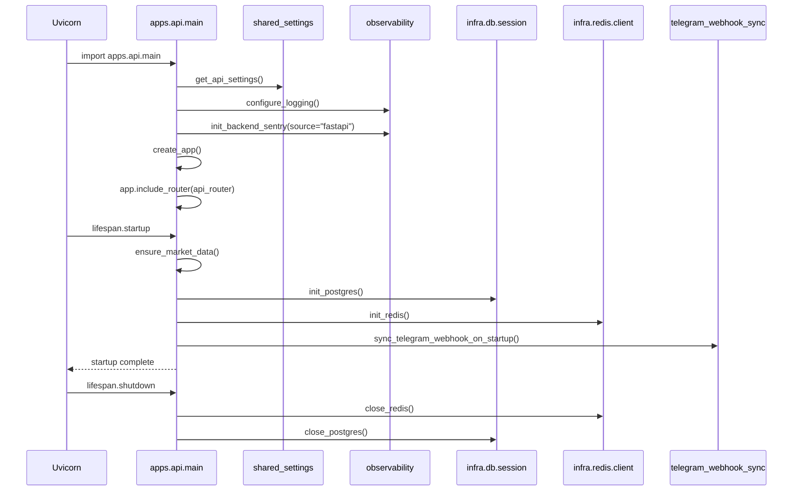
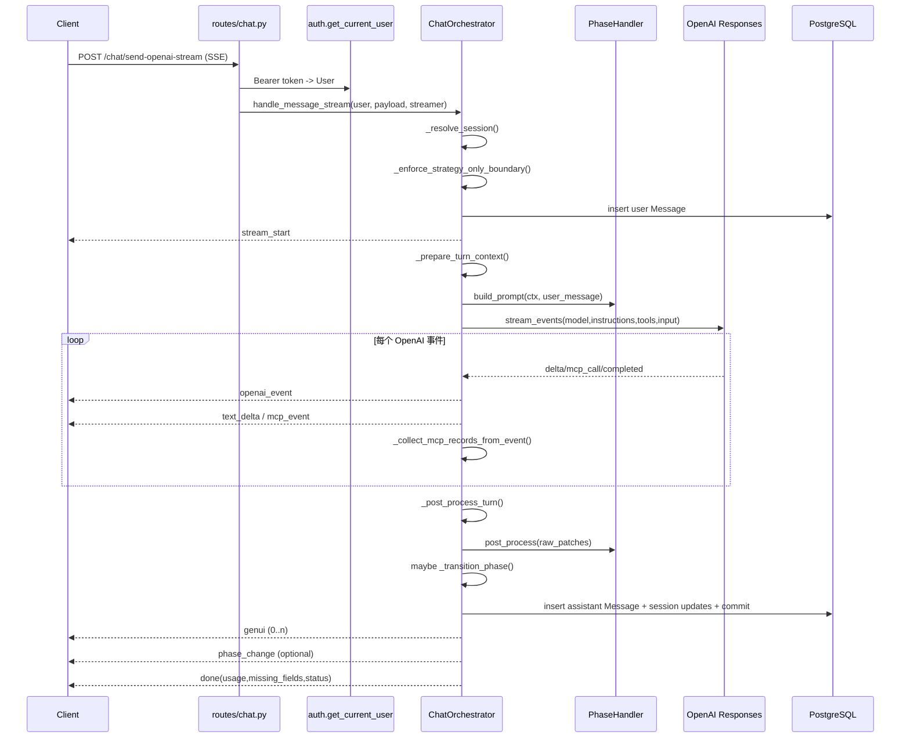
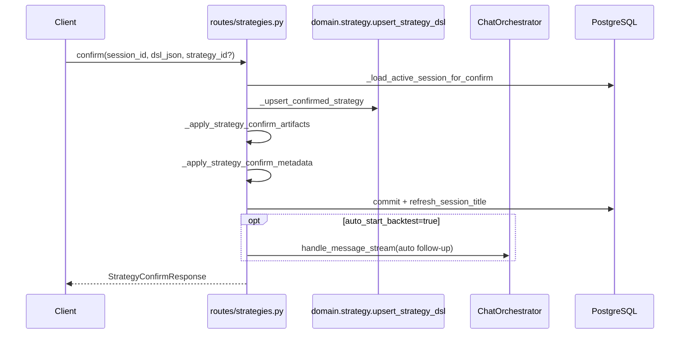
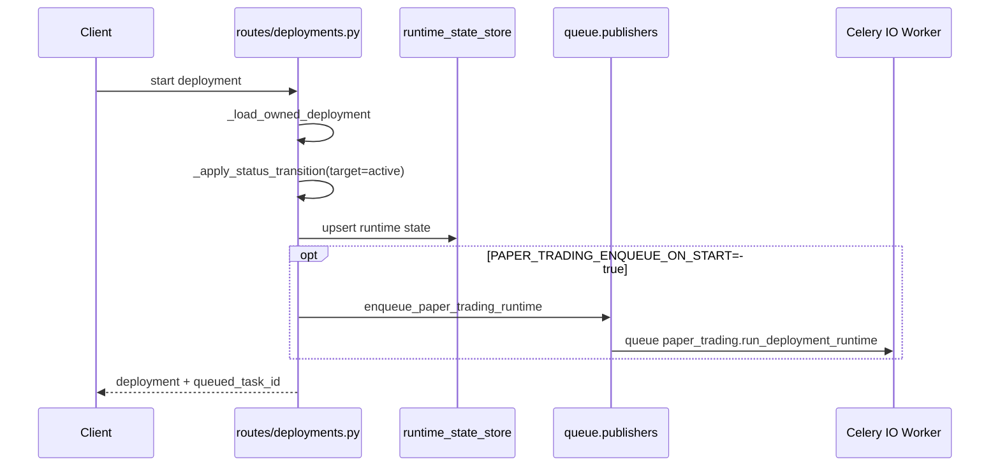

# apps/api README（Bottom-Up）

本文档按 **Bottom-Up** 方式描述 `apps/api`：
先看底层依赖与约束，再看启动顺序，最后看业务调用链（按真实函数调用顺序）。

## 1. 这个 app 的职责边界

`apps/api` 是后端 HTTP 入口层（FastAPI）。它负责：

- 对外暴露 REST + SSE 接口（当前 `routes/` 下 15 个路由模块，约 68 个 endpoint）。
- 鉴权、限流、依赖注入、协议编排（不是业务计算本体）。
- 把 AI 对话请求交给 `ChatOrchestrator`，把领域任务交给 `packages/domain`。
- 把异步任务发布到 Celery（通过 `apps/api/services/trading_queue_service.py` 转发到 `packages.infra.queue.publishers`）。

不负责：

- 回测/压力测试/交易引擎的核心逻辑（在 `packages/domain/*`）。
- 数据库模型定义与连接池实现（在 `packages/infra/db/*`）。

---

## 2. Bottom-Up 依赖拆解

### 2.1 运行时配置与环境分层

`apps/api/main.py` 在导入早期设置：

- `MINSY_SERVICE=api`（如果未显式设置）

随后 `get_api_settings()` 通过 `packages/shared_settings` 加载分层配置。默认查找顺序（后者覆盖前者）：

1. `env/.env.secrets`
2. `env/.env.common`
3. `env/.env.{profile}`（例如 dev/prod）
4. `env/.env.{profile}.api`

说明：`profile` 仅允许 `dev` / `prod`，不使用 `*.local`。

### 2.2 基础设施依赖

`apps/api` 直接依赖的底层基础设施：

- PostgreSQL：`packages.infra.db.session`
  - `init_postgres()` 启动时建池并可自动 `create_all`
  - `get_db_session()` 给路由注入 `AsyncSession`
- Redis：`packages.infra.redis.client`
  - `init_redis()/close_redis()`
  - `get_redis_client()` 给限流等依赖注入
- Observability：
  - `init_backend_sentry(source="fastapi")`
  - `SentryHTTPStatusMiddleware` 采集 4xx/5xx
  - `configure_logging()` 统一日志
- 市场数据冷启动：`ensure_market_data()`
  - 检查 `data/**/*.parquet`，必要时下载并解压

### 2.3 API 内部公共层

- `dependencies.py`
  - `get_db()`：生成 DB session
  - `get_redis()`：返回 Redis client
  - `get_responses_event_streamer()`：返回 OpenAI Responses 流式客户端
- `middleware/auth.py`
  - Bearer Token -> `AuthService.get_current_user()` -> `User`
- `middleware/rate_limit.py`
  - Redis ZSet 滑动窗口限流
- `router.py`
  - 聚合 15 个路由模块

### 2.4 编排层（AI 对话核心）

`ChatOrchestrator`（`apps/api/orchestration/core.py`）是会话流转核心，按 mixin 组装：

- `PromptBuilderMixin`：组装 prompt + phase runtime policy + MCP tool 列表
- `StreamHandlerMixin`：消费 OpenAI Responses 流并转 SSE
- `McpRecordsMixin`：聚合 MCP tool call 记录
- `PostProcessorMixin`：提取 `<AGENT_UI_JSON>/<AGENT_STATE_PATCH>`，落库并转阶段
- `StrategyContextMixin`：补全 strategy_id，上下文校验
- `CarryoverMixin`：phase 间 carryover memory
- `FallbackMixin`：空回复/超时兜底

配套 phase handler 在 `apps/api/agents/handlers/*`：

- `kyc_handler`
- `pre_strategy_handler`
- `strategy_handler`
- `stress_test_handler`（当前为 legacy 回退）
- `deployment_handler`

> 当前产品边界：`stress_test` 会在 orchestrator 边界处被回收至 `strategy`（`_enforce_strategy_only_boundary`）。

---

## 3. 启动顺序（精确到函数）

启动命令（本地常用）：

```bash
uv run uvicorn apps.api.main:app --host 0.0.0.0 --port 8000
```

对应调用顺序：



---

## 4. 路由层到领域层映射

| 路由模块 | 主要职责 | 主要下游依赖 |
|---|---|---|
| `routes/chat.py` | 新建会话、SSE 对话 | `ChatOrchestrator` |
| `routes/strategies.py` | 策略列表/版本/diff/confirm | `packages.domain.strategy.*` + `ChatOrchestrator` |
| `routes/deployments.py` | 部署生命周期、手动动作、信号处理 | `domain.trading.runtime.runtime_service` |
| `routes/backtests.py` | 回测分析读取、demo job 兜底创建 | `domain.backtest.service` |
| `routes/market_data.py` | 行情快照/订阅/健康 | `domain.market_data.runtime` + Celery 发布 |
| `routes/trading_stream.py` | Deployment SSE 事件流 | `trading_event_outbox` + `PnlService` |
| `routes/trade_approvals.py` | 审批列表与决策 | `TradeApprovalService` + Celery 发布 |
| `routes/portfolio.py` | 组合视图与成交明细 | `PnlService` |
| `routes/auth.py` | 注册/登录/refresh/me | `AuthService` |
| `routes/sessions.py` | 会话列表/详情/归档 | `Session` ORM |
| `routes/health.py` | /health /status 聚合探活 | OpenAI/Redis/Celery/运行时状态 |
| `routes/broker_accounts.py` | 券商账户 CRUD/校验 | Alpaca account probe |
| `routes/social_connectors.py` | Telegram connector/webhook | `TelegramService` |
| `routes/notification_preferences.py` | 通知偏好 | Notification preference service |
| `routes/trading_preferences.py` | 执行偏好 | Trading preference service |

---

## 5. 核心业务顺序图（按真实调用链）

### 5.1 Chat SSE（`POST /chat/send-openai-stream`）

这是最关键链路，实际入口在 `routes/chat.py::send_message_stream()`。



SSE 事件类型（你在前端会用到）：

- `stream_start`
- `openai_event`
- `text_delta`
- `mcp_event`
- `genui`
- `phase_change`
- `done`

### 5.2 策略确认（`POST /strategies/confirm`）



### 5.3 部署启动（`POST /deployments/{id}/start`）



### 5.4 实时交易流（`GET /stream/deployments/{id}`）

`trading_stream.py` 是 **SSE 轮询 outbox** 机制，不是 WebSocket：

1. 先生成/追加当前 deployment snapshot 到 `trading_event_outbox`。
2. 按 `event_seq > cursor` 拉取增量事件。
3. 输出 `event: <event_type>`, `id: <event_seq>`。
4. 空闲时发 `heartbeat`。

---

## 6. 关键依赖清单

### 6.1 外部依赖

- FastAPI / Starlette
- SQLAlchemy Async + asyncpg
- Redis
- OpenAI Responses API
- Celery（仅发布任务）
- Telegram Bot API（connector/webhook）

### 6.2 内部依赖（重点）

- `packages/domain/session/services/openai_stream_service.py`
- `packages/domain/strategy/*`
- `packages/domain/backtest/*`
- `packages/domain/trading/runtime/runtime_service.py`
- `packages/domain/market_data/runtime.py`
- `packages/infra/queue/publishers.py`

---

## 7. 开发时的最低验证路径

```bash
# 1) 架构边界检查
uv run python scripts/check_import_boundaries.py

# 2) API + 编排回归
uv run pytest -q tests/test_api
uv run pytest -q tests/test_agents
```

如果你在改 `routes/`、`orchestration/`、`agents/`，建议至少回归：

- `tests/test_api/test_kyc_flow.py`
- `tests/test_api/test_strategy_confirm.py`
- `tests/test_api/test_stream_*`
- `tests/test_agents/test_phase_handlers.py`

---

## 8. 未来功能开发计划 Brainstorm（PM 视角）

### 8.1 评估框架（Thinking 显式化）

- 评估维度：用户收益（留存/转化/信任）、工程复杂度（开发+测试+运维）、风险（合规/资金/误操作）。
- 优先级规则：先做“高收益 + 中低复杂度 + 可快速验证”的功能；高风险功能先在 paper 模式灰度。
- 现状判断：以下列表已避开当前已上线能力（如 Telegram 通知、审批流、Alpaca paper-only 校验），重点是“下一步增量”。

### 8.2 API 路线图（按优先级）

| 优先级 | 方向 | 现状判断 | 用户收益 | 工程复杂度 | 建议落地 |
|---|---|---|---|---|---|
| P0 | SSE 完成态可恢复（刷新后恢复完整回答与“thinking 摘要”） | 当前有流式 SSE 和 session 消息落库，但前端刷新后的“本回合状态恢复”仍可增强 | 高（直接改善聊天稳定感和信任） | 中 | 增加 turn_id + finalized 事件，补 `/sessions/{id}` 的“最后一轮完成态”聚合字段 |
| P0 | 免注册 paper 体验（Guest Sandbox） | 当前流程默认注册用户；门槛偏高 | 高（显著提升首日转化） | 中高 | 引入短期游客 token + 资源配额 + 自动回收策略 |
| P0 | 免费/付费分层与 usage 降级 | 已有 token usage/cost 记录基础 | 高（商业化和成本控制） | 中 | 在 API 层加 plan policy（模型档位、并发、回测额度） |
| P0 | API 安全基线升级（Scoped Token + 审计导出） | 当前以登录态为主，细粒度 token 权限仍可加强 | 高（安全与企业可用性） | 中高 | 增加可撤销 token、权限范围、审计日志导出接口 |
| P1 | 券商能力解释与接入引导 API | 已有 broker account CRUD 和 Alpaca 校验 | 中高（降低接入失败率） | 中 | 新增“券商能力矩阵 + 获取 key 指引”接口，前端可直连展示 |
| P1 | 多 LLM Provider 网关（OpenAI 之外） | 当前主路径是 OpenAI Responses | 中（可用性与成本优化） | 中高 | 抽象 provider adapter + 模型路由策略（失败切换/成本优先） |
| P1 | 审计链路 API（why/when/who/approved_by/params_version） | 基础交易与审批实体已在 | 高（策略可追溯、合规友好） | 中高 | 统一 audit timeline endpoint，串联 session/strategy/deployment/order |
| P1 | Chat 回放与调试快照 API | 当前有 trace 与历史消息，但“单轮可回放诊断”能力不足 | 中高（排障和研发效率） | 中 | 保存 turn 输入/工具调用/输出摘要，提供 replay 只读接口 |
| P1 | 前后端能力协商接口（Capabilities/Flags） | 当前功能开关分散在 env 和代码 | 中（避免版本错配） | 中 | 提供 `/capabilities` 返回可用特性、限额、实验开关 |
| P2 | 社媒传播 API（策略卡片快照） | 现有策略与回测数据可复用 | 中（增长） | 中 | 增加“可分享摘要”签名接口和有效期控制 |
| P2 | API 命名与 i18n 契约治理 | 目前中英和字段命名存在演进空间 | 中（长期维护效率） | 中 | 建立 response schema lint + i18n key 命名规范 |
| P2 | Workspace/团队级协作 API | 当前主要是单用户视角 | 中高（B2B 价值） | 高 | 引入 workspace、成员角色、策略共享与审批责任人模型 |

### 8.3 建议先开工的两个 Epic

1. `EPIC-A: Chat 恢复与可信展示`
   - 目标：用户刷新页面后，能看到完整上一轮输出、工具调用摘要、thinking 摘要（非原始 chain-of-thought）。
   - 里程碑：先补“完成态快照”，再补“断线重连增量同步”，最后补“异常轮次恢复提示”。
2. `EPIC-B: Growth + Cost Guard`
   - 目标：支持 guest 试用 + 付费分层 + 模型降级，形成增长与成本平衡闭环。
   - 里程碑：先做 plan policy 与限额，再接入游客会话，最后做运营侧看板。

### 8.4 本轮补充的验收指标建议

- Chat 稳定性：`send-openai-stream` 断线重连后，10 秒内恢复完成态的成功率 >= 99%。
- 增长转化：guest 到注册转化率、guest 首次回测触发率、7 日留存。
- 成本治理：每计划层级的人均 token 成本、超额降级触发率、降级后的满意度变化。
- 安全基线：高风险接口 token 覆盖率、token 撤销生效延迟、审计日志完整率。
