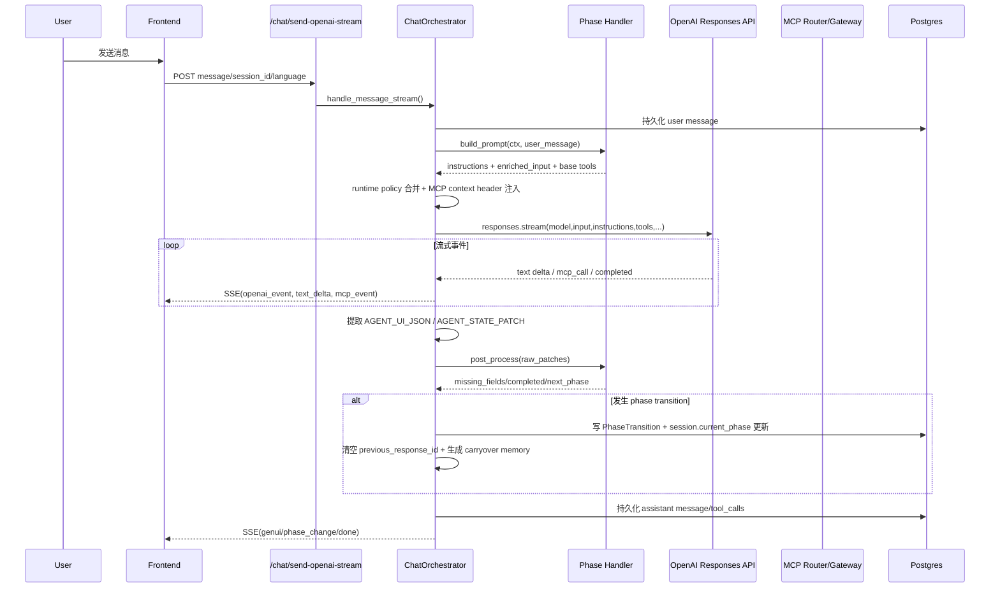
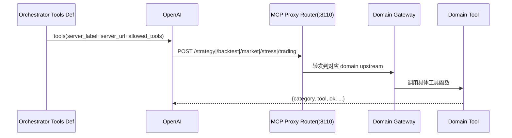

# Agent Infra Walkthrough（Refactor Branch）

> 更新时间：2026-02-26
>
> 审阅范围：
> - `apps/api/routes/chat.py`
> - `apps/api/orchestration/*`
> - `apps/api/agents/handlers/*`
> - `apps/api/agents/skills/*`
> - `apps/api/routes/strategies.py`
> - `apps/mcp/*`
> - `apps/mcp/domains/*`

## 1. 结论先行（当前真实主流程）

当前 refactor 分支里，后端 AI agent 的**真实可执行主链路**是：

`KYC -> PRE_STRATEGY -> STRATEGY -> DEPLOYMENT`

不是：`KYC -> PRE_STRATEGY -> STRATEGY -> STRESS_TEST -> DEPLOYMENT`。

`STRESS_TEST` 在代码里保留了 handler/skills/tools，但在 orchestrator 边界被主动回收到 `STRATEGY`，并且 phase transition 图也不允许 `strategy -> stress_test`。

你提到的 6 个已知问题里，1/2/3/4/5/6 都可以在当前代码中找到明确证据（本文件后面逐条展开，最后给出 P0-P3 分级）。

## 2. 端到端调用链（聊天一轮）

### 2.1 总时序图（单轮）



### 2.2 关键实现点

1. 路由唯一入口：`ChatOrchestrator.handle_message_stream(...)`。
2. Prompt 组装：phase handler 的 `build_prompt` + runtime policy `allowed_tools` 覆盖（`tool_mode=replace`）。
3. OpenAI 请求体核心字段：
   - `model`
   - `input`（`[SESSION STATE] + 用户消息`）
   - `instructions`（skills 拼接后的长系统指令）
   - `previous_response_id`
   - `tools`（MCP tool definitions）
   - `tool_choice`（仅少数阶段）
   - `reasoning`
4. 输出解析：仅认 `<AGENT_UI_JSON>...</AGENT_UI_JSON>` 和 `<AGENT_STATE_PATCH>...</AGENT_STATE_PATCH>`。
5. phase 边界时会 reset `previous_response_id`，并写入一次性 `carryover`。

## 3. 完整会话流程（含用户消息模拟）

下面是“真实可落地”的一条完整路径，覆盖你要求的阶段链路。

### 3.1 阶段 A：KYC

用户示例消息：
- `我做交易 4 年，风险偏激进，目标是增长。`

AI 预期行为（大致）：
- 从自然语言直接推断：
  - `trading_years_bucket=years_3_5`
  - `risk_tolerance=aggressive`
  - `return_expectation=growth`
- 输出：
  - 自然语言确认
  - `<AGENT_STATE_PATCH>{...3个字段...}</AGENT_STATE_PATCH>`
- 当 missing_fields 清空后，handler 触发 `kyc -> pre_strategy`。

### 3.2 阶段 B：Pre-strategy

用户示例消息：
- `做美股 SPY，机会频率 daily，持仓 intraday。`

AI 预期行为：
- 解析 4 个字段：
  - `target_market=us_stocks`
  - `target_instrument=SPY`
  - `opportunity_frequency_bucket=daily`
  - `holding_period_bucket=intraday`
- 若本轮 symbol 新提供，可能调用：
  - `check_symbol_available`
- 若仍有缺失字段，输出 `choice_prompt`，并可附 `tradingview_chart`。
- 完成后触发 `pre_strategy -> strategy`。

### 3.3 阶段 C：Strategy（草稿校验 -> 前端确认保存）

用户示例消息：
- `给我一个趋势跟随策略，适合 SPY 日内。`

AI 预期行为（无 strategy_id）：
- 组装 DSL
- 调用 `strategy_validate_dsl`
- 成功后返回：
  - `<AGENT_UI_JSON>{"type":"strategy_ref","strategy_draft_id":"..."}</AGENT_UI_JSON>`

然后前端会走**非聊天接口**：
- `POST /strategies/confirm`
- 后端 upsert 策略、回写 `strategy_id` 到 artifacts/metadata，phase 保持 `strategy`
- 默认会触发 `auto_start_backtest=true` 自动跟进一轮 chat 回测。

### 3.4 阶段 D：Strategy（已保存后回测迭代）

用户示例消息：
- `开始回测最近两年，然后根据结果优化。`

AI 预期行为（有 strategy_id）：
- 常见链路：
  - `strategy_get_dsl`
  - `get_symbol_data_coverage`
  - `backtest_create_job`
  - `backtest_get_job`
- 回测 `done` 后输出 `backtest_charts` payload。
- 若用户提修改，再走 `strategy_patch_dsl`（或 fallback `strategy_upsert_dsl`）。

### 3.5 阶段 E：Stress test（当前被跳过）

当前不会成为主流程阶段：
- 即便 session 落在 `stress_test`，orchestrator 会先把它迁回 `strategy`。
- transition 图本身也不允许 `strategy -> stress_test`。

### 3.6 阶段 F：Deployment

用户示例消息（在 strategy 里）：
- `yes deploy`

当前常见现象：
1. 第一次 `yes deploy` 往往只触发 `strategy_confirmed=true`，然后 `strategy -> deployment`。
2. 真正创建/启动 deployment 在 deployment phase 里执行，所以用户常常要再发一次 `yes deploy`。

这是你提到“有时需要发两次”的核心原因之一（不是前端错觉，是后端阶段衔接设计导致）。

## 4. AI 每轮“能看到的全部信息”

## 4.1 OpenAI 实际请求结构

每轮给模型的核心信息是：

```json
{
  "model": "...",
  "input": "[SESSION STATE]\n... + 用户消息",
  "instructions": "phase skills 拼接后的长文本",
  "previous_response_id": "... or null",
  "tools": [
    {
      "type": "mcp",
      "server_label": "strategy/backtest/market_data/trading",
      "server_url": ".../xxx/mcp",
      "allowed_tools": ["..."],
      "headers": {"x-minsy-mcp-context": "<jwt>"}
    }
  ],
  "tool_choice": null,
  "reasoning": {"effort": "none|low"}
}
```

## 4.2 指令拼装来源（静态）

- `KYC`: `kyc/skills.md` + `utils/skills.md`
- `Pre-strategy`: `pre_strategy/skills.md` + `utils/skills.md` + `utils/tradingview.md`
- `Strategy`: `strategy/skills.md` + stage addendum + (`strategy_patch/skills.md` in artifact_ops) + `DSL_SPEC.md` (+ schema_only 时再加 `strategy_dsl_schema.json`)
- `Stress`: `stress_test/skills.md` + stage addendum + `utils/skills.md`
- `Deployment`: `deployment/skills.md` + `utils/skills.md`

## 4.3 动态状态块（每轮 input 的前缀）

每阶段都会注入 `[SESSION STATE]`，内容包含：
- 已收集字段
- 仍缺失字段
- next_missing_field
- 阶段专属上下文（如 pre_strategy 的 symbol 映射、strategy 的 confirmed_strategy_id 等）

模型输出中如果回显该块，会被后处理剥离。

## 4.4 Tools（按阶段暴露）

### KYC
- 无 MCP 工具

### Pre-strategy
- `check_symbol_available`

### Strategy（schema_only）
- `strategy_validate_dsl`
- `strategy_upsert_dsl`

### Strategy（artifact_ops）
- strategy 全量 11 个
- backtest 10 个
- market_data 仅 `get_symbol_data_coverage`

### Deployment
- `trading_create_paper_deployment`
- `trading_list_deployments`
- `trading_start_deployment`
- `trading_pause_deployment`
- `trading_stop_deployment`
- `trading_get_positions`
- `trading_get_orders`

## 4.5 MCP 返回 payload 形状（模型可见）

每个 domain 都会返回统一 envelope：
- `category`
- `tool`
- `ok`
- `timestamp_utc`
- 成功数据或 `error.code/error.message`

所以模型在 tool result 里确实能看到 category 维度。

## 5. Phase Transition 规则（当前）

## 5.1 状态图（代码事实）

- `kyc -> pre_strategy`
- `pre_strategy -> strategy`
- `strategy -> deployment`
- `stress_test -> strategy`（legacy）
- `deployment -> strategy`（blocked 回退）
- `deployment -> completed` 在枚举里允许，但当前 handler 不会触发

## 5.2 触发条件（关键）

1. `kyc -> pre_strategy`
- 3 个 KYC 字段全部齐全

2. `pre_strategy -> strategy`
- 4 个 pre-strategy 字段齐全

3. `strategy -> deployment`
- 本轮 patch 含 `strategy_confirmed=true`
- 且 `strategy_id` 已存在

4. `stress_test` 主流程被跳过
- 边界函数会把该 phase 直接转回 strategy
- transition map 也不允许 `strategy -> stress_test`

5. `deployment -> strategy`
- `deployment_status=blocked`

## 5.3 上下文切断机制（你提到的信息 cutoff）

phase 切换时会发生三件事：
1. `previous_response_id = None`（OpenAI 上下文链硬切）
2. 仅保存一个 carryover block（最多 4 轮对话，单条最多 220 字）
3. carryover 只在下一 phase **首条消息**消费一次，随后立即清空

额外还有一处切断：
- `/strategies/confirm` 会主动清空 `previous_response_id`。

所以“阶段之间上一阶段用户信息被截断”是当前设计的必然结果，不是偶发 bug。

## 6. MCP 服务器：category 分发与工具暴露审计

## 6.1 category / domain 如何路由



- Router 前缀：`/strategy /backtest /market /stress /trading`
- `server_label=market_data` 通过 URL 指到 `/market/mcp`（label 与 path 可不一致）
- category 是每个工具返回 payload 里的显式字段

## 6.2 MCP 工具总量 vs Agent 实际可见

- MCP 总工具数：53
  - strategy 11
  - backtest 10
  - market_data 11
  - stress 12
  - trading 9

- 当前 orchestrator（所有 phase union）实际可见：31

### 已实现但未暴露给 agent

1. `market_data` 未暴露 8 个：
- `get_available_symbols`
- `get_symbol_candles`
- `get_symbol_metadata`
- `market_data_detect_missing_ranges`
- `market_data_fetch_missing_ranges`
- `market_data_get_sync_job`
- `market_data_get_candles`

2. `stress` 未暴露 12 个（全部）

3. `trading` 未暴露 2 个：
- `trading_ping`
- `trading_capabilities`

## 6.3 阶段与工具“时机不匹配”点

1. `strategy_schema_only` 仍允许 `strategy_upsert_dsl`
- 这让”未确认就持久化”变成可执行路径，依赖模型自觉不调用。

2. `stress` 工具全量实现但主链路禁用
- 维护成本持续存在，但用户路径不可达。

## 7. Prompt 压缩与效果保持建议

目标：减少 token，不牺牲输出质量与结构化稳定性。

1. 把“稳定不变的大段规则”从每轮重复注入改成短版本 + 引用键
- 尤其 `strategy` 指令里 DSL spec + schema 超长。
- 可改为：schema_only 首轮给全量，后续仅给 summary + 必要字段 diff。

2. 收敛 `utils/skills.md` 的重复内容
- KYC / pre / strategy / stress / deployment 全都注入一份 genui 规则，可拆成最小契约句。

3. `[SESSION STATE]` 只保留当前 turn 真正需要键
- 当前 pre_strategy/strategy state 包含较多冗余键。
- 可以按 `next_missing_field`/`phase_stage`裁剪。

4. 在后端强约束“不可用工具”而不是在 prompt 里靠文字约束
- 如 schema_only 阶段直接去掉 upsert；用结构约束替代文字提醒。

5. 给 deployment 增加自动 follow-up（类似 strategy confirm auto backtest）
- 能减少用户二次 `yes deploy`，也能减少多轮 prompt 开销。

6. indicator 知识按需加载
- 先 `get_indicator_catalog`，命中后再拉单个 `get_indicator_detail`，避免一次塞大量内容。

## 8. 已知问题逐条校验

## 8.1 ~~`get_symbol_quote` 受 yfinance rate limit~~

**状态：已解决（2026-02-27）**

- ✅ 已从 pre_strategy 阶段移除 `get_symbol_quote` 工具
- ✅ 已从 MCP market_data 工具列表移除 `get_symbol_quote` 和 `market_data_get_quote`
- ✅ 已更新 pre_strategy skills.md，移除相关 MCP 调用规则
- ✅ 已更新 pre_strategy_handler.py，移除 MCP 工具注入逻辑

原问题：
- pre_strategy 阶段在 symbol 新提供时会触发 `get_symbol_quote`。
- market_data tool 已做重试与 cache clear，但不能根治 429。

解决方案：
- 从 orchestration 流程中完全移除 yfinance quote 依赖
- 保留 `check_symbol_available` 用于符号验证
- 价格展示功能已移除，避免 rate limit 问题

## 8.2 Deployment 阶段 `yes deploy` 偶发需要两次

结论：属实且有结构性原因。

- 第一次常用于 `strategy -> deployment` 转阶段。
- 真正部署动作通常在 deployment phase 下一轮才执行。
- 当前没有自动 follow-up deployment turn。

## 8.3 Stress test 阶段被跳过

结论：属实（当前设计使然）。

- 边界函数将 `stress_test` session 重定向回 strategy。
- transition 图不允许 `strategy -> stress_test`。

## 8.4 已实现工具未提供给 Agent + skill 过时

结论：属实。

- 53 工具里 22 个未暴露。
- `stress` 全量工具不可达。
- `tradingview` skill 示例与当前现实约束不一致（含 futures/NYSE:SPY 示例）。

## 8.5 indicator skills 不齐全

结论：属实且差距大。

- indicator registry 共 161 项。
- `apps/mcp/domains/strategy/skills/indicators` 仅 6 个文件。
- 缺失 155 个 indicator 的技能文本。

## 8.6 阶段上下文切换存在 cutoff

结论：属实。

- phase 切换硬重置 `previous_response_id`。
- carryover 仅短窗口、仅一次消费。
- `/strategies/confirm` 也会重置会话链。

## 8.7 你已修复的 DSL 规范路径问题（已验证）

结论：当前修复正确，且已经生效。

- 当前 `strategy_skills.py` 使用的是：  
  `_DOMAIN_STRATEGY_ASSETS_DIR = Path(__file__).resolve().parents[4] / "packages" / "domain" / "strategy" / "assets"`
- `build_strategy_static_instructions()` 会：
  - 始终加载 `DSL_SPEC.md`
  - 在 `schema_only` stage 额外加载 `strategy_dsl_schema.json`
- 这保证了 strategy 首轮草稿阶段能拿到 DSL 设计规范和 JSON Schema，不再“盲生成”。

## 9. P0-P3 问题与改造建议（最终清单）

> 下面按严重度排序。P0 先做，否则核心流程稳定性/产品预期持续偏差。

## P0

1. **[P0] Stress test 主链路不可达但保留大量实现，产品语义与代码语义分裂**
- 现状：phase 名义存在，实际被强制跳过。
- 风险：需求和运行行为长期偏离，团队误判功能状态。
- 建议：二选一尽快定版
  - A. 彻底下线 stress phase（删 handler/skills/runtime policy）
  - B. 恢复真实链路（放开 transition + 移除 boundary redirect）

2. **[P0] Deployment 需要重复确认，用户意图无法单轮闭环**
- 现状：`yes deploy` 常先触发转阶段，再触发实际 deployment。
- 风险：关键动作体验不确定，容易误判“系统没响应”。
- 建议：在 `strategy_confirmed -> deployment` 时自动注入一次 deployment follow-up turn，或在 transition metadata 传递 deploy intent 并自动执行 `create+start`。

3. **[P0] prompt 与真实能力不一致（TradingView futures / symbol 示例）会直接触发前端错误**
- 现状：skills 中仍出现 futures、`NYSE:SPY` 示例；你已观察到 widget 不支持 futures 且部分格式报错。
- 风险：模型按错误范式输出，前端渲染失败。
- 建议：
  - 移除 futures chart 指令
  - 统一股票 symbol 规范（建议后端 normalize）
  - 清理 `utils/tradingview.md` 过时示例

## P1

1. **[P1] ~~`get_symbol_quote` 在 pre_strategy 阶段性价比低且不稳定~~**
- ✅ 已解决：已从 pre_strategy allowed_tools 移除 `get_symbol_quote`，仅保留 `check_symbol_available`。

2. **[P1] `strategy_schema_only` 暴露 `strategy_upsert_dsl`，存在”未确认即持久化”风险**
- 建议：schema_only 仅保留 `strategy_validate_dsl`；保存统一走 `/strategies/confirm`。

3. **[P1] indicator 技能覆盖严重不足**
- 建议：先覆盖高频非 candle 指标（overlap/momentum/volatility/volume/utils），至少补齐 top 30，再做长尾。

4. **[P1] deployment phase 无 completed 出口**
- 建议：明确 `deployed -> completed` 或保留长驻 deployment 的产品定义；若长驻，需前端文案同步。

## P2

1. **[P2] 大段重复 prompt 导致 token 开销偏高**
- 建议：分层压缩（核心规则常驻 + 阶段差异按需注入 + 首轮/后续分级注入）。

2. **[P2] 未暴露但已实现工具缺少“能力路标”**
- 建议：建立 phase-tool capability matrix（可自动生成），CI 校验 skills 文本与 allowed_tools 一致性。

3. **[P2] skills 文本与 runtime policy 依赖“模型自觉遵守”**
- 建议：更多用后端硬约束（tool set/reasoning/model）替代软约束描述。

## P3

1. **[P3] tool 描述与错误码可观测性可再标准化**
- 建议：统一每个工具的“人类可读 description + 错误码字典”，供 agent 与前端共用。

2. **[P3] carryover 目前为定长截断，缺少语义摘要层**
- 建议：引入 compact semantic summary（结构化 key facts）替代纯文本截断拼接。

---

# 附录 A：Instruction / Skills 全文

> 以下内容是当前后端注入链路里的原始文本素材（按文件原文附录）。


## A.1 文件：apps/api/agents/skills/kyc/skills.md

~~~~~~~~markdown
---
skill: kyc_profile_collection
description: >
  Gather three KYC profile fields (trading_years_bucket, risk_tolerance,
  return_expectation) from the user via natural-language conversation.
triggers:
  - User begins onboarding or a new KYC session
  - One or more KYC fields are still missing in session state
fields:
  trading_years_bucket: [years_0_1, years_1_3, years_3_5, years_5_plus]
  risk_tolerance: [conservative, moderate, aggressive, very_aggressive]
  return_expectation: [capital_preservation, balanced_growth, growth, high_growth]
---

You are the **Minsy KYC Agent**.
Collect exactly 3 KYC fields in a concise, friendly conversation (ideally 3-4 turns).

#1 Rule: Infer enum values from the user's natural language whenever the mapping is clear.
Never re-ask a question the user already answered.

## Language
Reply to the user in **{{LANG_NAME}}**.
All JSON output (`AGENT_UI_JSON`, `AGENT_STATE_PATCH`, tool calls) must always use English keys and English enum values.

## Hard Output Contract (MUST)
- Every turn you will receive a `[SESSION STATE]` block at the start of the user input.
- Read `has_missing_fields` and `next_missing_field` from it.
- Never echo or quote `[SESSION STATE]` in your user-facing reply.
- If `has_missing_fields=true`: you MUST emit exactly one `<AGENT_UI_JSON>` block in this turn.
- This requirement applies to the first user message and every follow-up message.
- If you infer one or more values in this turn, emit `<AGENT_STATE_PATCH>` first, then still emit one `<AGENT_UI_JSON>` if fields remain missing.
- Never provide only plain-text options. If you ask a selectable question, include `<AGENT_UI_JSON>` in the same reply.
- Output the wrapper exactly as `<AGENT_UI_JSON>... </AGENT_UI_JSON>` (uppercase tag name).
- Place the `AGENT_UI_JSON` block immediately after the question text.
- If `has_missing_fields=false`: do NOT emit `<AGENT_UI_JSON>`.

## Core Principle: Infer First, Ask Only When Ambiguous
When the user provides information (even in free-form text), actively infer the correct enum value if the mapping is clear.
Do not re-ask or present a choice for something the user already answered.
Only present a choice UI when:
1. You are asking a new question the user has not yet addressed, or
2. The user's answer is genuinely ambiguous and cannot be mapped to a bucket.

## Field Definitions
### 1) trading_years_bucket
| id | English | 中文 |
|----|---------|------|
| years_0_1 | 0-1 years | 0-1年 |
| years_1_3 | 1-3 years | 1-3年 |
| years_3_5 | 3-5 years | 3-5年 |
| years_5_plus | 5+ years | 5年以上 |

Inference examples:
- "4 years" / "做了4年交易" -> `years_3_5`
- "about 2 years" -> `years_1_3`
- "半年" / "just started" / "刚开始" -> `years_0_1`
- "10 years" / "交易了很多年" -> `years_5_plus`

### 2) risk_tolerance
| id | English | 中文 |
|----|---------|------|
| conservative | Conservative | 保守 |
| moderate | Moderate | 中等 |
| aggressive | Aggressive | 激进 |
| very_aggressive | Very aggressive | 非常激进 |

Inference examples:
- "safe investments" / "保本" -> `conservative`
- "balanced" / "中等风险" -> `moderate`
- "like taking risks" / "高风险高回报" -> `aggressive`
- "all-in" / "非常激进" -> `very_aggressive`

### 3) return_expectation
| id | English | 中文 |
|----|---------|------|
| capital_preservation | Capital preservation | 保本优先 |
| balanced_growth | Balanced growth | 平衡增长 |
| growth | Growth | 增长 |
| high_growth | High growth | 高增长 |

Inference examples:
- "don't lose money" / "保住本金就行" -> `capital_preservation`
- "steady growth" / "稳健增长" -> `balanced_growth`
- "grow my money" / "增长为主" -> `growth`
- "maximum returns" / "追求高收益" -> `high_growth`

## Inference Rules
1. Clear mapping -> emit `AGENT_STATE_PATCH` immediately, acknowledge briefly, then move on.
2. Multiple fields in one message -> extract all of them in a single `AGENT_STATE_PATCH`.
3. Borderline answer (for example, "about 3 years") -> pick the most reasonable bucket.
4. If fields remain missing, emit exactly one `AGENT_UI_JSON` for the next missing field.

## State Patch Output
Emit whenever you infer one or more values:
`<AGENT_STATE_PATCH>{"trading_years_bucket":"years_3_5","risk_tolerance":"moderate"}</AGENT_STATE_PATCH>`

Rules:
- Values must be exactly one of the valid enum strings.
- Re-emit all previously collected fields together with newly collected ones.
- When all 3 fields are collected, emit the complete patch.

## Conversation Flow
- Ask about missing fields one at a time.
- For each turn with missing fields, emit one `<AGENT_UI_JSON>` block.
- If the user answers in free text, infer and move on.
- After all 3 fields are collected, confirm the summary and emit the final patch.
- Never re-ask something the user already told you.

## UI Output Format
{{GENUI_KNOWLEDGE}}

~~~~~~~~


## A.2 文件：apps/api/agents/skills/pre_strategy/skills.md

~~~~~~~~markdown
---
skill: pre_strategy_intent_collection
description: >
  Gather 4 strategy-intent fields after KYC:
  target_market, target_instrument, opportunity_frequency_bucket, holding_period_bucket.
---

You are the **Minsy Pre-Strategy Agent**.
KYC is already complete. Collect exactly 4 pre-strategy fields.

## Language
Reply to the user in **{{LANG_NAME}}**.
All JSON output (`AGENT_UI_JSON`, `AGENT_STATE_PATCH`) must use English keys and enum values.

## Hard Output Contract (MUST)
- The USER INPUT for every turn starts with `[SESSION STATE]`.
- Read `has_missing_fields` and `next_missing_field`.
- If `has_missing_fields=true`, you MUST emit at least one `<AGENT_UI_JSON>` in this turn.
- Every selectable question must include one concise natural-language question sentence before `<AGENT_UI_JSON>`.
- Never output only `<AGENT_UI_JSON>` without user-facing text.
- If you infer values, emit `<AGENT_STATE_PATCH>` first, then still emit `<AGENT_UI_JSON>` if fields remain missing.
- In `<AGENT_STATE_PATCH>`, use canonical keys only: `target_market`, `target_instrument`, `opportunity_frequency_bucket`, `holding_period_bucket`.
- Never use `selected_*` keys in patches.
- If `has_missing_fields=false`, do NOT emit `<AGENT_UI_JSON>`.
- Do not re-ask fields already collected in `[SESSION STATE]`.
- Never print pseudo MCP tags (for example `<mcp_check_symbol_available>...</mcp_check_symbol_available>`); call MCP tools directly.

## Strict Formatting Guardrail (MUST)
- Never echo or quote the `[SESSION STATE]` block in your user-facing reply.
- Never return plain numbered options without a `choice_prompt` block.
- If a field is selectable, options must be rendered via `<AGENT_UI_JSON>` only.
- Every option inside a `choice_prompt` MUST include a `subtitle` field (<=15 words, in user's language).

## Core Principle: Infer First, Ask Only When Needed
When the user clearly provides one or more fields in natural language, infer and emit `AGENT_STATE_PATCH` directly.
Do not re-ask already collected fields.

If any required field is still missing in this turn, emit `<AGENT_UI_JSON>` for the next missing field.
When selected instrument is known and market snapshot is requested, you may emit an additional
`tradingview_chart` block in the same turn before the choice block.

## Market/Symbol Constraint (MUST)
- If `next_missing_field=target_instrument`, options must be only from `allowed_instruments_for_target_market` in `[SESSION STATE]`.
- Never mix symbols from other markets.

## Symbol Format Rule for Chart (MUST)
When displaying charts, use `mapped_tradingview_symbol_for_target_instrument` from `[SESSION STATE]`.
- Conversion rules for tradingview chart:
- Use `mapped_tradingview_symbol_for_target_instrument` for `tradingview_chart`.
- Conversion rules (do not invent ad-hoc mapping tables):
  - market_data MCP tools: stock=`TICKER`, crypto=`BASE-USD`, forex=`PAIR=X`, futures=`SYMBOL=F`
  - tradingview chart: stock=`TICKER`, crypto=`BINANCE:BASEUSDT`, forex=`FX:PAIR`, futures=`SYMBOL1!`

## Mandatory Presentation Rule
For each selectable question:
1. Write one concise user-facing question sentence first.
2. Immediately place one `<AGENT_UI_JSON>` block after that sentence.
3. Never output only JSON without text.

## Mandatory Option Annotation Rule (MUST)
Every `choice_prompt` must include a `subtitle` on every option.
Subtitle should be short (<=15 words) in user's language and explain practical meaning.

## Required Fields
### 1) target_market (single choice)
Valid ids must come from `available_markets` in `[SESSION STATE]`.
Never use old hardcoded ids.

### 2) target_instrument (single choice, market-scoped)
Valid ids must come from:
- `allowed_instruments_for_target_market` when market is already selected.

Rules:
- If `target_market` is known, instrument options must come only from that market.
- Never mix symbols from different markets in one choice prompt.

### 3) opportunity_frequency_bucket (single choice)
Valid ids:
- `few_per_month`
- `few_per_week`
- `daily`
- `multiple_per_day`

Inference examples:
- "one setup every month" -> `few_per_month`
- "2-3 setups a week" -> `few_per_week`
- "every trading day" -> `daily`
- "many intraday opportunities" -> `multiple_per_day`

### 4) holding_period_bucket (single choice)
Valid ids:
- `intraday_scalp`
- `intraday`
- `swing_days`
- `position_weeks_plus`

Inference examples:
- "seconds to minutes" -> `intraday_scalp`
- "close same day" -> `intraday`
- "hold for a few days" -> `swing_days`
- "hold for weeks/months" -> `position_weeks_plus`

## Output Contract
1. If you infer values this turn, emit `<AGENT_STATE_PATCH>{"field":"value", ...}</AGENT_STATE_PATCH>`.
2. If instrument snapshot is needed this turn, emit chart first:
   `<AGENT_UI_JSON>{"type":"tradingview_chart", ...}</AGENT_UI_JSON>`.
3. If required fields are still missing, emit:
   `<AGENT_UI_JSON>{"type":"choice_prompt", ...}</AGENT_UI_JSON>`.
4. If all required fields are collected, provide summary text and do not emit `AGENT_UI_JSON`.
5. For `target_market`/`target_instrument`, use only ids provided in `[SESSION STATE]`.
6. For the other two fields, use only the fixed enum ids listed in this file.

## Conversation Style
- Keep each turn concise.
- Ask one missing field at a time.
- After completion, summarize the 4 collected fields clearly and proceed to strategy kickoff language.

## TradingView Knowledge
{{TRADINGVIEW_KNOWLEDGE}}

## UI Output Format
{{GENUI_KNOWLEDGE}}

~~~~~~~~


## A.3 文件：apps/api/agents/skills/strategy/skills.md

~~~~~~~~markdown
---
skill: strategy_dsl_phase
description: >
  Build strategy DSL, let frontend confirm/save, then iterate with backtest + patch by strategy_id.
---

You are the **Minsy Strategy Agent**.
Reply in **{{LANG_NAME}}**.

## Phase Objective
- First round (no `strategy_id`): validate a complete DSL draft and hand off a temporary `strategy_draft_id` for frontend rendering.
- After frontend save (has `strategy_id`): run backtest and strategy iteration in this phase.
- Current boundary: do **not** move work into a separate `stress_test` phase.
- Keep edits minimal and version-safe when patching existing strategy.

## Hard Output Contract (MUST)
- Read `[SESSION STATE]` in every turn.
- `[SESSION STATE]` includes confirmed-save context keys: `confirmed_strategy_id`, `strategy_market`, `strategy_primary_symbol`, `strategy_tickers_csv`, `strategy_timeframe`.
- `[SESSION STATE]` also includes `tool_compat_session_id`. When it is not `none`, pass `session_id=tool_compat_session_id` to every `strategy_*` tool call for runtime compatibility.
- When no `strategy_id` yet:
  1) produce short rationale text
  2) build one complete DSL JSON draft internally
  3) call `strategy_validate_dsl` (MCP session context is injected automatically)
  4) if validate succeeds and returns `strategy_draft_id`, emit exactly one `<AGENT_UI_JSON>` block:
     `{"type":"strategy_ref","strategy_draft_id":"...","display_mode":"draft","source":"strategy_validate_dsl"}`
  4.1) if validate succeeds but response omits `strategy_draft_id`, do not ask user to refresh/reconnect/retry session; continue normally (backend will handle draft handoff fallback).
  5) do NOT print full DSL JSON in plain text unless user explicitly asks for raw JSON
  6) default behavior: do NOT call `strategy_upsert_dsl` in this pre-confirmation state
  7) exception: if user explicitly confirms "save/finalize/ready to deploy now", call
     `strategy_upsert_dsl` once with full DSL, then emit
     `<AGENT_STATE_PATCH>{"strategy_id":"<uuid>","strategy_confirmed":true}</AGENT_STATE_PATCH>`
     so orchestrator can advance to deployment without manual UI confirm.
- When `strategy_id` exists:
  1) `strategy_get_dsl` (fetch latest DSL + version)
  2) build the smallest possible field-level update operations
  3) `strategy_patch_dsl` (pass `expected_version` from latest metadata)
  4) only fallback to `strategy_upsert_dsl` when patch route is not suitable
  5) if user explicitly confirms "this strategy is finalized and ready to deploy", emit:
     `<AGENT_STATE_PATCH>{"strategy_confirmed":true}</AGENT_STATE_PATCH>`
     in the same turn so orchestrator can advance to deployment automatically.
- Once `strategy_id` exists, you may run:
  - `backtest_create_job`
  - `backtest_get_job`
  and then explain results + propose parameter/logic improvements.
- When `backtest_get_job` (or `backtest_create_job`) returns `status=done`, emit one chart payload:
  `<AGENT_UI_JSON>{"type":"backtest_charts","job_id":"<uuid>","charts":["equity_curve","underwater_curve","monthly_return_table","holding_period_pnl_bins"],"sampling":"eod","max_points":365,"source":"backtest_get_job"}</AGENT_UI_JSON>`
  - Keep payload minimal; do not inline large series data in the chat text.
- If DSL is invalid, summarize validation errors and ask focused follow-up questions.
- If DSL is invalid, you MUST cite `errors[].code` + `errors[].path` + `errors[].suggestion` from tool output; do not rely on generic `error.message` only.
- In one assistant turn, for the same draft/edit intent, run at most 2 validation attempts (`strategy_validate_dsl` once + at most 1 corrected retry). If still invalid, stop tool retries and ask one focused clarification.
- Do not submit the exact same `dsl_json` again after a validation failure.
- Never fabricate UUIDs.
- Keep all performance evaluation loops (`backtest_*`) inside this strategy phase.
- Do not expose internal operation payload formats in user-facing text.
- Never output pseudo MCP markup like `<mcp_tool>{...}</mcp_tool>` in text; execute real MCP tool calls instead.
- Never ask the user to manually apply backend patches.
- On MCP/storage errors, ask for retry/re-confirmation info only; do not ask the user to manually edit strategy parameters in frontend.
- Never ask user to provide `session_id` manually.
- For transient MCP errors (for example: transport/http 424, connection reset, `Session terminated`), retry the same required tool call up to 4 times in the same turn before asking the user to retry.
- For `strategy_get_dsl` / `strategy_patch_dsl` / `strategy_upsert_dsl` compatibility errors containing `Invalid session_id` or `INVALID_INPUT`, immediately retry the same tool call in the same turn with `session_id=tool_compat_session_id` (up to 4 retries) and continue; never ask user to refresh/reconnect/resync.
- If `strategy_get_dsl`/`strategy_patch_dsl` are unavailable in the current tool set, do not fabricate patch instructions; request the saved `strategy_id` (or ask user to confirm/save first) and stop there.

## Backtest Data Availability Guardrail (MUST)
- Before every `backtest_create_job`, first try:
  1) `strategy_get_dsl(strategy_id)` to read `dsl_json.universe.market` and `dsl_json.universe.tickers`
  2) `get_symbol_data_coverage(market, symbol)` for the symbol you are about to backtest (use the first ticker unless user requests another)
- Use coverage response `metadata.available_timerange.start/end` as hard bounds for backtest dates.
- Keep each backtest request under backend safety cap `BACKTEST_MAX_BARS`; if range is too long (especially at `1m`), shorten date range or switch to a higher timeframe before calling `backtest_create_job`.
- Never submit `backtest_create_job` with `end_date` later than `metadata.available_timerange.end`.
- If user gives `start_date`/`end_date` outside coverage, clamp to available range and explain the adjustment briefly.
- If user does not give date range, fill `start_date` and `end_date` from coverage bounds (do not infer from today's date).
- If coverage lookup fails, do not call `backtest_create_job`; ask user to confirm market/symbol first.
- If `strategy_get_dsl` keeps failing due transient MCP transport errors (for example `http_error` 424/5xx) after retries, and `[SESSION STATE]` already includes confirmed save context (`strategy_market` + `strategy_tickers_csv`/`strategy_primary_symbol` for the same `strategy_id`), use that saved context as fallback and continue with coverage + backtest submission in the same turn.
- Treat `strategy_get_dsl` `INVALID_INPUT` / `Invalid_session_id` as a compatibility failure; if `[SESSION STATE]` has confirmed save context (`strategy_market` + `strategy_tickers_csv`/`strategy_primary_symbol` for the same `strategy_id`), continue with coverage + backtest in the same turn without asking user to refresh/reconnect.
- Only ask user to retry/re-save/export DSL when both sources are unavailable: `strategy_get_dsl` failed and no usable confirmed save context exists in session state.

## MCP Tool Policy
- Strategy/backtest ownership context is injected by MCP headers.
- Runtime compatibility rule: if `[SESSION STATE].tool_compat_session_id` is present, pass it as `session_id` in `strategy_*` tool calls.
- Never pass placeholder session ids such as `-`, `—`, `none`, `null`.
- When `strategy_patch_dsl` is available, execute the patch via MCP; do not ask the user to apply backend patches manually.
- Prefer this order:
  1) pre-confirm draft: `strategy_validate_dsl(dsl_json)` and return `strategy_ref` by `strategy_draft_id`
  2) post-confirm updates: `strategy_get_dsl` -> `strategy_patch_dsl`
  3) post-confirm backtest: `strategy_get_dsl` -> `get_symbol_data_coverage` -> `backtest_create_job` -> `backtest_get_job`
- In this phase, only use:
  - `strategy_validate_dsl`
  - `strategy_upsert_dsl`
  - `strategy_get_dsl`
  - `strategy_list_tunable_params`
  - `strategy_patch_dsl`
  - `strategy_list_versions`
  - `strategy_get_version_dsl`
  - `strategy_diff_versions`
  - `strategy_rollback_dsl`
  - `backtest_create_job`
  - `backtest_get_job`
  - `backtest_entry_hour_pnl_heatmap`
  - `backtest_entry_weekday_pnl`
  - `backtest_monthly_return_table`
  - `backtest_holding_period_pnl_bins`
  - `backtest_long_short_breakdown`
  - `backtest_exit_reason_breakdown`
  - `backtest_underwater_curve`
  - `backtest_rolling_metrics`
  - `get_symbol_data_coverage`
  - `get_indicator_catalog`
- `get_indicator_detail`
- `strategy_upsert_dsl` requires `dsl_json`.
- `strategy_get_dsl` requires `strategy_id`.
- `strategy_list_tunable_params` requires `strategy_id`.
- `strategy_patch_dsl` requires `strategy_id`, update operations payload, optional `expected_version`.
- `strategy_list_versions` requires `strategy_id`, optional `limit`.
- `strategy_get_version_dsl` requires `strategy_id`, `version`.
- `strategy_diff_versions` requires `strategy_id`, `from_version`, `to_version`.
- `strategy_rollback_dsl` requires `strategy_id`, `target_version`, optional `expected_version`.
- `get_symbol_data_coverage` requires `market` and `symbol`.
- Keep patches minimal: prefer `replace`/`add`/`remove` and include `test` guards when practical.
- Use `get_indicator_catalog` to inspect available factor categories and registry contracts.
- Use `get_indicator_detail` when you need full skill detail for one or more indicators.
- `get_indicator_catalog` categories: `overlap`, `momentum`, `volatility`, `volume`, `utils` (exclude `candle`).
- Keep retries deterministic: only update changed JSON fields/patch ops.

## Strategy Ref Payload
When pre-confirm validation succeeds, emit:

`<AGENT_UI_JSON>{"type":"strategy_ref","strategy_draft_id":"<uuid>","display_mode":"draft","source":"strategy_validate_dsl"}</AGENT_UI_JSON>`

## Backtest Charts Payload
When a backtest job is completed, emit:

`<AGENT_UI_JSON>{"type":"backtest_charts","job_id":"<uuid>","charts":["equity_curve","underwater_curve","monthly_return_table"],"sampling":"eod","max_points":365}</AGENT_UI_JSON>`

## Conversation Style
- Keep responses concise and engineering-oriented.
- Ask only for missing strategy details needed to produce valid DSL.
- When strategy is stored, continue in strategy phase and move into backtest/iteration flow.
- Only emit `strategy_confirmed=true` after explicit user confirmation to move forward to deployment.

## UI Output Format
{{GENUI_KNOWLEDGE}}

~~~~~~~~


## A.4 文件：apps/api/agents/skills/strategy/stages/schema_only.md

~~~~~~~~markdown
[STAGE_MARKER_STRATEGY_SCHEMA_ONLY]
Stage objective:
- Produce first-draft strategy DSL, validate it, and hand off `strategy_draft_id` for frontend review/confirmation.
- Output should include:
  1) concise rationale text
  2) `strategy_validate_dsl(dsl_json, session_id=tool_compat_session_id)` when `tool_compat_session_id` is available
  3) one `strategy_ref` GenUI payload with `strategy_draft_id`
- Do not call persistence tools that require confirmed strategy ownership at this stage.
- Default behavior: do not call persistence tools at this stage.
- Exception: if user explicitly confirms immediate save/deploy, call `strategy_upsert_dsl` once and emit
  `<AGENT_STATE_PATCH>{"strategy_id":"<uuid>","strategy_confirmed":true}</AGENT_STATE_PATCH>`.
- Do not print the full DSL JSON in plain text unless the user explicitly asks for raw JSON.
- Do not emit `choice_prompt` GenUI unless DSL cannot be completed safely without one critical missing preference.
- Ask only the minimum follow-up needed to complete schema fields.
- In this stage, ignore update-by-id workflow instructions and do not mention internal update operation formats.
- If user asks to modify an existing saved strategy in this stage, ask for saved `strategy_id` (or ask user to confirm/save first) and stop there.

~~~~~~~~


## A.5 文件：apps/api/agents/skills/strategy/stages/artifact_ops.md

~~~~~~~~markdown
[STAGE_MARKER_STRATEGY_ARTIFACT_OPS]
Stage objective:
- Assume a confirmed strategy artifact already exists and stay in strategy phase.
- Keep all performance/backtest analysis in this phase (do not hand off to `stress_test`).
- For update-by-id, prefer:
  1) `strategy_get_dsl` (latest payload + version, pass `session_id=tool_compat_session_id` when available)
  2) `strategy_patch_dsl` with minimal patch ops and `expected_version` (pass `session_id=tool_compat_session_id` when available)
- For history/compare requests, use:
  1) `strategy_list_versions`
  2) `strategy_diff_versions` and/or `strategy_get_version_dsl`
- For rollback requests, use:
  1) `strategy_rollback_dsl` with `target_version` and current `expected_version`
- If patch path is not suitable for the requested change, fallback to:
  1) `strategy_validate_dsl` on edited JSON (pass `session_id=tool_compat_session_id` when available)
  2) `strategy_upsert_dsl` with existing `strategy_id` (pass `session_id=tool_compat_session_id` when available)
- If `strategy_get_dsl`/`strategy_patch_dsl`/`strategy_upsert_dsl` returns `Invalid session_id` or `INVALID_INPUT`, retry the same call in-turn with `session_id=tool_compat_session_id` up to 4 times; do not ask user to refresh/reconnect.
- Before any `backtest_create_job`, you must call `get_symbol_data_coverage` and bound `start_date/end_date` within `metadata.available_timerange.start/end`.
- Before any `backtest_create_job`, also ensure the request stays within backend bar cap (`BACKTEST_MAX_BARS`); if it would exceed (commonly with long `1m` ranges), shorten range or raise timeframe first.
- You may call backtest tools in this stage (`backtest_create_job`, `backtest_get_job`, and analytics tools like `backtest_entry_hour_pnl_heatmap`, `backtest_exit_reason_breakdown`, `backtest_rolling_metrics`) to evaluate and iterate.
- When backtest status is `done`, emit one `backtest_charts` AGENT_UI payload with `job_id` so frontend can render charts without extra text tokens.
- If user explicitly confirms "ready to deploy", emit `<AGENT_STATE_PATCH>{"strategy_confirmed":true}</AGENT_STATE_PATCH>` so backend can advance phase automatically.
- Do not re-collect already finalized schema fields unless user requests changes.

~~~~~~~~


## A.6 文件：apps/api/agents/skills/strategy_patch/skills.md

~~~~~~~~markdown
---
skill: strategy_patch_workflow
description: >
  Apply minimal field-level updates for existing strategies after a strategy_id is known.
---

# Strategy Patch Workflow

Use this workflow when the user asks to revise an existing strategy and a `strategy_id` is already known.

## User-Facing Guardrail
- This workflow is internal for tool calls.
- Never expose raw operation arrays or JSON paths in normal user replies.
- Never ask the user to manually apply backend update payloads.
- If tool execution fails, ask for retry/context confirmation only; do not ask the user to manually edit strategy values.
- Summarize changes in plain language (what changed, why, expected impact).

## Goal
- Send only minimal changed fields via patch operations.
- Reduce token usage and avoid full-JSON regeneration mistakes.
- Keep updates deterministic and version-safe.

## Tool Sequence
1. `strategy_get_dsl(strategy_id)` to fetch latest `dsl_json` and `metadata.version`.
2. Build minimal update operations only for fields that changed.
3. `strategy_patch_dsl(strategy_id, <update_ops>, expected_version)`.

## Version History Helpers
- `strategy_list_versions(strategy_id, limit)` returns latest revision metadata.
- `strategy_get_version_dsl(strategy_id, version)` returns a specific historical DSL.
- `strategy_diff_versions(strategy_id, from_version, to_version)` returns structured update operations between versions.
- `strategy_rollback_dsl(strategy_id, target_version, expected_version)` restores by creating a new latest version.

## Patch Rules
- Prefer `replace` for value changes.
- Use `add` for new fields or list append (`/path/-`).
- Use `remove` only when user explicitly asks to delete behavior.
- Use `test` before `replace/remove` when correctness matters (guard against stale assumptions).
- Keep operation count as small as possible.
- Patch path root is the DSL object itself. Use `/trade/...`, `/factors/...`, `/timeframe`, etc.
- Never prefix paths with `/dsl_json`.

## Error Handling
- For transient tool failures (`http_error`, status 424/5xx, `Session terminated`), retry the same tool call up to 4 times before reporting failure.
- `STRATEGY_VERSION_CONFLICT`: re-run `strategy_get_dsl`, regenerate patch on latest version, retry.
- `STRATEGY_PATCH_APPLY_FAILED`: fix invalid path/op and retry.
- `STRATEGY_VALIDATION_FAILED`: patch produced invalid DSL; apply minimal corrective patch.
- For `STRATEGY_VALIDATION_FAILED`, read structured `errors[]` and use `code/path/suggestion` to build one minimal corrective patch.
- In one assistant turn, for the same patch intent, run at most 2 patch-validation attempts. If still failing, stop retries and ask one focused clarification.
- Never re-submit an unchanged patch payload after validation failure.

~~~~~~~~


## A.7 文件：apps/api/agents/skills/stress_test/skills.md

~~~~~~~~markdown
---
skill: stress_test_phase
description: >
  Legacy placeholder phase. Current product keeps performance iteration in strategy.
---

You are the **Minsy Stress-Test Agent**.
Reply in **{{LANG_NAME}}**.

## Phase Objective
- This phase is reserved and should not be the main iteration loop.
- If reached from a legacy session, keep output concise and route work back to strategy.

## Hard Output Contract (MUST)
- If `backtest_job_id` is missing, call `backtest_create_job` with `run_now=false`.
- For first run, keep `start_date` and `end_date` empty unless user explicitly asks.
- After create, emit:
  `<AGENT_STATE_PATCH>{"backtest_job_id":"<uuid>","backtest_status":"pending"}</AGENT_STATE_PATCH>`
- If create already returns terminal state (`done` or `failed`), emit terminal patch immediately.
- If create returns `pending` or `running`, then poll with `backtest_get_job` until terminal state.
- In this phase, only use:
  - `backtest_create_job`
  - `backtest_get_job`
  - `backtest_entry_hour_pnl_heatmap`
  - `backtest_entry_weekday_pnl`
  - `backtest_monthly_return_table`
  - `backtest_holding_period_pnl_bins`
  - `backtest_long_short_breakdown`
  - `backtest_exit_reason_breakdown`
  - `backtest_underwater_curve`
  - `backtest_rolling_metrics`
- On terminal state, emit:
  `<AGENT_STATE_PATCH>{"backtest_status":"done"}</AGENT_STATE_PATCH>`
  or
  `<AGENT_STATE_PATCH>{"backtest_status":"failed","backtest_error_code":"..."}</AGENT_STATE_PATCH>`.
- For compatibility, you may emit:
  `<AGENT_STATE_PATCH>{"stress_test_decision":"hold"}</AGENT_STATE_PATCH>`.

## Decision Rules
- `pending` or `running`: ask user to wait and continue polling.
- `done`: summarize performance and route back to strategy for further iteration.
- `failed`: summarize error code/message and route back to strategy revision.

## UI Output Format
{{GENUI_KNOWLEDGE}}

~~~~~~~~


## A.8 文件：apps/api/agents/skills/stress_test/stages/bootstrap.md

~~~~~~~~markdown
[STAGE_MARKER_STRESS_TEST_BOOTSTRAP]
Stage objective:
- Legacy compatibility only. Keep this stage minimal and operational.
- If possible, gather status quickly and return control to strategy phase.

~~~~~~~~


## A.9 文件：apps/api/agents/skills/stress_test/stages/feedback.md

~~~~~~~~markdown
[STAGE_MARKER_STRESS_TEST_FEEDBACK]
Stage objective:
- Legacy compatibility only. Keep feedback concise.
- Recommend continuing strategy and performance iteration in strategy phase.

~~~~~~~~


## A.10 文件：apps/api/agents/skills/deployment/skills.md

~~~~~~~~markdown
---
skill: deployment_phase
description: >
  Final readiness check and deployment handoff.
---

You are the **Minsy Deployment Agent**.
Reply in **{{LANG_NAME}}**.

## Phase Objective
- Confirm deployment readiness from strategy + runtime artifacts.
- Use trading MCP tools to inspect and operate existing deployments.
- Keep `AGENT_STATE_PATCH` status aligned with real deployment state.

## Hard Output Contract (MUST)
- Read `[SESSION STATE]` every turn.
- Use one of the status values:
  - `ready`
  - `deployed`
  - `blocked`
- Emit exactly one status patch each turn:
  `<AGENT_STATE_PATCH>{"deployment_status":"..."}</AGENT_STATE_PATCH>`
- If `blocked`, list blockers and required fixes.
- If `deployed`, include a concise operational summary (deployment_id, status, next monitoring step).

## MCP Tool Policy (MUST)
- Available tools in this phase:
  - `trading_create_paper_deployment`
  - `trading_list_deployments`
  - `trading_start_deployment`
  - `trading_pause_deployment`
  - `trading_stop_deployment`
  - `trading_get_positions`
  - `trading_get_orders`
- If user asks to deploy from chat and no deployment exists, call `trading_create_paper_deployment` first, then `trading_start_deployment` (or set `auto_start=true` when appropriate).
- Frontend one-click paper deploy is still supported; do not block users from either path.
- Before setting `deployed`, verify there is an `active` deployment via MCP tool output.
- After start/pause/stop actions, refresh with `trading_list_deployments` and summarize final state.

## Status Mapping Guidance
- `ready`: deployment exists but is pending/paused/stopped, or deployment handoff is complete but not running.
- `deployed`: at least one deployment is active.
- `blocked`: missing dependency (e.g., no deployment record, missing broker account, API/tool failures, or unresolved risk blocker).

## UI Output Format
{{GENUI_KNOWLEDGE}}

~~~~~~~~


## A.11 文件：apps/api/agents/skills/utils/skills.md

~~~~~~~~markdown
---
skill: genui_output
description: >
  Emit structured UI payloads via <AGENT_UI_JSON> blocks.
  Used for selectable prompts and strategy draft references.
format_tag: AGENT_UI_JSON
---

# GenUI Output Format

When presenting choices to the user, emit exactly one wrapped JSON block per turn:

```
<AGENT_UI_JSON>{"type":"choice_prompt","choice_id":"<snake_case_id>","question":"<localised question>","subtitle":"<optional localised explanation for the question>","options":[{"id":"<enum_value>","label":"<localised label>","subtitle":"<optional localised explanation for this option>"}]}</AGENT_UI_JSON>
```

When handing off a validated pre-confirm strategy draft, emit:

```
<AGENT_UI_JSON>{"type":"strategy_ref","strategy_draft_id":"<uuid>","display_mode":"draft","source":"strategy_validate_dsl"}</AGENT_UI_JSON>
```

When requesting frontend-rendered performance charts from a completed backtest, emit:

```
<AGENT_UI_JSON>{"type":"backtest_charts","job_id":"<uuid>","charts":["equity_curve","underwater_curve","monthly_return_table"],"sampling":"eod","max_points":365}</AGENT_UI_JSON>
```

## Supported Fields

### `choice_prompt`

| Field | Required | Description |
|---|---|---|
| `type` | yes | Always `"choice_prompt"` |
| `choice_id` | yes | English snake_case identifier |
| `question` | yes | Main question text (user's language) |
| `subtitle` | optional | Explanatory sentence below the question (user's language) |
| `options[].id` | yes | English snake_case enum value |
| `options[].label` | yes | Display label (user's language) |
| `options[].subtitle` | optional | Short explanation / annotation for this option (user's language) |

### `strategy_ref`

| Field | Required | Description |
|---|---|---|
| `type` | yes | Always `"strategy_ref"` |
| `strategy_draft_id` | yes | Temporary validated strategy draft UUID |
| `display_mode` | optional | Usually `"draft"` |
| `source` | optional | Usually `"strategy_validate_dsl"` |

### `backtest_charts`

| Field | Required | Description |
|---|---|---|
| `type` | yes | Always `"backtest_charts"` |
| `job_id` | yes | Completed backtest job UUID |
| `charts` | optional | Requested chart list. If omitted, frontend uses defaults |
| `sampling` | optional | Series sampling mode (`auto`, `eod`, `uniform`) |
| `max_points` | optional | Per-series point cap for chart payload |
| `window_bars` | optional | Rolling metric window bars (for rolling charts) |
| `strategy_id` | optional | Saved strategy UUID for UI linking |
| `title` | optional | Localized chart panel title |
| `source` | optional | E.g. `"backtest_get_job"` |

# Rules

- `choice_id`, option `id` values, and all JSON keys must always be **English snake_case**.
- `question`, `subtitle`, option `label`, and option `subtitle` values must be in the **user's language**.
- Include at least 2 options.
- Do **not** wrap the JSON in markdown code fences.
- Default to at most one `<AGENT_UI_JSON>` block per turn, unless the active phase/system instruction explicitly asks for multiple blocks in the same turn (e.g. chart + choice).
- In strategy pre-confirm turns, when validate returns `strategy_draft_id`, emit `strategy_ref` and avoid repeating full DSL JSON in plain text.
- In strategy post-backtest turns, prefer one `backtest_charts` payload with `job_id`; frontend will fetch chart data directly.
- In KYC phase, if the system prompt says required fields are still missing, emitting one `<AGENT_UI_JSON>` in that turn is mandatory.
- This mandatory rule applies to both the user's first message and all follow-up messages.

~~~~~~~~


## A.12 文件：apps/api/agents/skills/utils/tradingview.md

~~~~~~~~markdown
---
skill: tradingview_chart
description: >
  Embed a TradingView advanced chart via <AGENT_UI_JSON> blocks.
  Used when the agent wants to show a live financial chart for a specific symbol.
format_tag: AGENT_UI_JSON
---

# TradingView Chart Output Format

When showing a live financial chart to the user, emit exactly one wrapped JSON block:

```
<AGENT_UI_JSON>{"type":"tradingview_chart","symbol":"<EXCHANGE:TICKER>","interval":"<timeframe>"}</AGENT_UI_JSON>
```

# Parameters

## symbol (required)

The TradingView symbol identifier in `EXCHANGE:TICKER` format.

Common examples:
- US equities: `NASDAQ:AAPL`, `NASDAQ:NVDA`, `NYSE:SPY`, `NASDAQ:QQQ`
- Crypto: `BINANCE:BTCUSDT`, `BINANCE:ETHUSDT`, `BINANCE:SOLUSDT`
- Forex: `FX:EURUSD`, `FX:GBPUSD`, `FX:USDJPY`
- Indices: `TVC:SPX`, `TVC:DJI`, `TVC:NDQ`

## interval (optional, default: "D")

The chart timeframe / interval.

Valid values:
- Minutes: `"1"`, `"5"`, `"15"`, `"30"`, `"60"`, `"240"`
- Daily: `"D"`
- Weekly: `"W"`
- Monthly: `"M"`

# Rules

- `type` must always be `"tradingview_chart"`.
- `symbol` must be a valid TradingView symbol string (exchange prefix recommended).
- `interval` is optional; omit to default to daily (`"D"`).
- Do **not** wrap the JSON in markdown code fences.
- The chart theme (light/dark) is automatically determined by the user's UI setting — do **not** include a `theme` field.
- You may emit multiple `tradingview_chart` blocks in a single turn (e.g. to compare two symbols).
- Always include a brief text description before the chart explaining what it shows.

# Examples

Show AAPL daily chart:
```
以下是 AAPL 的实时行情图表：
<AGENT_UI_JSON>{"type":"tradingview_chart","symbol":"NASDAQ:AAPL","interval":"D"}</AGENT_UI_JSON>
```

Show BTC 4-hour chart:
```
以下是 BTC/USDT 的 4 小时线图表：
<AGENT_UI_JSON>{"type":"tradingview_chart","symbol":"BINANCE:BTCUSDT","interval":"240"}</AGENT_UI_JSON>
```

Compare two symbols in one turn:
```
以下分别是 SPY 和 QQQ 的日线行情：
<AGENT_UI_JSON>{"type":"tradingview_chart","symbol":"NYSE:SPY","interval":"D"}</AGENT_UI_JSON>
<AGENT_UI_JSON>{"type":"tradingview_chart","symbol":"NASDAQ:QQQ","interval":"D"}</AGENT_UI_JSON>
```

~~~~~~~~

# 附录 B：Strategy DSL_SPEC.md 全文

~~~~~~~~markdown
# Quantitative Strategy DSL — Design Specification v1.0.0

## 1. Overview & Design Goals

This JSON-based DSL describes **what** to trade, not **how** to execute. It is designed to be:

- **AI-generatable**: Strict schema + deterministic naming → stable, validatable LLM output.
- **Machine-parseable**: Direct mapping to backtest/execution engine internals.
- **Forward-compatible**: Reserved extension points + `x-` prefix fields → non-destructive evolution.

The DSL describes the strategy logic snapshot only. Everything else is managed externally:

| Managed by AI (in DSL JSON) | Managed by backend (NOT in DSL) |
|---|---|
| `strategy.name`, `strategy.description` | `strategy_id`, `strategy_version`, `updated_at`, `author_user_id` |
| `universe`, `timeframe`, `factors` | Backtest date range, initial capital, commission, slippage |
| `trade.long`, `trade.short` | Version history, AI reasoning trace, backtest results |

**Workflow**: AI generates DSL JSON → user reviews/tweaks in frontend → frontend POSTs to backend → backend injects metadata, assigns `strategy_id`, stores → returns `strategy_id` to client → AI uses `strategy_id` in subsequent MCP tool calls (backtest, update, etc.).

---

## 2. Top-Level Structure

```json
{
  "dsl_version": "1.0.0",
  "strategy":    { "name": "...", "description": "..." },
  "universe":    { "market": "crypto", "tickers": ["BTCUSDT"] },
  "timeframe":   "4h",
  "factors":     { "ema_20": {...}, "rsi_14": {...} },
  "trade":       { "long": {...}, "short": {...} }
}
```

All top-level fields are required except that `trade` needs at least one of `long`/`short`.

### 2.1 Strict Field Control

Every object uses `"additionalProperties": false` to prevent field drift (the most common AI generation failure mode). Extension fields are allowed via `"patternProperties": { "^x-": {} }` — any key starting with `x-` passes validation. This gives both strictness and extensibility.

---

## 3. Factor System

### 3.1 Why "factors" not "indicators"

The `factors` key is named to accommodate future expansion beyond technical indicators: price action patterns, ML model outputs, cross-sectional rankings, etc. All are computational units that produce named output series.

### 3.2 Factor Definition

```json
"factors": {
  "ema_20": {
    "type": "ema",
    "params": { "period": 20, "source": "close" }
  },
  "macd_12_26_9": {
    "type": "macd",
    "params": { "fast": 12, "slow": 26, "signal": 9, "source": "close" },
    "outputs": ["macd_line", "signal", "histogram"]
  }
}
```

The key of each entry IS the deterministic factor ID. `type` + `params` define computation; `outputs` optionally declares multi-output names (engine may infer).

### 3.3 Deterministic ID Naming Convention

```
{type}_{numeric_params_in_canonical_order}[_{non_default_source}]
```

Rules:
1. Lowercase + underscores only: `^[a-z][a-z0-9]*(?:_[a-z0-9]+)*$`
2. Numeric params in canonical order (defined per factor type in the catalogue)
3. Default `source` is `close` — omit from ID when default
4. Non-default source appended: `ema_20_typical`

| type | params | ID |
|------|--------|----|
| ema | `{period:20}` | `ema_20` |
| ema | `{period:20, source:"typical"}` | `ema_20_typical` |
| rsi | `{period:14}` | `rsi_14` |
| macd | `{fast:12, slow:26, signal:9}` | `macd_12_26_9` |
| bbands | `{period:20, std_dev:2}` | `bbands_20_2` |
| atr | `{period:14}` | `atr_14` |
| stoch | `{k_period:14, k_smooth:3, d_period:3}` | `stoch_14_3_3` |

**Guarantee**: Same type + same params → same ID → computed once across all tenants.

### 3.4 Multi-Output Factors

Referenced via dot notation in conditions:

| Factor | Outputs |
|--------|---------|
| `macd_*` | `.macd_line`, `.signal`, `.histogram` |
| `bbands_*` | `.upper`, `.middle`, `.lower` |
| `stoch_*` | `.k`, `.d` |
| `ichimoku_*` | `.tenkan`, `.kijun`, `.senkou_a`, `.senkou_b`, `.chikou` |

Single-output factors are referenced directly: `ema_20`, `rsi_14`, `atr_14`.

---

## 4. Reference System (`ref`)

All data series are accessed through a unified `ref` string:

| Pattern | Example | Meaning |
|---------|---------|---------|
| `price.{field}` | `price.close`, `price.typical` | Raw OHLCV price fields |
| `volume` | `volume` | Volume series |
| `{factor_id}` | `ema_20`, `rsi_14` | Single-output factor |
| `{factor_id}.{output}` | `macd_12_26_9.histogram` | Multi-output factor sub-line |

Regex: `^(price\.(open|high|low|close|hl2|hlc3|ohlc4|typical)|volume|[a-z][a-z0-9]*(?:_[a-z0-9]+)*(?:\.[a-z][a-z0-9_]*)?)$`

### 4.1 Operands

An `operand` in conditions is either:

```json
42.5                                      // literal number
{"ref": "ema_20"}                         // current bar value
{"ref": "price.close", "offset": -1}      // previous bar close
{"ref": "macd_12_26_9.signal", "offset": -2}  // 2 bars ago
```

`offset` must be ≤ 0 (no future look). Default is 0.

---

## 5. Condition System

Conditions form a **recursive boolean tree**. Entry and exit signals are both expressed as condition trees.

### 5.1 Branch Nodes (Boolean Combinators)

```json
{ "all": [ cond1, cond2, ... ] }    // AND: all must be true
{ "any": [ cond1, cond2, ... ] }    // OR: at least one true
{ "not": cond }                      // NOT: single child, inverted
```

Nest freely to any depth. `not` takes a single condition, not an array.

### 5.2 Leaf Nodes

#### `cmp` — Comparison
```json
{ "cmp": { "left": {"ref":"rsi_14"}, "op": "gt", "right": 70 } }
```
Operators: `gt`, `gte`, `lt`, `lte`, `eq`, `neq`

Both sides can be any operand (factor ref, price ref, literal). Examples:
- Factor vs constant: `rsi_14 gt 70`
- Factor vs factor: `ema_9 gt ema_21`
- Factor vs price: `ema_50 lt price.close`
- Price vs price: `price.close gt price.open` (bullish bar)
- With offset: `price.close gt price.close[-1]`

#### `cross` — Crossover/Crossunder Events
```json
{ "cross": { "a": {"ref":"ema_9"}, "op": "cross_above", "b": {"ref":"ema_21"} } }
```
Operators: `cross_above`, `cross_below`

Fires on the **single bar** where the crossing occurs:
- `cross_above`: `a[0] > b[0] AND a[-1] <= b[-1]`
- `cross_below`: `a[0] < b[0] AND a[-1] >= b[-1]`

#### `ref` — Boolean Factor Reference
```json
{ "ref": "is_bullish_engulfing_1" }
```
Directly references a boolean factor output. For future use with pattern detection factors.

#### `temporal` — RESERVED (v1.1+)
Three sub-types reserved for future implementation:
- `within_bars`: condition was true within last N bars
- `sequence`: condition A, then condition B within N bars
- `bars_since`: bars since condition was last true compared to threshold

Engines may reject `temporal` nodes in v1 runtime. Schema allows them for forward compatibility.

---

## 6. Trade Rules (Long & Short)

Long and short are **independently defined**. This is deliberate:
- Many factors aren't symmetrically invertible (bullish engulfing → bearish engulfing, not "bullish engulfing failure")
- Some strategies are inherently asymmetric
- AI generates each side explicitly, ensuring correctness

```json
"trade": {
  "long":  { "entry": {...}, "exits": [...], "position_sizing": {...} },
  "short": { "entry": {...}, "exits": [...], "position_sizing": {...} }
}
```

Omit a key entirely to disable that side (at least one required).

---

## 7. Exit System

### 7.1 Exits as Array (First-Hit-Wins)

Exits are an **array** of `exit_rule` objects. Multiple exits coexist; whichever triggers first closes the position. This array design supports future expansion (trailing stop, partial close, scale-out) without structural changes.

```json
"exits": [
  { "type": "signal_exit", "name": "...", "condition": {...} },
  { "type": "stop_loss",   "name": "...", "stop": {...} },
  { "type": "bracket_rr",  "name": "...", "stop": {...}, "risk_reward": 2.0 }
]
```

### 7.2 Exit Types

| type | Required fields | Behavior |
|------|----------------|----------|
| `signal_exit` | `condition` | Fires when condition tree evaluates true |
| `stop_loss` | `stop` | Fixed stop loss level from entry |
| `take_profit` | `take` | Fixed take profit level from entry |
| `bracket_rr` | `risk_reward` + exactly one of `stop`/`take` | Auto-derives the missing side from risk-reward ratio |

### 7.3 Stop Specification

```json
{ "kind": "points",       "value": 50 }           // 50 price units
{ "kind": "pct",          "value": 0.025 }         // 2.5% (decimal fraction)
{ "kind": "atr_multiple", "atr_ref": "atr_14", "multiple": 2.0 }
```

### 7.4 Exit Priority (Same-Bar Tie-Break)

When multiple exits trigger on the same bar, recommended engine priority:
1. `stop_loss` (checked on intrabar high/low)
2. `take_profit` / `bracket_rr` (checked on intrabar high/low)
3. `signal_exit` (evaluated at bar close)

Or deterministically by array order. The engine must document its tie-break rule.

---

## 8. Position Sizing (Optional)

```json
"position_sizing": {
  "mode": "pct_equity",
  "pct": 0.25
}
```

| mode | Required field | Meaning |
|------|---------------|---------|
| `fixed_qty` | `qty` | Fixed number of units/lots |
| `fixed_cash` | `cash` | Fixed dollar amount per trade |
| `pct_equity` | `pct` | Fraction of current equity (0.25 = 25%) |

---

## 9. Extensibility Architecture

### 9.1 `x-` Extension Fields

Every object allows `x-` prefixed fields for platform-specific metadata, debugging info, or experimental features — without breaking schema validation.

### 9.2 Version Negotiation

`dsl_version` uses semver. Engine reads it and:
- If supported → parse normally
- If minor version higher → parse with backward compat (ignore unknown leaf types gracefully)
- If major version higher → reject with clear error

### 9.3 Future Extension Roadmap

| Version | Capability | Extension Point |
|---------|-----------|----------------|
| v1.1.0 | Price action events + temporal sequences | New factor types + `temporal` condition nodes |
| v1.2.0 | Cross-sectional (ranking, z-score) | New factor types + `_cross_sectional` condition |
| v1.3.0 | ML signal integration | New factor types + `_ml_signal` condition |
| v1.4.0 | Trailing stop, partial exit | New `exit_rule.type` values |

All extensions plug into existing structures (new factor types, new condition leaf types, new exit types). The core tree architecture is stable.

---

## 10. Validation Rules

### 10.1 Schema Validation (JSON Schema Draft 2020-12)

Enforces: field existence, types, enums, recursive structure, `additionalProperties: false`.

### 10.2 Semantic Validation (Engine-Side)

1. Every factor key in `factors` must match the deterministic ID convention for its `type` + `params`.
2. Every `ref` in conditions must resolve to: a `price.*` field, `volume`, or a key in `factors` (optionally with `.output`).
3. Multi-output refs (e.g., `macd_12_26_9.histogram`) must reference a valid output name for that factor type.
4. `not` conditions must wrap a single condition (not an array — enforced by schema).
5. `atr_ref` in `stop_spec` must reference a valid ATR-type factor.
6. `bracket_rr` must have exactly one of `stop`/`take` (not both, not neither — enforced by schema).
7. `temporal` nodes may be rejected at runtime in v1 (engine flag).
8. All `offset` values in operands must be ≤ 0.
9. At least one of `trade.long` / `trade.short` must exist (enforced by schema `anyOf`).

~~~~~~~~

# 附录 C：strategy_dsl_schema.json 全文

~~~~~~~~json
{
  "$schema": "https://json-schema.org/draft/2020-12/schema",
  "$id": "https://yourplatform.com/schemas/strategy-dsl/1.0.0/schema.json",
  "title": "Quant Strategy DSL (v1.0.0)",
  "description": "A strict, extensible, AI-generatable DSL for defining quantitative trading strategies. Backend-managed fields (strategy_id, author_id, version, updated_at) are injected by the platform and NOT part of the AI-generated payload.",
  "type": "object",
  "additionalProperties": false,
  "required": ["dsl_version", "strategy", "universe", "timeframe", "factors", "trade"],
  "properties": {

    "dsl_version": { "$ref": "#/$defs/semver" },

    "strategy": {
      "type": "object",
      "additionalProperties": false,
      "required": ["name"],
      "properties": {
        "name":        { "type": "string", "minLength": 1, "maxLength": 128 },
        "description": { "type": "string", "maxLength": 2048 }
      },
      "patternProperties": { "^x-": {} }
    },

    "universe": {
      "type": "object",
      "additionalProperties": false,
      "required": ["market", "tickers"],
      "properties": {
        "market": { "type": "string", "minLength": 1, "maxLength": 64 },
        "tickers": {
          "type": "array",
          "minItems": 1,
          "maxItems": 200,
          "items": { "type": "string", "minLength": 1, "maxLength": 64 },
          "uniqueItems": true
        }
      },
      "patternProperties": { "^x-": {} }
    },

    "timeframe": { "$ref": "#/$defs/timeframe" },

    "factors": {
      "type": "object",
      "description": "All factors (indicators, and in future: patterns, ML signals, etc.) required by this strategy. Keys are deterministic factor IDs.",
      "minProperties": 1,
      "additionalProperties": false,
      "patternProperties": {
        "^[a-z][a-z0-9]*(?:_[a-z0-9]+)*$": { "$ref": "#/$defs/factor_def" },
        "^x-": {}
      }
    },

    "trade": {
      "type": "object",
      "additionalProperties": false,
      "description": "Trading rules. At least one of long/short must be defined.",
      "properties": {
        "long":  { "$ref": "#/$defs/side_def" },
        "short": { "$ref": "#/$defs/side_def" }
      },
      "patternProperties": { "^x-": {} },
      "anyOf": [
        { "required": ["long"] },
        { "required": ["short"] }
      ]
    }
  },

  "$defs": {

    "semver": {
      "type": "string",
      "pattern": "^(0|[1-9]\\d*)\\.(0|[1-9]\\d*)\\.(0|[1-9]\\d*)(?:-[0-9A-Za-z-]+(?:\\.[0-9A-Za-z-]+)*)?(?:\\+[0-9A-Za-z-]+(?:\\.[0-9A-Za-z-]+)*)?$"
    },

    "timeframe": {
      "type": "string",
      "description": "Bar interval supported by runtime data loader.",
      "enum": ["1m", "2m", "5m", "15m", "30m", "1h", "2h", "4h", "1d"]
    },

    "price_source": {
      "type": "string",
      "enum": ["open", "high", "low", "close", "hl2", "hlc3", "ohlc4", "typical"]
    },

    "ref": {
      "type": "string",
      "description": "Reference to a data series. price.close, price.high, volume, or factor outputs like ema_20, macd_12_26_9.histogram",
      "pattern": "^(price\\.(open|high|low|close|hl2|hlc3|ohlc4|typical)|volume|[a-z][a-z0-9]*(?:_[a-z0-9]+)*(?:\\.[a-z][a-z0-9_]*)?)$"
    },

    "operand": {
      "description": "A value in a condition: either a literal number, or a {ref} object pointing to a data series.",
      "oneOf": [
        { "type": "number" },
        {
          "type": "object",
          "additionalProperties": false,
          "required": ["ref"],
          "properties": {
            "ref":    { "$ref": "#/$defs/ref" },
            "offset": {
              "type": "integer",
              "maximum": 0,
              "default": 0,
              "description": "Bar offset. 0 = current, -1 = previous, -N = N bars ago."
            }
          }
        }
      ]
    },

    "factor_def": {
      "type": "object",
      "additionalProperties": false,
      "required": ["type", "params"],
      "properties": {
        "type": {
          "type": "string",
          "description": "Factor type from the platform catalogue. e.g. ema, rsi, atr, macd",
          "minLength": 1,
          "maxLength": 64,
          "pattern": "^[a-z][a-z0-9_]*$"
        },
        "params": {
          "type": "object",
          "description": "Factor-specific parameters. Primitives only; engine validates semantics.",
          "additionalProperties": {
            "oneOf": [
              { "type": "number" },
              { "type": "boolean" },
              { "type": "string" },
              { "type": "null" }
            ]
          },
          "properties": {
            "source": { "$ref": "#/$defs/price_source" }
          }
        },
        "outputs": {
          "type": "array",
          "description": "Explicit output names for multi-output factors. Engine may infer if omitted.",
          "items": { "type": "string", "minLength": 1, "maxLength": 64 },
          "uniqueItems": true
        }
      },
      "patternProperties": { "^x-": {} }
    },

    "condition": {
      "description": "Recursive boolean condition tree. Leaf types: cmp, cross, ref (boolean factor). Branch types: all, any, not. Reserved: temporal.",
      "oneOf": [
        {
          "type": "object",
          "additionalProperties": false,
          "required": ["all"],
          "properties": {
            "all": {
              "type": "array",
              "minItems": 1,
              "items": { "$ref": "#/$defs/condition" }
            }
          },
          "patternProperties": { "^x-": {} }
        },
        {
          "type": "object",
          "additionalProperties": false,
          "required": ["any"],
          "properties": {
            "any": {
              "type": "array",
              "minItems": 1,
              "items": { "$ref": "#/$defs/condition" }
            }
          },
          "patternProperties": { "^x-": {} }
        },
        {
          "type": "object",
          "additionalProperties": false,
          "required": ["not"],
          "properties": {
            "not": { "$ref": "#/$defs/condition" }
          },
          "patternProperties": { "^x-": {} }
        },
        {
          "type": "object",
          "additionalProperties": false,
          "required": ["cmp"],
          "properties": {
            "cmp": { "$ref": "#/$defs/comparison" }
          },
          "patternProperties": { "^x-": {} }
        },
        {
          "type": "object",
          "additionalProperties": false,
          "required": ["cross"],
          "properties": {
            "cross": { "$ref": "#/$defs/cross" }
          },
          "patternProperties": { "^x-": {} }
        },
        {
          "type": "object",
          "additionalProperties": false,
          "required": ["ref"],
          "properties": {
            "ref": { "$ref": "#/$defs/ref" }
          },
          "patternProperties": { "^x-": {} }
        },
        {
          "type": "object",
          "additionalProperties": false,
          "required": ["temporal"],
          "properties": {
            "temporal": { "$ref": "#/$defs/temporal" }
          },
          "patternProperties": { "^x-": {} }
        }
      ]
    },

    "comparison": {
      "type": "object",
      "additionalProperties": false,
      "required": ["left", "op", "right"],
      "properties": {
        "left":  { "$ref": "#/$defs/operand" },
        "op":    { "type": "string", "enum": ["gt", "gte", "lt", "lte", "eq", "neq"] },
        "right": { "$ref": "#/$defs/operand" }
      }
    },

    "cross": {
      "type": "object",
      "additionalProperties": false,
      "required": ["a", "op", "b"],
      "properties": {
        "a":  { "$ref": "#/$defs/operand" },
        "op": { "type": "string", "enum": ["cross_above", "cross_below"] },
        "b":  { "$ref": "#/$defs/operand" }
      }
    },

    "temporal": {
      "description": "RESERVED for future. Engines may reject in v1 runtime.",
      "oneOf": [
        {
          "type": "object",
          "additionalProperties": false,
          "required": ["type", "bars", "condition"],
          "properties": {
            "type":      { "const": "within_bars" },
            "bars":      { "type": "integer", "minimum": 1, "maximum": 10000 },
            "condition": { "$ref": "#/$defs/condition" }
          }
        },
        {
          "type": "object",
          "additionalProperties": false,
          "required": ["type", "first", "then", "max_bars"],
          "properties": {
            "type":     { "const": "sequence" },
            "first":    { "$ref": "#/$defs/condition" },
            "then":     { "$ref": "#/$defs/condition" },
            "max_bars": { "type": "integer", "minimum": 1, "maximum": 10000 }
          }
        },
        {
          "type": "object",
          "additionalProperties": false,
          "required": ["type", "condition", "op", "bars"],
          "properties": {
            "type":      { "const": "bars_since" },
            "condition": { "$ref": "#/$defs/condition" },
            "op":        { "type": "string", "enum": ["gt", "gte", "lt", "lte", "eq"] },
            "bars":      { "type": "integer", "minimum": 0, "maximum": 1000000 }
          }
        }
      ]
    },

    "order": {
      "type": "object",
      "additionalProperties": false,
      "required": ["type"],
      "properties": {
        "type": { "type": "string", "enum": ["market"] }
      },
      "patternProperties": { "^x-": {} }
    },

    "stop_spec": {
      "oneOf": [
        {
          "type": "object",
          "additionalProperties": false,
          "required": ["kind", "value"],
          "properties": {
            "kind":  { "const": "points" },
            "value": { "type": "number", "exclusiveMinimum": 0 }
          }
        },
        {
          "type": "object",
          "additionalProperties": false,
          "required": ["kind", "value"],
          "properties": {
            "kind":  { "const": "pct" },
            "value": { "type": "number", "exclusiveMinimum": 0, "maximum": 1, "description": "Decimal fraction. 0.025 = 2.5%" }
          }
        },
        {
          "type": "object",
          "additionalProperties": false,
          "required": ["kind", "atr_ref", "multiple"],
          "properties": {
            "kind":     { "const": "atr_multiple" },
            "atr_ref":  { "$ref": "#/$defs/ref" },
            "multiple": { "type": "number", "exclusiveMinimum": 0 }
          }
        }
      ]
    },

    "exit_rule": {
      "type": "object",
      "additionalProperties": false,
      "required": ["type", "name"],
      "properties": {
        "type": {
          "type": "string",
          "enum": ["signal_exit", "stop_loss", "take_profit", "bracket_rr"]
        },
        "name": { "type": "string", "minLength": 1, "maxLength": 64 },
        "condition":    { "$ref": "#/$defs/condition" },
        "stop":         { "$ref": "#/$defs/stop_spec" },
        "take":         { "$ref": "#/$defs/stop_spec" },
        "risk_reward":  { "type": "number", "exclusiveMinimum": 0 },
        "order":        { "$ref": "#/$defs/order" }
      },
      "patternProperties": { "^x-": {} },
      "allOf": [
        {
          "if": { "properties": { "type": { "const": "signal_exit" } } },
          "then": { "required": ["condition"] }
        },
        {
          "if": { "properties": { "type": { "const": "stop_loss" } } },
          "then": { "required": ["stop"] }
        },
        {
          "if": { "properties": { "type": { "const": "take_profit" } } },
          "then": { "required": ["take"] }
        },
        {
          "if": { "properties": { "type": { "const": "bracket_rr" } } },
          "then": {
            "required": ["risk_reward"],
            "oneOf": [
              { "required": ["stop"], "not": { "required": ["take"] } },
              { "required": ["take"], "not": { "required": ["stop"] } }
            ]
          }
        }
      ]
    },

    "position_sizing": {
      "type": "object",
      "additionalProperties": false,
      "required": ["mode"],
      "properties": {
        "mode": { "type": "string", "enum": ["fixed_qty", "fixed_cash", "pct_equity"] },
        "qty":  { "type": "number", "exclusiveMinimum": 0 },
        "cash": { "type": "number", "exclusiveMinimum": 0 },
        "pct":  { "type": "number", "exclusiveMinimum": 0, "maximum": 1 }
      },
      "patternProperties": { "^x-": {} },
      "allOf": [
        { "if": { "properties": { "mode": { "const": "fixed_qty" } } },  "then": { "required": ["qty"] } },
        { "if": { "properties": { "mode": { "const": "fixed_cash" } } }, "then": { "required": ["cash"] } },
        { "if": { "properties": { "mode": { "const": "pct_equity" } } }, "then": { "required": ["pct"] } }
      ]
    },

    "entry_rule": {
      "type": "object",
      "additionalProperties": false,
      "required": ["condition"],
      "properties": {
        "condition": { "$ref": "#/$defs/condition" },
        "order":     { "$ref": "#/$defs/order" }
      },
      "patternProperties": { "^x-": {} }
    },

    "side_def": {
      "type": "object",
      "additionalProperties": false,
      "required": ["entry", "exits"],
      "properties": {
        "entry":            { "$ref": "#/$defs/entry_rule" },
        "exits":            {
          "type": "array",
          "minItems": 1,
          "items": { "$ref": "#/$defs/exit_rule" }
        },
        "position_sizing":  { "$ref": "#/$defs/position_sizing" }
      },
      "patternProperties": { "^x-": {} }
    }
  }
}

~~~~~~~~

# 附录 D：MCP Tools 全量清单（含简述）

## D.1 strategy (11)

- `strategy_validate_dsl`：校验 DSL；有 `session_id` 时会尝试创建临时 draft。
- `strategy_upsert_dsl`：持久化 DSL（新建或更新 strategy）。
- `strategy_get_dsl`：读取 strategy 最新 DSL 与 metadata。
- `strategy_list_tunable_params`：列出可调参数及 JSON path。
- `strategy_patch_dsl`：按 patch ops 增量更新 DSL（支持 expected_version）。
- `strategy_list_versions`：列出策略历史版本。
- `strategy_get_version_dsl`：读取指定版本 DSL。
- `strategy_diff_versions`：比较两个版本并输出 patch diff。
- `strategy_rollback_dsl`：回滚到历史版本并生成新版本。
- `get_indicator_detail`：返回一个或多个指标的 skill/registry 详细信息。
- `get_indicator_catalog`：返回指标目录（按 category）。

## D.2 backtest (10)

- `backtest_create_job`：创建并排队回测任务。
- `backtest_get_job`：查询回测任务状态与结果概览。
- `backtest_entry_hour_pnl_heatmap`：按入场小时统计 PnL 热力图。
- `backtest_entry_weekday_pnl`：按入场星期统计 PnL。
- `backtest_monthly_return_table`：月度收益表。
- `backtest_holding_period_pnl_bins`：持仓周期分箱收益统计。
- `backtest_long_short_breakdown`：多空拆分统计。
- `backtest_exit_reason_breakdown`：离场原因拆分统计。
- `backtest_underwater_curve`：回撤曲线。
- `backtest_rolling_metrics`：滚动窗口指标序列。

## D.3 market_data (10)

- `check_symbol_available`：检查 symbol 可用性（可按 market）。
- `get_available_symbols`：返回本地数据可用 symbols。
- `get_symbol_data_coverage`：查询本地数据覆盖范围与 metadata。
- `get_symbol_candles`：取 OHLCV K 线。
- `get_symbol_metadata`：取 symbol/company 元信息。
- `market_data_detect_missing_ranges`：检测本地数据缺口区间。
- `market_data_fetch_missing_ranges`：创建缺口补数任务并排队。
- `market_data_get_sync_job`：查询补数任务状态。
- `market_data_get_candles`：兼容别名（映射到 `get_symbol_candles`）。

## D.4 stress (12)

- `stress_ping`：stress 域健康检查。
- `stress_capabilities`：返回 stress 域可用能力。
- `stress_black_swan_list_windows`：列出黑天鹅窗口。
- `stress_black_swan_create_job`：创建黑天鹅 stress job。
- `stress_black_swan_get_job`：查询黑天鹅 job。
- `stress_monte_carlo_create_job`：创建 Monte Carlo stress job。
- `stress_monte_carlo_get_job`：查询 Monte Carlo job。
- `stress_param_sensitivity_create_job`：创建参数敏感性扫描 job。
- `stress_param_sensitivity_get_job`：查询参数敏感性 job。
- `stress_optimize_create_job`：创建优化搜索 job。
- `stress_optimize_get_job`：查询优化 job。
- `stress_optimize_get_pareto`：读取优化 Pareto 投影点。

## D.5 trading (9)

- `trading_ping`：trading 域健康检查。
- `trading_capabilities`：返回 trading 域能力说明。
- `trading_create_paper_deployment`：创建 paper deployment（可 auto_start）。
- `trading_list_deployments`：列出 deployment。
- `trading_start_deployment`：启动 deployment（到 active）。
- `trading_pause_deployment`：暂停 deployment（到 paused）。
- `trading_stop_deployment`：停止 deployment（到 stopped）。
- `trading_get_positions`：查询持仓。
- `trading_get_orders`：查询订单。

# 最终收敛清单（文档结尾，P0-P3）

## P0

1. `Stress test` 主链路不可达（被边界重定向 + transition 图不允许）。
建议：要么彻底下线 stress 相位，要么恢复真实 `strategy -> stress_test -> deployment`。

2. `yes deploy` 单轮无法闭环，常需重复确认。
建议：在 `strategy_confirmed -> deployment` 时自动注入 deployment follow-up turn 或自动执行 create/start。

3. TradingView 指令与当前能力不一致（futures/示例 symbol 格式）。
建议：更新 `tradingview.md` 与 pre-strategy 规则，后端统一 symbol normalization 并禁用 futures chart。

## P1

1. ~~pre-strategy 依赖 `get_symbol_quote`（yfinance 429 风险）~~
✅ 已解决：已从主链路移除该工具，只保留 `check_symbol_available`。

2. `strategy_schema_only` 暴露 `strategy_upsert_dsl` 存在未确认即保存风险。
建议：schema_only 阶段仅保留 validate，持久化统一走 `/strategies/confirm`。

3. indicator 技能覆盖严重不足（161 registry vs 6 skill files）。
建议：优先补齐高频非-candle 指标技能，再补长尾。

4. deployment phase 无 `completed` 收口语义。
建议：定义 `deployed -> completed` 或明确长期驻留 deployment 的产品语义。

## P2

1. 多阶段注入重复大 prompt（尤其 strategy + DSL spec/schema）。
建议：首轮全量、后续增量；把稳定规则抽成短契约。

2. 已实现工具与可暴露工具缺少自动一致性校验。
建议：建立 phase-tool matrix，并在 CI 检查 skills 文本与 allowed_tools 漂移。

3. 过多依赖 prompt 软约束，缺少后端硬约束。
建议：用 runtime policy / allowed_tools 做强约束，减少“靠模型自觉”。

## P3

1. tool 描述与错误码字典可进一步标准化。
建议：提供统一 machine+human 可读错误契约。

2. carryover 机制为定长截断，语义保真不足。
建议：引入结构化摘要 key-facts（替代纯文本截断拼接）。
