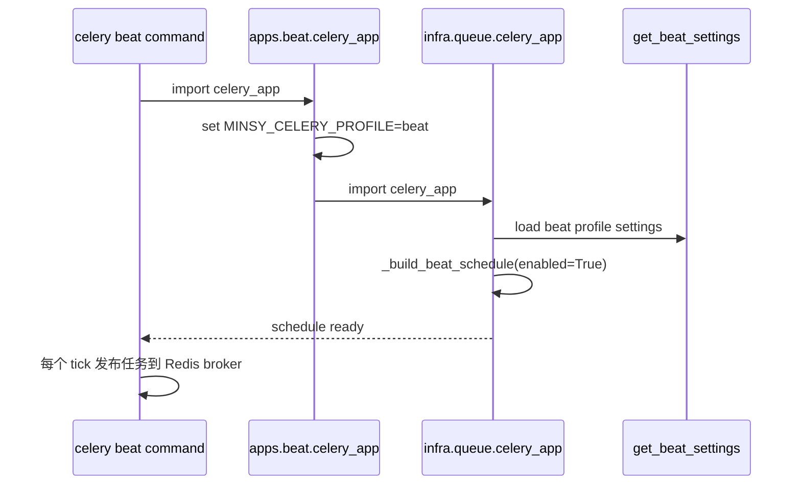
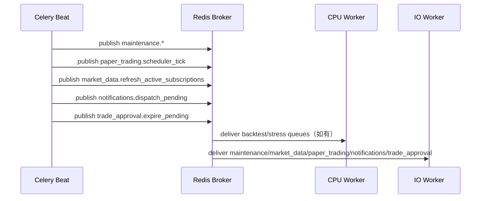

# apps/beat README（Bottom-Up）

`apps/beat` 是 Celery 定时调度入口，职责非常聚焦：

- 定时发布任务到对应 queue
- 不执行重任务（真正执行在 worker）

## 1. Bottom-Up 结构

### 1.1 入口文件

文件：`apps/beat/celery_app.py`

做两件事：

1. 设置环境变量
   - `MINSY_CELERY_PROFILE=beat`
   - `MINSY_SERVICE=beat`
2. 导出 `packages.infra.queue.celery_app.celery_app`

### 1.2 真正调度逻辑位置

定时表不在 `apps/beat` 本身，而在：

- `packages/infra/queue/celery_app.py::_build_beat_schedule(enabled=True)`

也就是说，beat app 只是 profile 化入口；调度策略由 infra 层统一维护。

---

## 2. 启动顺序

启动命令：

```bash
uv run celery -A apps.beat.celery_app beat -l info
```

启动链路：



---

## 3. 周期任务表（由配置开关控制）

`_build_beat_schedule` 最多发布以下任务：

| 配置开关 | 任务名 | 默认触发方式 | 目标 queue |
|---|---|---|---|
| `POSTGRES_BACKUP_ENABLED` | `maintenance.backup_postgres_full` | crontab（按 UTC 小时/分钟） | `maintenance` |
| `USER_EMAIL_CSV_EXPORT_ENABLED` | `maintenance.export_user_emails_csv` | 每 N 分钟 | `maintenance` |
| `BACKTEST_STALE_JOB_CLEANUP_ENABLED` | `maintenance.fail_stale_backtest_jobs` | 每 N 分钟 | `maintenance` |
| `PAPER_TRADING_ENABLED` | `paper_trading.scheduler_tick` | 每 N 秒 | `paper_trading` |
| `PAPER_TRADING_ENABLED` | `market_data.refresh_active_subscriptions` | 每 N 秒 | `market_data` |
| `NOTIFICATIONS_ENABLED` | `notifications.dispatch_pending` | 每 N 秒 | `notifications` |
| `TRADING_APPROVAL_ENABLED` | `trade_approval.expire_pending` | 每 N 秒 | `trade_approval` |

---

## 4. 调用时序（beat -> worker）



注意：

- beat 只“发消息”，不参与业务计算。
- 如果 IO worker 未启动，beat 仍会持续发布，队列会累积。

---

## 5. 依赖与排查

依赖：

- Redis（broker/backend）
- `packages.shared_settings`（读取 beat profile 配置）

排查顺序建议：

1. `beat` 进程是否运行。
2. schedule 对应开关是否开启（`env/.env.{profile}.beat` 等）。
3. worker 是否消费对应 queue。
4. 任务是否因 `expires` 或配置导致被丢弃/延迟。

---

## 6. 未来功能开发计划 Brainstorm（PM 视角）

### 6.1 评估框架（Thinking 显式化）

- 评估维度：系统稳定性收益、成本节约、对用户可感知价值、调度复杂度。
- 优先级规则：先做“避免队列雪崩和数据陈旧”的调度能力，再做“体验增益型自动化”。
- 现状判断：beat 已覆盖交易 tick、行情刷新、通知、审批过期、维护任务，下一步重点是“智能调度”。

### 6.2 Beat 路线图（按优先级）

| 优先级 | 方向 | 现状判断 | 用户收益 | 工程复杂度 | 建议落地 |
|---|---|---|---|---|---|
| P0 | 错峰调度（回测/压测/重任务） | 当前调度以固定间隔为主 | 高（降低高峰卡顿和堆积） | 中 | 新增离峰窗口策略，重任务默认夜间触发 |
| P0 | 队列背压感知调度（Queue Lag Aware） | 当前 beat 不看 broker backlog | 高（稳定性） | 中高 | 根据队列长度/处理时延动态降频或暂停非关键任务 |
| P0 | 数据维护自动化增强 | 已有备份与部分维护任务 | 中高（减少运行中断） | 中 | 增加“数据缺口巡检 -> 自动补齐”周期任务 |
| P0 | 调度抖动机制（Jitter） | 当前固定节奏可能造成瞬时并发峰值 | 中高（稳定性） | 低中 | 为同类周期任务引入随机抖动，降低惊群效应 |
| P1 | 每日交易报告自动生成与分发 | 通知链路已具备 | 中高（用户粘性） | 中 | 每日收盘后生成摘要并推送到站内/IM |
| P1 | 交易时段感知调度 | 当前 tick 主要依赖统一周期 | 中（资源效率） | 中 | 按市场交易日历动态开关 paper_trading/market_data 任务 |
| P1 | Schedule Dry-Run 与回放工具 | 当前调度问题定位依赖线上日志 | 中（研发效率） | 中 | 提供“未来 24h 任务触发表”预览与历史回放 |
| P1 | SLO 联动调度降级 | 当前调度与服务健康指标关联弱 | 中高（高峰期可用性） | 中高 | 当 API/worker 错误率超阈值时自动降频非关键任务 |
| P2 | 定期恢复演练（备份可恢复性） | 当前有备份任务，缺恢复演练闭环 | 中（灾备可信度） | 中高 | 定时触发“备份还原校验”并产出演练报告 |
| P2 | 多租户分层调度策略 | 当前全局节奏为主 | 中（商业化支撑） | 高 | 按 plan 等级拆分调度频率与任务配额 |
| P2 | 调度策略 A/B 实验框架 | 当前策略调整依赖经验法 | 中（持续优化） | 高 | 对不同调度策略做灰度对照并自动评估收益 |

### 6.3 建议先开工的两个 Epic

1. `EPIC-B1: 调度稳态化`
   - 覆盖：错峰调度 + 背压感知 + 交易时段感知。
   - 目标：在用户规模增长后仍保持队列与延迟稳定。
2. `EPIC-B2: 自动化运营能力`
   - 覆盖：日报自动分发 + 数据维护增强 + 恢复演练。
   - 目标：提升用户可见价值，同时降低人工运维负担。

### 6.4 本轮补充的验收指标建议

- 稳态指标：任务触发抖动前后瞬时队列峰值变化、任务超时率。
- 资源效率：交易时段感知后非交易时段任务量下降比例。
- 调度可靠性：计划触发准确率、漏触发/重复触发率。
- 降级有效性：SLO 联动后核心任务成功率与延迟改善幅度。
