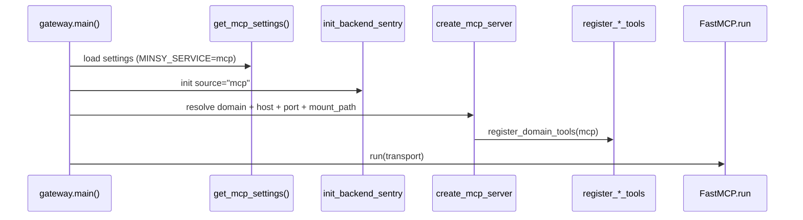
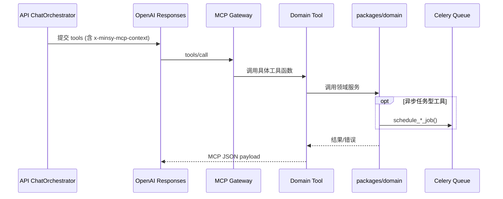

# apps/mcp README（Bottom-Up）

本文档按 **Bottom-Up** 顺序说明 `apps/mcp`：
先看鉴权/序列化等底座，再看 domain tools，最后看 gateway 如何把它们变成可运行 MCP 服务。

## 1. 这个 app 的职责边界

`apps/mcp` 是 Minsy 的 **MCP 工具服务层**，向模型暴露可调用工具。

当前包含 5 个领域服务（domain）：

- `strategy`
- `backtest`
- `market_data`
- `stress`
- `trading`

工具总量（按 `TOOL_NAMES`）：**52**

- strategy: 11
- backtest: 10
- market_data: 10
- stress: 12
- trading: 9

---

## 2. Bottom-Up 依赖拆解

### 2.1 请求上下文鉴权（最底层）

MCP 请求中的用户上下文通过 header 注入：

- Header: `x-minsy-mcp-context`
- 由 API orchestrator 在 tool 定义里注入（JWT）
- 解析位置：`apps/mcp/auth/context_auth.py`（转发到 `packages.infra.auth.mcp_context`）

关键能力：

- `extract_mcp_context_token(headers)`
- `decode_mcp_context_token(token)` -> `McpContextClaims(user_id, session_id, phase, request_id, ...)`

### 2.2 统一返回与日志

`apps/mcp/common/utils.py` 提供：

- `to_json()`：统一 JSON 序列化
- `utc_now_iso()`：统一时间戳
- `log_mcp_tool_result()`：统一工具结果日志（ok/failed + code/message）

### 2.3 Domain Tool 依赖模式（共性）

每个 domain 的 `tools.py` 基本遵循同一模式：

1. 解析入参（UUID/JSON/范围参数）
2. 可选解析 MCP context claims（用户态约束）
3. 懒初始化 DB session（`init_postgres(ensure_schema=False)`）
4. 调 `packages/domain/*` 服务
5. 统一包装 `ok / error_code / error_message`

---

## 3. Gateway 启动顺序（入口）

入口文件：`apps/mcp/gateway.py`

启动命令示例：

```bash
# 推荐：单进程树统一启动（一个 router 入口 + 五个 domain 子进程）
uv run python -m apps.mcp.launch_all --router-host 127.0.0.1 --router-port 8110

# 如需单域调试，也可直接起某个 domain gateway
uv run python -m apps.mcp.gateway --domain strategy --transport streamable-http --host 127.0.0.1 --port 8111
```

调用顺序：



> `create_mcp_server()` 对 `market_data/market-data` 做了 alias 归一化；
> transport 支持 `streamable-http / sse / stdio`。

---

## 4. 业务调用顺序（关键链路）

## 4.1 从 ChatOrchestrator 到 MCP 工具



### 4.2 Strategy domain（`domains/strategy/tools.py`）

关键顺序（`strategy_validate_dsl`）：

1. `_parse_payload(dsl_json)`
2. `validate_strategy_payload(payload)`
3. 若有 `session_id`：校验 session 归属（`_assert_session_matches_context_user`）
4. 尝试 `create_strategy_draft(...)`（超时/失败会降级返回 warning）
5. 返回 `strategy_draft_id`（若成功）

关键顺序（`strategy_upsert_dsl`）：

1. 解析 `claims/session_id/strategy_id/dsl_json`
2. session 用户归属校验
3. 调 `upsert_strategy_dsl(...)`
4. 返回 `strategy_id + metadata`

此外支持 patch/version/diff/rollback 全链路，均带 ownership + 输入校验。

### 4.3 Backtest domain（`domains/backtest/tools.py`）

`backtest_create_job` 顺序：

1. `create_backtest_job(...)`（DB 建 job，状态 queued）
2. `schedule_backtest_job(job_id)`（入 Celery）
3. `get_backtest_job_view(job_id)` 立即返回可轮询视图

`run_now` 参数仅兼容保留，当前实现 **统一走异步队列**。

### 4.4 Market Data domain（`domains/market_data/tools.py`）

同步查询工具：

- `check_symbol_available`
- `get_symbol_candles`
- `get_symbol_metadata`

异步补数链路（`market_data_fetch_missing_ranges`）：

1. 解析时间窗/缺口范围
2. `create_market_data_sync_job(...)`
3. `schedule_market_data_sync_job(job_id)`
4. `market_data_get_sync_job(job_id)` 轮询结果

### 4.5 Stress domain（`domains/stress/tools.py`）

`stress_*_create_job` 统一走 `_create_job(...)`：

1. 校验 `run_async`（必须 true）
2. `create_stress_job(...)`
3. `schedule_stress_job(job_id)`
4. `get_stress_job_view(job_id)`

支持 `black_swan / monte_carlo / param_scan / optimization`。

### 4.6 Trading domain（`domains/trading/tools.py`）

`trading_create_paper_deployment` 顺序：

1. 读取 MCP claims，必须有 user context
2. 自动解析 strategy_id（显式 > session 最近 > 用户最近）
3. 自动解析 broker_account_id（显式 > 用户最近 active paper）
4. 调 `deployment_ops.create_deployment(...)`
5. 若 `auto_start=true`：`apply_status_transition(active)` + 可选入队 runtime

---

## 5. 端口与路由映射

| Domain | 内部默认端口 | 对外入口 |
|---|---:|---|
| strategy | 8111 | `:8110/strategy/*` |
| backtest | 8112 | `:8110/backtest/*` |
| market | 8113 | `:8110/market/*` |
| stress | 8114 | `:8110/stress/*` |
| trading | 8115 | `:8110/trading/*` |

统一路由入口：`apps/mcp/proxy/router.py`（兼容入口 `apps/mcp/proxy/dev_proxy.py`，默认 8110）。

---

## 6. 故障定位（按层）

1. 网关层：`gateway.py` 的 domain/transport 参数、端口冲突。
2. 上下文层：`x-minsy-mcp-context` 缺失/过期（常见 `MISSING_CONTEXT`、`INVALID_INPUT`）。
3. 领域层：domain service 的业务校验失败（如策略 ownership、版本冲突）。
4. 队列层：创建 job 成功但 worker 未消费（检查 Celery worker/queue）。

---

## 7. 未来功能开发计划 Brainstorm（PM 视角）

### 7.1 评估框架（Thinking 显式化）

- 评估维度：策略质量提升幅度、用户可解释性、计算成本、实现与维护复杂度。
- 优先级规则：先补“结果准确性和闭环能力”，再做“高级优化”和“专家功能”。
- 现状判断：MCP 五域基础工具已可用，下一步重点是“质量提升 + 性能扩展”。

### 7.2 MCP 路线图（按优先级）

| 优先级 | 方向 | 现状判断 | 用户收益 | 工程复杂度 | 建议落地 |
|---|---|---|---|---|---|
| P0 | 多标的回测（修复只取首标的） | 当前回测服务仍有 `symbols[0]` 路径 | 高（组合策略真实可用） | 中 | 扩展 engine 为组合级持仓与 PnL，再补 symbol 分解报表 |
| P0 | 数据缺失自动拉取闭环 | 已有 `market_data_fetch_missing_ranges` 工具，但前置感知可加强 | 高（减少“跑不动”） | 中 | 回测/压测前自动 preflight 检查，缺口自动建 sync job |
| P0 | Deployment Gate（部署门禁） | 当前可直接建部署并启动 | 高（降低坏策略上线风险） | 中高 | 强制满足最低回测/压测阈值才允许 `trading_create_paper_deployment` |
| P0 | MCP 工具契约版本化（Schema Versioning） | 当前工具参数可用，但缺少显式版本协商 | 高（减少前后端破坏性变更） | 中 | 给每个工具返回 `tool_version`，引入向后兼容策略 |
| P1 | Walk-Forward 优化（WFO v1） | 目前以单窗口回测为主 | 高（降低过拟合） | 中高 | 新增 train/validation 滚动窗口工具与结果聚合视图 |
| P1 | 策略对比 `compare_strategies` | 现有 diff 偏结构级别 | 高（帮助用户迭代） | 中 | 输出改动前后 KPI 对比 + 自动总结“有效改动” |
| P1 | 相关性矩阵与风险敞口 | 当前主要是单策略维度 | 中高（组合管理） | 中 | 增加 `get_correlation_matrix` 与组合风险提示 |
| P1 | 回测/压测资源预算预估器 | 当前任务提交后才感知成本和耗时 | 中高（更可控） | 中 | 新增 `estimate_job_cost` 工具预估时间/数据量/算力 |
| P2 | Grid Search 效率优化 | 已有 optimization 工具，算力成本可能偏高 | 中（提效） | 高 | 参数空间剪枝 + 并行策略 + 缓存命中 |
| P2 | Counterfactual 补丁建议 | 当前以用户显式改 DSL 为主 | 中高（智能化） | 高 | 自动提出防守性补丁并估算 drawdown 改善 |
| P2 | 指标工厂（TradingView -> DSL 因子） | 当前指标体系可用但规模有限 | 中（策略多样性） | 高 | 建立“采集-清洗-翻译-验证”流水线与质量评分 |
| P2 | Level2/订单簿与 ML 因子工具化 | 当前主路径还是 OHLCV 因子 | 中高（上限能力） | 高 | 分层引入高频特征与模型推理接口，先 paper 回测验证 |

### 7.3 建议先开工的两个 Epic

1. `EPIC-M1: 回测真实性提升`
   - 覆盖：多标的回测 + 数据缺口自动补齐 + 组合级指标。
   - 目标：把“能跑”升级到“结果可信、可解释”。
2. `EPIC-M2: 上线前质量门禁`
   - 覆盖：Deployment Gate + 策略对比总结 + WFO v1。
   - 目标：减少劣质策略直接进入部署链路。

### 7.4 本轮补充的验收指标建议

- 回测真实性：多标的组合与单标回测结果一致性校验通过率、组合净值重算误差。
- 任务可预期性：`estimate_job_cost` 预估耗时与真实耗时误差（P50/P95）。
- 工具稳定性：MCP 工具 schema 破坏性变更次数、跨版本兼容通过率。
- 上线质量：Deployment Gate 拦截后 7 日内避免的高风险部署比例。
