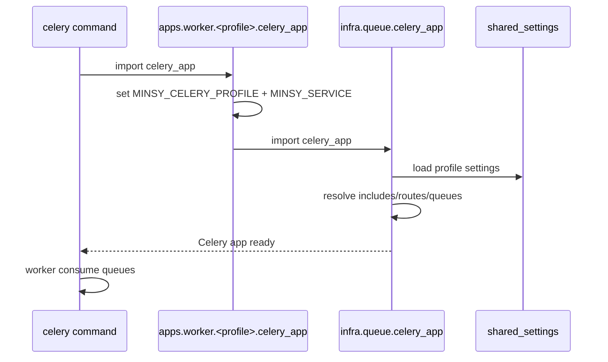
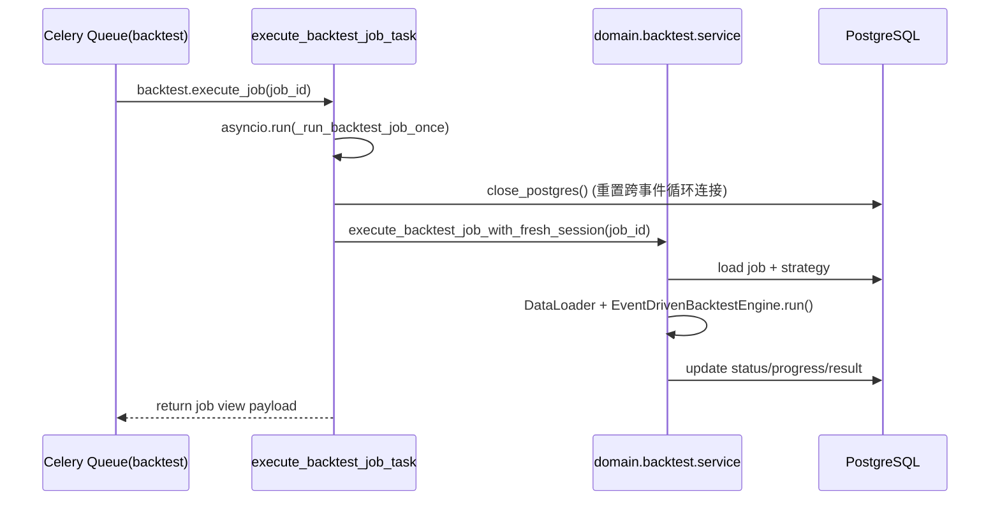
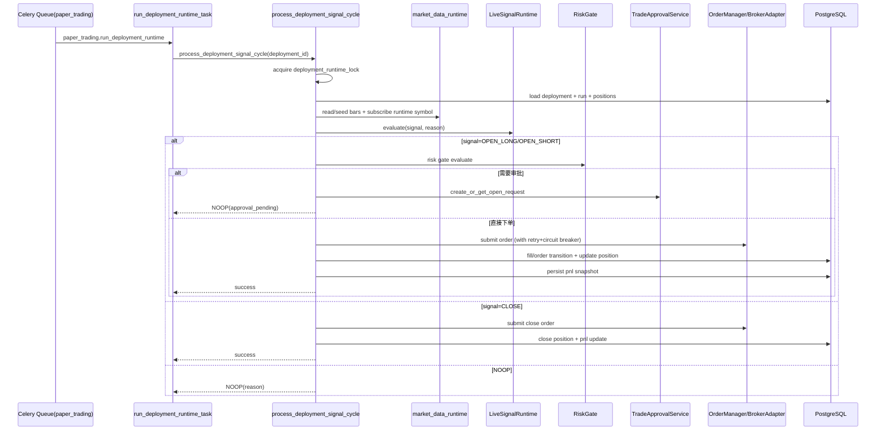

# apps/worker README（Bottom-Up）

本文档按 Bottom-Up 说明 `apps/worker`：
从 Celery 基座配置开始，到 CPU/IO 两类 worker 启动，再到每个任务的业务执行顺序。

## 1. 这个 app 的职责边界

`apps/worker` 是后台异步执行层，负责把 API/MCP 入队的任务真正执行掉。

分两类进程：

- `worker/cpu`：CPU 密集（回测、压力测试）
- `worker/io`：IO 密集（纸交易运行时、行情刷新、通知分发、审批执行、维护任务）

---

## 2. Bottom-Up 依赖拆解

### 2.1 Celery 基座（`packages/infra/queue/celery_app.py`）

所有 worker 实际都共用这一个 `celery_app`，通过环境变量切 profile：

- `MINSY_CELERY_PROFILE=cpu|io|beat|all`

基座做的事情：

1. 根据 profile 选择 `include`（导入哪些 tasks 模块）
2. 绑定 `task_queues` 与 `task_routes`
3. 根据配置构建 `beat_schedule`（仅 beat/all）
4. 配置重试、超时、prefetch、memory cap、序列化格式等

### 2.2 Worker 入口（`apps/worker/*/celery_app.py`）

- `cpu/celery_app.py`
  - 设置 `MINSY_CELERY_PROFILE=cpu`
  - 设置 `MINSY_SERVICE=worker_cpu`
- `io/celery_app.py`
  - 设置 `MINSY_CELERY_PROFILE=io`
  - 设置 `MINSY_SERVICE=worker_io`
- `common/celery_base.py`
  - 仅转发到 `packages.infra.queue.celery_app`

### 2.3 profile 与队列分配

| Profile | include 模块 | 消费队列 |
|---|---|---|
| `cpu` | `apps.worker.cpu.tasks.backtest`, `apps.worker.cpu.tasks.stress` | `backtest`, `stress` |
| `io` | `apps.worker.io.tasks.market_data`, `maintenance`, `notification`, `paper_trading`, `trade_approval` | `market_data`, `paper_trading`, `maintenance`, `notifications`, `trade_approval` |

---

## 3. 启动顺序与命令

推荐分别启动两个 worker 进程：

```bash
# CPU worker
uv run celery -A apps.worker.cpu.celery_app worker -l info -Q backtest,stress

# IO worker
uv run celery -A apps.worker.io.celery_app worker -l info -Q market_data,paper_trading,maintenance,notifications,trade_approval
```

启动过程（两类 worker相同）：



---

## 4. 任务级调用顺序（按函数链）

## 4.1 CPU: 回测任务

入口：`apps/worker/cpu/tasks/backtest.py::execute_backtest_job_task`



关键点：

- task 装饰器 `acks_late=False`，避免 OOM 场景重复 redelivery。
- 每次任务前后都会 `close_postgres()`，规避 asyncpg 跨 loop 问题。

## 4.2 CPU: 压测任务

入口：`apps/worker/cpu/tasks/stress.py::execute_stress_job_task`

执行顺序与回测一致，核心域函数换成：

- `execute_stress_job_with_fresh_session(job_id)`
- 内部按 `job_type` 分支：`black_swan / monte_carlo / param_scan / optimization`

---

## 4.3 IO: 纸交易调度与执行

入口任务：

- `paper_trading.scheduler_tick`
- `paper_trading.run_deployment_runtime`

### 4.3.1 scheduler_tick（扫描部署并入队）

主要步骤（`_run_paper_scheduler_tick`）：

1. 查询活跃 paper deployment 列表。
2. 每个 deployment 申请 Redis 分布式锁（`deployment_runtime_lock`）。
3. 根据 timeframe + 上次 bucket 判断是否到点。
4. 队列拥塞保护（`paper_trading_queue_backlog_soft_limit`）。
5. 满足条件则 `enqueue_paper_trading_runtime(deployment_id)`。
6. 同步 runtime_state 到 Redis store（`runtime_state_store.upsert`）。

### 4.3.2 run_deployment_runtime（单部署运行心跳）

业务主链在 `packages/domain/trading/runtime/runtime_service.py::process_deployment_signal_cycle`。



关键保护：

- Kill switch（`RuntimeKillSwitch`）
- Broker circuit breaker
- Risk gate（仓位/敞口/最小下单量/日损失）
- Trade approval（按用户偏好决定 OPEN 是否审批）

---

## 4.4 IO: 市场数据任务

文件：`apps/worker/io/tasks/market_data.py`

任务与顺序：

- `market_data.refresh_active_subscriptions`
  - 从 runtime 读取 active symbols
  - Redis 去重占位（防止重复刷新）
  - 批量发布 `market_data.refresh_symbol`
- `market_data.refresh_symbol`
  - 拉 quote + latest 1m bar
  - 写入 runtime cache
  - 异常写 `MarketDataErrorEvent`
- `market_data.backfill_symbol`
  - 回填最近 N 分钟 1m bars
- `market_data.sync_missing_ranges`
  - 调 `execute_market_data_sync_job_with_fresh_session`

---

## 4.5 IO: 通知分发任务

文件：`apps/worker/io/tasks/notification.py`

流程：

1. 获取 Redis 短锁（防并发重复分发）。
2. `NotificationOutboxService.dispatch_due(limit)` 拉取 due outbox。
3. 按渠道发送（当前默认 Telegram provider）。
4. 成功 -> `sent`；失败 -> `failed/dead`（指数退避）。

---

## 4.6 IO: 交易审批任务

文件：`apps/worker/io/tasks/trade_approval.py`

- `trade_approval.execute_approved_open`
  - `mark_executing` -> `execute_manual_trade_action` -> `mark_executed/mark_failed`
- `trade_approval.expire_pending`
  - 扫描 pending 且过期请求，标记 expired

---

## 4.7 IO: 维护任务

文件：`apps/worker/io/tasks/maintenance.py`

- `maintenance.backup_postgres_full`
  - 调 `pg_dump`，轮转历史备份
- `maintenance.export_user_emails_csv`
  - 导出用户邮箱归档（只增不删）
- `maintenance.fail_stale_backtest_jobs`
  - 将长期 running 的回测任务置为 failed

---

## 5. 关键依赖

外部依赖：

- Celery + Redis broker/backend
- PostgreSQL
- Alpaca/HTTPX（行情/交易）

内部依赖（核心）：

- `packages.domain.backtest.service`
- `packages.domain.stress.service`
- `packages.domain.trading.runtime.runtime_service`
- `packages.domain.market_data.runtime`
- `packages.domain.notification.services.notification_outbox_service`

---

## 6. 运行与排查建议

1. 先确认 profile 与队列匹配（CPU 不应消费 IO 队列）。
2. 看任务名是否被路由到预期 queue（`task_routes`）。
3. 交易任务异常优先看：
   - lock 冲突
   - kill switch
   - risk gate
   - broker circuit breaker
4. 通知堆积优先看：Redis lock、provider 可用性、outbox 状态迁移。

---

## 7. 未来功能开发计划 Brainstorm（PM 视角）

### 7.1 评估框架（Thinking 显式化）

- 评估维度：成交安全性、执行稳定性、用户可控性、运维成本。
- 优先级规则：先做“避免错误交易”的能力，再做“提高收益曲线质量”的能力。
- 现状判断：通知、审批、纸交易循环已具备 MVP，下一步要从“可跑”升级到“可控且可扩展”。

### 7.2 Worker 路线图（按优先级）

| 优先级 | 方向 | 现状判断 | 用户收益 | 工程复杂度 | 建议落地 |
|---|---|---|---|---|---|
| P0 | 渐进式 Auto-Pilot（审批 -> 小额自动 -> 全自动） | 当前已有审批任务与执行链路 | 高（降低手动负担，提升信任） | 中 | 增加风险阈值分层策略，按账户风险等级自动切模式 |
| P0 | 交易审计增强（why/when/who/approved_by/params_version） | 关键实体已在，但链路聚合不足 | 高（可追溯、可复盘） | 中高 | 在任务执行时补充统一 audit payload，写入 order/fill metadata |
| P0 | 队列隔离与成本守护（含 Redis 拆库演进） | 当前 broker/backend 共用一套 redis 配置 | 高（稳定性） | 中高 | 分阶段拆分：先逻辑前缀隔离，再演进 broker/缓存独立实例 |
| P0 | 下单幂等账本（Execution Idempotency Ledger） | 当前有锁与状态机，但跨重试幂等仍可增强 | 高（避免重复成交） | 中高 | 为每次执行生成幂等键，重复任务直接短路并审计 |
| P1 | 动态仓位管理（Kelly / ATR sizing） | 回测层已有 ATR 相关能力，实盘侧待统一 | 高（风险收益比提升） | 中高 | 先 paper 小流量灰度，观察回撤/胜率后再扩大 |
| P1 | 交易“尸检”任务（大亏自动归因） | 当前告警与事件具备基础 | 中高（提升迭代效率） | 中 | 新增异步归因任务，产出事件窗口+波动+信号上下文报告 |
| P1 | 夜间实验批处理与次日 Top N 推送 | 当前队列与通知能力可复用 | 中（用户粘性） | 中高 | 设定离峰窗口批量跑实验，早晨通过 IM 推送摘要 |
| P1 | Worker 瓶颈巡检与容量建议 | 当前有健康指标，但缺任务级容量建议 | 中高（运维效率） | 中 | 定期输出 CPU/内存/队列瓶颈报告与并发建议值 |
| P2 | 本地/云端混合执行（Edge Worker） | 当前以云端 worker 为主 | 中高（满足“本地保管 API Key”诉求） | 高 | 设计 remote command + 心跳机制，支持用户本机执行敏感交易 |
| P2 | 多券商 runtime adapter 扩展 | 当前以 Alpaca 路径为主 | 中（覆盖更多用户） | 高 | 抽象 broker adapter contract，先接 paper 能力一致性测试 |
| P2 | Chaos/故障演练任务集 | 当前主要是功能正确性验证 | 中（稳定性） | 高 | 注入网络抖动/慢响应/限流，验证降级与重试策略 |

### 7.3 建议先开工的两个 Epic

1. `EPIC-W1: 安全可控执行`
   - 覆盖：渐进式 Auto-Pilot + 审计增强 + 成本守护。
   - 目标：先把“不会乱下单”做到可量化、可验证。
2. `EPIC-W2: 风险收益改进`
   - 覆盖：动态仓位 + 交易尸检 + 夜间实验批处理。
   - 目标：让策略迭代速度和实盘质量一起提升。

### 7.4 本轮补充的验收指标建议

- 交易安全：重复下单率、幂等短路命中率、人工回滚事件数。
- 执行稳定性：任务失败率、重试成功率、队列堆积时长（P95）。
- 风险收益：启用动态仓位后回撤变化、收益波动比变化。
- 运维效率：容量建议采纳率、容量建议后的任务延迟下降幅度。
